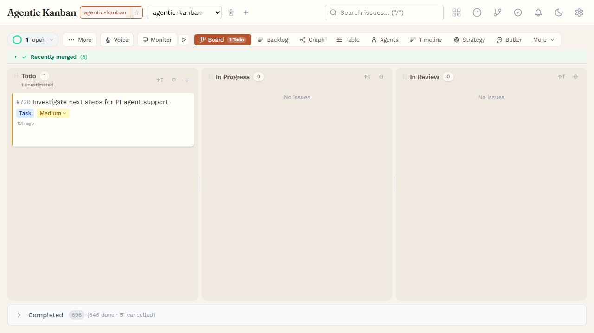
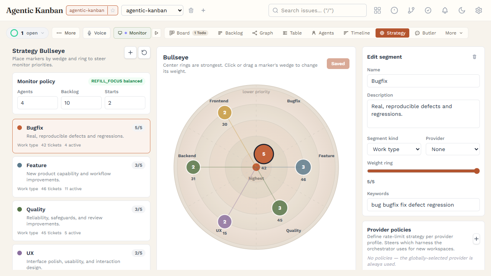
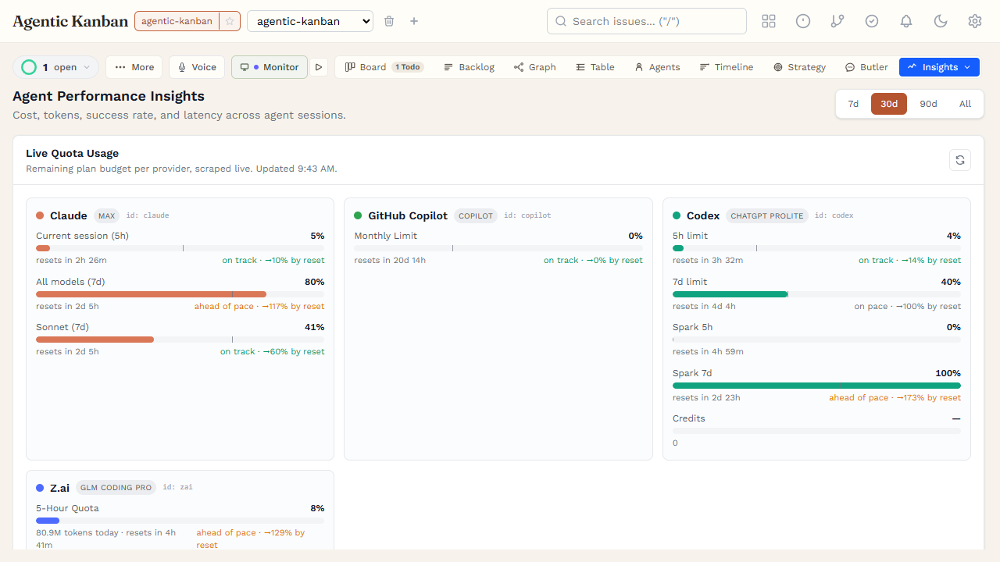
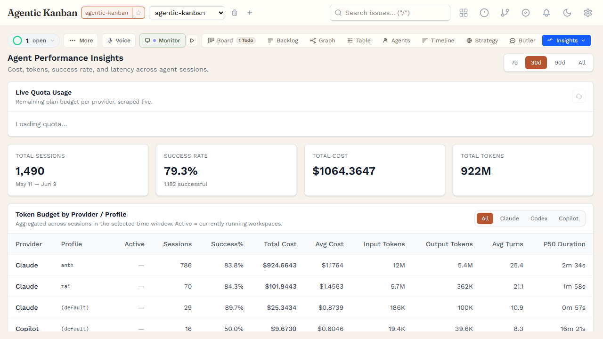
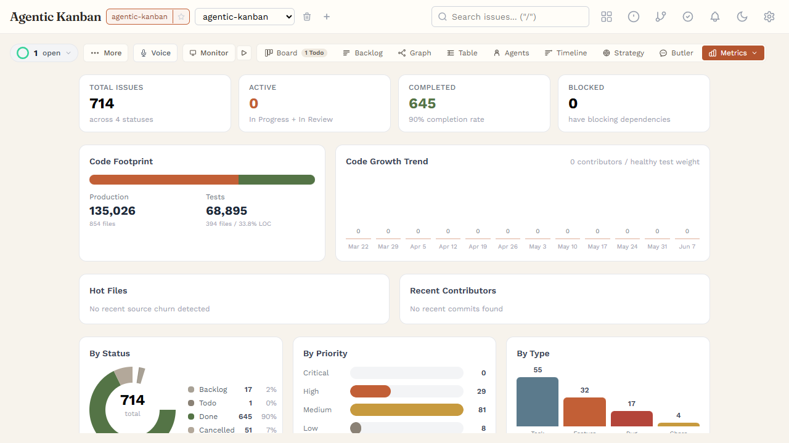

# Agentic Kanban

A kanban board for managing AI-driven coding tasks. Built as a focused, local-first alternative to [vibe-kanban](https://github.com/BloopAI/vibe-kanban) — designed for single-user workflows with Claude Code as the agent.

Each task card on the board is backed by a git worktree and a live Claude Code session. The core loop is: **plan → execute (Claude Code) → review (diff) → ship (merge)**.

## Showcase

| Board | Strategy Bullseye |
|-------|-------------------|
|  |  |

| Insights (quota + summary) | Insights (cost breakdown) | Metrics |
|---------------------------|--------------------------|---------|
|  |  |  |

## Features

- **Kanban board** — drag-and-drop between columns (Todo, In Progress, In Review, Done, Cancelled), collapsible archive group
- **Issue management** — create, edit, delete, search/filter with highlighted matches, priority badges, tags, auto-incrementing issue numbers
- **Workspace lifecycle** — one-step creation: branch + git worktree + auto-launch Claude Code. Supports direct workspaces (no worktree) for quick tasks
- **Live agent output** — real-time streaming via WebSocket, chat-like input with Send/Stop, `--resume` support for session continuity
- **Diff viewer** — unified and split views with inline comments, diff stats, merge and close actions
- **MCP server** — 35 tools for AI agent integration (board status, issues, workspaces, review/merge, dependencies, skills, etc.)
- **Real-time board updates** — WebSocket push + polling fallback for cross-tab and MCP-driven changes
- **Command palette** — Ctrl+K action search with keyboard navigation
- **Multi-project** — register multiple independent projects and switch between them
- **Multi-repo projects** — a single project can span multiple git repos (a leading repo plus siblings). Each workspace fans out a matching worktree across every repo on the same branch, with per-repo diffs, per-repo merge status (merged / ahead / stranded), sibling-aware conflict detection, an all-or-nothing coordinated merge, a cross-repo `HANDOFF.md` bundle, and file-contention detection
- **Service stacks (Docker Compose)** — bring up a per-workspace dependency stack (databases, queues, sibling services) from a Compose file, with automatic per-workspace port allocation and health checks, so agents build and test against real dependencies. Runs under **Docker-in-Docker (DinD)** so a containerized agent can drive its own Compose stack
- **Multi-repo monitoring** — a live repo × workspace merge-state matrix, per-workspace health pill, cross-repo activity feed, fleet token/cost meter, stalled/looping-agent detection, and a full turn-by-turn agent transcript viewer
- **Session history** — browse past agent sessions per workspace without leaving context
- **Worktree overview** — see all git worktrees across workspaces with diff stats and status badges
- **Butler assistant** — a warm, persistent Claude (Agent SDK) per project (press `i`): chat for board/codebase guidance, per-project model & profile pickers, slash-command autocomplete, a Stop button, and it can orchestrate board work for you

## Tech Stack

| Layer | Technology |
|-------|-----------|
| Backend | Hono (Node.js), Drizzle ORM, SQLite |
| Frontend | React, TypeScript, Tailwind CSS, Vite |
| Agent | Claude Code, Codex, Copilot, and Pi — per-task CLI subprocess, plus a warm in-process Butler (Agent SDK) |
| Integration | MCP SDK (stdio JSON-RPC) |
| Service stacks | Docker Compose (per-workspace), Docker-in-Docker supported |
| Testing | Vitest (unit), Playwright (E2E) |
| Monorepo | pnpm workspaces |

## Getting Started

```bash
pnpm install
pnpm db:setup        # migrate + seed + register this repo as a project
pnpm dev             # start server (port 3001) + client (port 5173)
```

Open http://localhost:5173 — the board loads with 3 active columns for the registered project.

For prerequisites, troubleshooting, and clean-clone gotchas see [docs/install.md](docs/install.md).

## CLI

```bash
pnpm cli -- register <path>     # register a git repo as a project
pnpm cli -- list                # list registered projects
pnpm cli -- unregister <name>   # remove a project by name or ID
pnpm cli -- cleanup             # show stale worktrees for closed workspaces
```

## Core Workflow

1. **Register repo** — `pnpm cli -- register /path/to/repo`
2. **Create issue** — add a task to the board via the inline form
3. **Start workspace** — click "New Workspace" on an issue card (creates branch + worktree + launches Claude Code with the issue as prompt)
4. **Review changes** — view the diff in the workspace panel, add inline comments
5. **Merge** — merge the branch into the project's default branch and close the workspace

> For a **multi-repo** project, steps 3–5 apply across every registered repo at once: one workspace creates a worktree on the same branch in each repo, the diff and merge status are shown per repo, and the merge is coordinated all-or-nothing.

## Multi-Repo Projects & Service Stacks

**Multi-repo.** A project isn't limited to one repository. Register additional repos (by local path or clone-from-URL) alongside the leading repo, and every workspace you create gets a matching git worktree on the same branch in *each* repo. The board then treats the change set as one coordinated unit:

- **Per-repo diffs** — the diff panel groups changes by repo, with jump-nav and per-repo stats.
- **Per-repo merge status** — each repo shows merged / N-ahead (stranded) / no-changes against its base.
- **Sibling-aware conflict detection** — read-only `git merge-tree` per repo; conflicts (namespaced `repo::file`) are surfaced on the board card *before* you merge.
- **Coordinated merge** — sibling merges are pre-validated and executed all-or-nothing, so you never land half a cross-repo change.
- **Cross-repo `HANDOFF.md`** — a generated bundle folds every repo's diff into one hand-off artifact for the next agent.
- **Multi-Repo Monitor** — a live repo × workspace merge-state matrix, per-workspace health pill, file-contention heatmap, and a cross-repo activity feed.

Add and manage repos under **Settings → Repos** (or `POST /api/projects/:id/repos`).

**Service stacks (Docker Compose).** A workspace can bring up a real dependency stack from a Docker Compose file — databases, queues, sibling services — so agents build and test against the real thing instead of mocks. Ports are allocated per workspace (no collisions between parallel worktrees) and the board health-checks the stack before handing off to the agent. It runs under **Docker-in-Docker (DinD)** too, so a containerized agent can drive its own Compose stack. Configure it per project under **Settings → Service stack**. See [docs/decisions/011-per-workspace-service-stacks.md](docs/decisions/011-per-workspace-service-stacks.md).

## MCP Server

The MCP server exposes 35 tools for AI agent integration via stdio JSON-RPC. A representative subset (tool names are snake_case):

| Tool | Description |
|------|-------------|
| `get_context` | Current project context and issue counts |
| `get_board_status` | Comprehensive overview: active agents, workspace state, diff/session stats |
| `list_issues` / `get_issue` | List/filter issues; full issue detail with workspaces + dependencies |
| `create_issue` / `update_issue` / `move_issue` | Create, edit, and move issues |
| `start_workspace` | Create a bare git worktree for an issue (does **not** move the issue or launch an agent — to actually start work, the board's one-step `POST /api/workspaces` is used) |
| `review_workspace` | Run the AI code review on a workspace branch |
| `get_workspace_diff` / `merge_workspace` | Inspect the diff; merge the branch and close |
| `add_dependency` / `remove_dependency` | Manage typed issue dependencies |
| `list_agent_skills` / `get_agent_skill` / `create_agent_skill` | Manage agent skills |
| `ask_butler` | Ask the project Butler a question synchronously |

Run the MCP server:

```bash
pnpm --filter @agentic-kanban/mcp-server dev
```

## Testing

```bash
pnpm test                # Vitest unit tests
pnpm test:e2e            # Playwright E2E tests
```

## Architecture

```
packages/
├── server/        # Hono API server, SQLite DB, session manager, CLI
├── client/        # React frontend (Vite + Tailwind)
├── shared/        # Drizzle schemas, migrations, shared types
├── mcp-server/    # MCP server (stdio JSON-RPC, 35 tools)
└── e2e/           # Playwright end-to-end tests
```

Key patterns:
- **Server-side aggregation** — workspace summaries computed in the board endpoint, not client-side joins
- **Board events** — dual-path: WebSocket push for instant updates + 30s polling fallback
- **One-step workspace creation** — single POST creates DB record, git worktree, and launches agent
- **Session resume chains** — Claude's internal session ID captured for `--resume` on relaunch

## License

MIT

---

**Building agentic workflows for your team?** Peter Wegner consults on AI-driven development practices — [get in touch](https://github.com/p-wegner).

## Support

If this tool saves you time, consider [sponsoring development](https://github.com/sponsors/p-wegner).

---

[README.de.md](README.de.md) — Deutsche Version
[README.fr.md](README.fr.md) — Version française
[README.it.md](README.it.md) — Versione italiana
[README.ru.md](README.ru.md) — Русская версия
