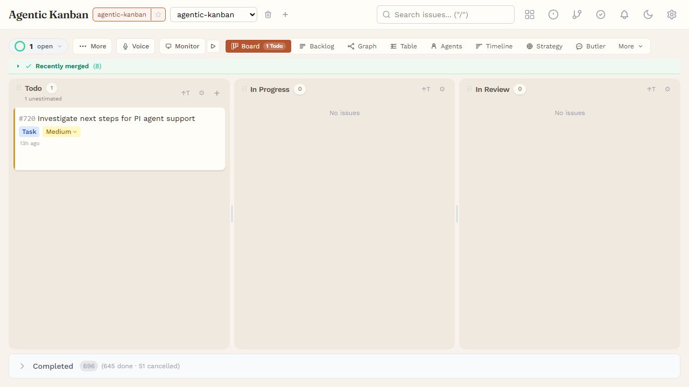
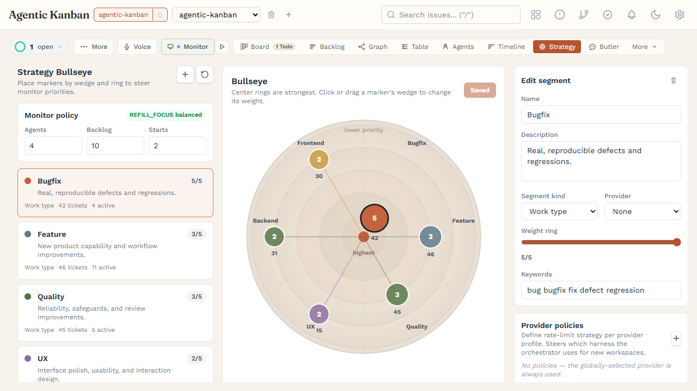
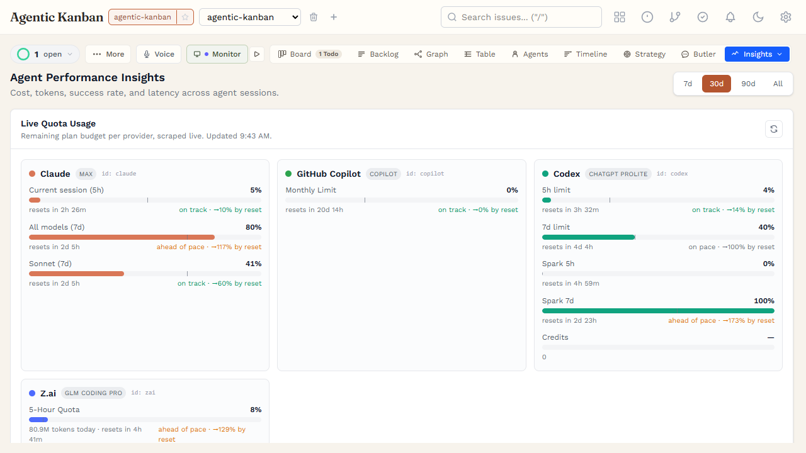
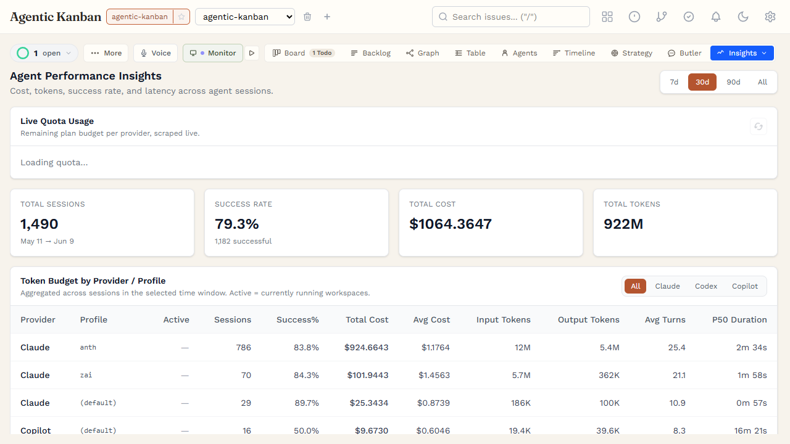
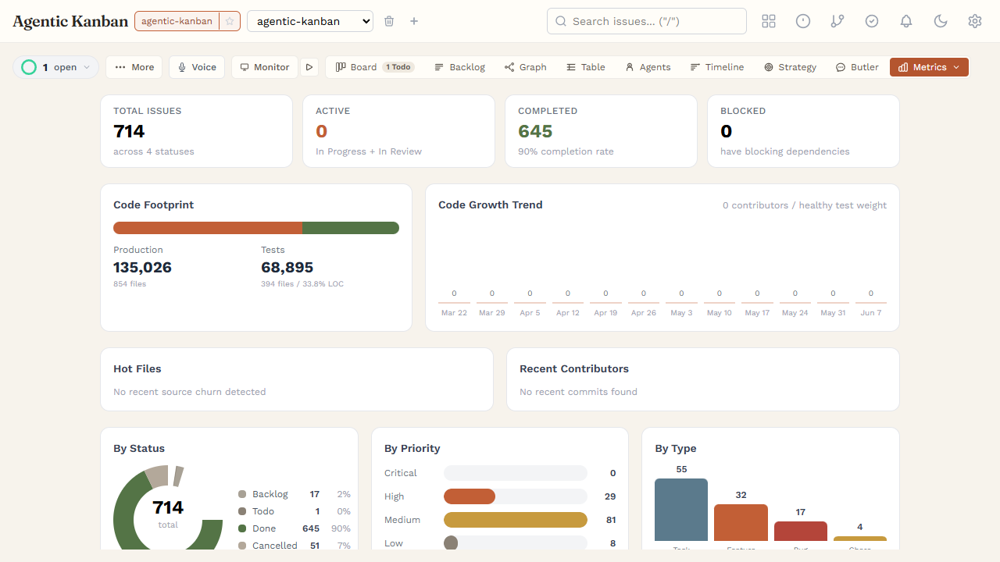

# Agentic Kanban

A kanban board for managing AI-driven coding tasks. Built as a focused, local-first alternative to [vibe-kanban](https://github.com/BloopAI/vibe-kanban) — designed for single-user workflows with Claude Code as the agent.

Each task card on the board is backed by a git worktree and a live Claude Code session. The core loop is: **plan → execute (Claude Code) → review (diff) → ship (merge)**.

## Showcase

| Board | Strategy Bullseye |
|-------|-------------------|
|  |  |

| Insights (quota + summary) | Insights (cost breakdown) | Metrics |
|---------------------------|--------------------------|---------|
|  |  |  |

## Features

- **Kanban board** — drag-and-drop between columns (Todo, In Progress, In Review, Done, Cancelled), collapsible archive group
- **Issue management** — create, edit, delete, search/filter with highlighted matches, priority badges, tags, auto-incrementing issue numbers
- **Workspace lifecycle** — one-step creation: branch + git worktree + auto-launch Claude Code. Supports direct workspaces (no worktree) for quick tasks
- **Live agent output** — real-time streaming via WebSocket, chat-like input with Send/Stop, `--resume` support for session continuity
- **Diff viewer** — unified and split views with inline comments, diff stats, merge and close actions
- **MCP server** — 35 tools for AI agent integration (board status, issues, workspaces, review/merge, dependencies, skills, etc.)
- **Real-time board updates** — WebSocket push + polling fallback for cross-tab and MCP-driven changes
- **Bundled agent skill** — install once with `agentic-kanban install-skill --user` and every agent profile on the machine (`~/.claude*/skills`, `~/.codex/skills`) can drive the board from *any* repo: hand over a `BACKLOG.md`, file tickets, or have the board implement one — no checkout of this repository required. It is junctioned rather than copied, so upgrades reach every agent with no re-install, and its tool/CLI indexes are generated from source under a merge-blocking freshness gate. See [Using the board from any project](#using-the-board-from-any-project--the-bundled-agent-skill)
- **Command palette** — Ctrl+K action search with keyboard navigation
- **Multi-project** — register multiple independent projects and switch between them
- **Multi-repo projects** — a single project can span multiple git repos (a leading repo plus siblings). Each workspace fans out a matching worktree across every repo on the same branch, with per-repo diffs, per-repo merge status (merged / ahead / stranded), sibling-aware conflict detection, an all-or-nothing coordinated merge, a cross-repo `HANDOFF.md` bundle, and file-contention detection
- **Service stacks (Docker Compose)** — bring up a per-workspace dependency stack (databases, queues, sibling services) from a Compose file, with automatic per-workspace port allocation and health checks, so agents build and test against real dependencies. Runs under **Docker-in-Docker (DinD)** so a containerized agent can drive its own Compose stack
- **Multi-repo monitoring** — a live repo × workspace merge-state matrix, per-workspace health pill, cross-repo activity feed, fleet token/cost meter, stalled/looping-agent detection, and a full turn-by-turn agent transcript viewer
- **Session history** — browse past agent sessions per workspace without leaving context
- **Worktree overview** — see all git worktrees across workspaces with diff stats and status badges
- **Butler assistant** — a warm, persistent Claude (Agent SDK) per project (press `i`): chat for board/codebase guidance, per-project model & profile pickers, slash-command autocomplete, a Stop button, and it can orchestrate board work for you
- **Plugins** — install a repo with a `kanban-plugin.json` and it contributes agent skills, one-shot scripts, framed dashboards, and **board-owned converging loops**: the plugin prints the outstanding work units, the board turns each into a ticket and runs it under the project's WIP limit, provider selection and quota rotation, so an open-ended analysis is resumable and visible instead of hidden in a private run-log. Each enabled plugin gets **its own view** under the toolbar's Plugins dropdown tab. See [docs/plugin-development.md](docs/plugin-development.md)
- **Plugin marketplace** — the Plugins tab's Marketplace surface: install a plugin from a git URL or local path in one click, enable/disable it per project, and browse a per-machine catalog of installable plugins (`~/.agentic-kanban/plugins/marketplace.json` — a user-maintained JSON list of `{ name, description, gitUrl }` entries; no remote registry, nothing phones home)

## Tech Stack

| Layer | Technology |
|-------|-----------|
| Backend | Hono (Node.js), Drizzle ORM, SQLite |
| Frontend | React, TypeScript, Tailwind CSS, Vite |
| Agent | Claude Code, Codex, Copilot, and Pi — per-task CLI subprocess, plus a warm in-process Butler (Agent SDK) |
| Integration | MCP SDK (stdio JSON-RPC) |
| Service stacks | Docker Compose (per-workspace), Docker-in-Docker supported |
| Testing | Vitest (unit), Playwright (E2E) |
| Monorepo | pnpm workspaces |

## Getting Started

```bash
pnpm install
pnpm db:setup        # migrate + seed + register this repo as a project
pnpm dev             # start server (port 3001) + client (port 5173)
```

Open http://localhost:5173 — the board loads with 3 active columns for the registered project.

Prefer not to build from source? Run the published image instead — `docker pull pwegner3141/agentic-kanban:latest`, or `npx agentic-kanban dev`. See [docs/deployment.md](docs/deployment.md) for the Docker Compose setup (volumes, agent auth, DinD/DooD service stacks).

For prerequisites, troubleshooting, and clean-clone gotchas see [docs/install.md](docs/install.md).

## CLI

```bash
pnpm cli -- register <path>     # register a git repo as a project
pnpm cli -- list                # list registered projects
pnpm cli -- unregister <name>   # remove a project by name or ID
pnpm cli -- cleanup             # show stale worktrees for closed workspaces
pnpm cli -- worker pair         # mint a pairing token for a compute worker
pnpm cli -- worker list         # show connected workers and their capacity
```

Agent skills ship with the CLI: `npx agentic-kanban install-skill --list` to see them, `npx agentic-kanban install-skill <path> -n <name>` to write one into a project as `.claude/skills/<name>/SKILL.md`, and `npx agentic-kanban install-skill --user` to install the bundled `agentic-kanban` skill into every agent profile on the machine — see [Using the board from any project](#using-the-board-from-any-project--the-bundled-agent-skill).

## Core Workflow

1. **Register repo** — `pnpm cli -- register /path/to/repo`
2. **Create issue** — add a task to the board via the inline form
3. **Start workspace** — click "New Workspace" on an issue card (creates branch + worktree + launches Claude Code with the issue as prompt)
4. **Review changes** — view the diff in the workspace panel, add inline comments
5. **Merge** — merge the branch into the project's default branch and close the workspace

> For a **multi-repo** project, steps 3–5 apply across every registered repo at once: one workspace creates a worktree on the same branch in each repo, the diff and merge status are shown per repo, and the merge is coordinated all-or-nothing.

## Using the board from any project — the bundled agent skill

The board ships an agent skill, **`agentic-kanban`**, that teaches any agent how to drive it: the
mental model, the MCP tool index, the CLI, the statuses and the review/merge gate, plus
`references/` for depth. Install it once, machine-wide, and Claude Code (or Codex) in *any* repo
can hand a backlog to the board, file tickets against it, or have it implement one — with no
checkout of this repository and no code-reading to figure out how the board works.

**Install it once:**

```bash
npx agentic-kanban install-skill --user      # every ~/.claude*/skills and ~/.codex/skills
npx agentic-kanban skill verify --user       # linked / current / stale / absent; exit 1 on stale
```

`--user` **junctions** the skill directory into each agent profile rather than copying it, so
`npm update agentic-kanban` refreshes what every agent reads with no re-install. Where a junction
can't be created (npx cache, no symlink permission) it falls back to a copy and says so —
`skill verify` is what then catches a copy that fell behind. A project-scoped install
(`npx agentic-kanban install-skill [path]`) writes into that project's `.claude/skills/` instead,
and also gets the prompt-only built-ins (`code-review`, `orchestrator`, …); `--user` deliberately
installs the bundled skill only, since those others are per-project working prompts.

**Give the agent tools.** The skill describes the board; the MCP server is how an agent reaches
it. Wire it once, machine-wide:

```bash
claude mcp add agentic-kanban --scope user -- npx -y -p agentic-kanban agentic-kanban-mcp
```

Without MCP the skill still works through the CLI (`npx -y agentic-kanban <command>` — the same
verbs), which is the documented fallback.

**Then, from any repo:**

```
> register this repo on the kanban board and put BACKLOG.md on it
> file a ticket about the flaky auth test
> have the board implement #14
```

Registration is not read-only: it scaffolds the repo with `.claude/` safety hooks, a starter
`CLAUDE.md`/`AGENTS.md` and `.gitignore` entries, and commits them as *"chore: scaffold agent
guards and onboarding"* — so run it on a clean tree.

Under the hood the rest is `import_backlog_markdown` (preview, then apply),
`create_issue`, and `POST /api/workspaces` — which creates the worktree, moves the card to In
Progress and launches an agent inside it. The work happens in the board's own worktree under the
board's review and pre-merge gate; the agent that *asked* stays where it is.

**Two preconditions, both local to the machine:**

- **The board server is running.** Tools reach it on loopback `127.0.0.1:3001`
  (`KANBAN_SERVER_PORT` to change it). Start it with `npx agentic-kanban dev`, or from Docker.
  Project registration and issue CRUD work without it; backlog import/export, workspaces, review
  and merge do not.
- **One database.** Every board process on the machine opens the same SQLite file —
  `~/.agentic-kanban/kanban.db`, or `packages/server/kanban.db` inside a checkout, with
  `AGENTIC_KANBAN_DIR` / `DB_URL` overriding both. The CLI prints the path it resolved, so a
  split-brain is visible rather than silent.

This is a same-machine story: MCP is stdio and the board API is loopback-only, by design (the API
has no auth). To run *agents* on other machines, use the [Worker Fleet](#worker-fleet-remote-compute).

**The skill can't go stale.** Its MCP-tool index, CLI index and view/shortcut tables are generated
from source by `pnpm skill:generate`, and `pnpm skill:check` (plus a merge-blocking test) fails
when the committed skill no longer matches what the code would produce — so adding an MCP tool or
a CLI command turns the build red until the skill is regenerated.

## Multi-Repo Projects & Service Stacks

**Multi-repo.** A project isn't limited to one repository. Register additional repos (by local path or clone-from-URL) alongside the leading repo, and every workspace you create gets a matching git worktree on the same branch in *each* repo. The board then treats the change set as one coordinated unit:

- **Per-repo diffs** — the diff panel groups changes by repo, with jump-nav and per-repo stats.
- **Per-repo merge status** — each repo shows merged / N-ahead (stranded) / no-changes against its base.
- **Sibling-aware conflict detection** — read-only `git merge-tree` per repo; conflicts (namespaced `repo::file`) are surfaced on the board card *before* you merge.
- **Coordinated merge** — sibling merges are pre-validated and executed all-or-nothing, so you never land half a cross-repo change.
- **Cross-repo `HANDOFF.md`** — a generated bundle folds every repo's diff into one hand-off artifact for the next agent.
- **Multi-Repo Monitor** — a live repo × workspace merge-state matrix, per-workspace health pill, file-contention heatmap, and a cross-repo activity feed.

Add and manage repos under **Settings → Repos** (or `POST /api/projects/:id/repos`).

**Service stacks (Docker Compose).** A workspace can bring up a real dependency stack from a Docker Compose file — databases, queues, sibling services — so agents build and test against the real thing instead of mocks. Ports are allocated per workspace (no collisions between parallel worktrees) and the board health-checks the stack before handing off to the agent. It runs under **Docker-in-Docker (DinD)** too, so a containerized agent can drive its own Compose stack. Configure it per project under **Settings → Service stack**. See [docs/decisions/011-per-workspace-service-stacks.md](docs/decisions/011-per-workspace-service-stacks.md).

## Worker Fleet (remote compute)

Agent sessions don't have to run on the board's machine. Pair other machines as **workers** and the board schedules ticket work onto them — capacity becomes "the machines you've paired" instead of "this laptop". Workers dial the board (like CI runners), so a worker behind NAT needs no inbound access; only the board does.

**Connect a machine** — the CLI prints the full runbook with your board URL filled in, so you can follow it (or hand it to an agent) without prior context:

```bash
agentic-kanban worker instructions --board http://<board-host>:3001
agentic-kanban worker instructions --board http://<board-host>:3001 --json   # machine-readable
```

The short version:

```bash
# On the BOARD machine — single-use, expires in 10 minutes
agentic-kanban worker pair

# On the WORKER machine — no board checkout, no board database, HTTP/WS only
agentic-kanban-worker start --board http://<board-host>:3001 --token <pairing-token> \
  --labels docker,linux --providers claude --max-concurrency 2

agentic-kanban-worker list --board http://<board-host>:3001   # should read "online"
```

`agentic-kanban-worker` is a **standalone binary** for worker machines: it loads only the daemon (a ~36 KB bundle) instead of the board's command tree, so it starts in ~0.25s instead of ~1.5s and never opens or creates a database. The same commands are also available as `agentic-kanban worker <cmd>` on a machine that already runs the board.

Registration alone routes nothing — opt a project in with `worker_dispatch_<projectId>=true`. Optionally require capabilities with `worker_labels_<projectId>=docker,linux`, and set `worker_dispatch_strict_<projectId>=true` to forbid the silent fallback to running on the board host (the monitor then reports a `no_available_worker` skip instead of quietly running it locally). Manage the fleet in the UI via the command palette → **Worker Fleet** (pair, revoke, status, capacity, labels).

**How work travels.** The board serves each project's repo over token-authed git-over-HTTP. A worker clones it, runs the agent in its own checkout, and pushes to a staging namespace (`refs/kanban/incoming/<branch>`); the board then **fast-forwards** the real branch from there, after which the normal diff / review / merge flow applies unchanged. Divergence is held and reported, never force-landed. A worker on the *same* machine as the board can skip all of that with `--shares-filesystem`.

**Credentials never travel.** A worker authenticates its agent with its own local provider login — the board sends a launch spec, never an API key or profile.

**Networking.** The board API has no authentication — its defense is that it listens only on 127.0.0.1, and it stays there. A cross-machine fleet instead opens two purpose-built listeners, each serving one narrow, bearer-token-authenticated surface:

```bash
KANBAN_FLEET_PORT=3003 KANBAN_GIT_HTTP_PORT=3002 pnpm dev
```

`KANBAN_FLEET_PORT` serves only worker register/heartbeat/WebSocket; `KANBAN_GIT_HTTP_PORT` serves only the git transport (pin it, or it moves every boot and no firewall rule can match). Both are opt-in: unset means nothing is exposed. A remote worker points `--board` at the **fleet** port. Because the board API is never mounted on either listener, it is unreachable from the network by construction rather than by convention — though a fleet still belongs on a trusted network (LAN/VPN/Tailscale), not the open internet. Design rationale: [docs/decisions/012-worker-fleet-compute-model.md](docs/decisions/012-worker-fleet-compute-model.md).

## MCP Server

The MCP server exposes 35 tools for AI agent integration via stdio JSON-RPC. A representative subset (tool names are snake_case):

| Tool | Description |
|------|-------------|
| `get_context` | Current project context and issue counts |
| `get_board_status` | Comprehensive overview: active agents, workspace state, diff/session stats |
| `list_issues` / `get_issue` | List/filter issues; full issue detail with workspaces + dependencies |
| `create_issue` / `update_issue` / `move_issue` | Create, edit, and move issues |
| `start_workspace` | Create a bare git worktree for an issue (does **not** move the issue or launch an agent — to actually start work, the board's one-step `POST /api/workspaces` is used) |
| `review_workspace` | Run the AI code review on a workspace branch |
| `get_workspace_diff` / `merge_workspace` | Inspect the diff; merge the branch and close |
| `add_dependency` / `remove_dependency` | Manage typed issue dependencies |
| `list_agent_skills` / `get_agent_skill` / `create_agent_skill` | Manage agent skills |
| `ask_butler` | Ask the project Butler a question synchronously |

Run the MCP server:

```bash
pnpm --filter @agentic-kanban/mcp-server dev
```

## Testing

```bash
pnpm test                # Vitest unit tests
pnpm test:e2e            # Playwright E2E tests
```

## Architecture

```
packages/
├── server/        # Hono API server, SQLite DB, session manager, CLI
├── client/        # React frontend (Vite + Tailwind)
├── shared/        # Drizzle schemas, migrations, shared types
├── mcp-server/    # MCP server (stdio JSON-RPC, 35 tools)
└── e2e/           # Playwright end-to-end tests
```

Key patterns:
- **Server-side aggregation** — workspace summaries computed in the board endpoint, not client-side joins
- **Board events** — dual-path: WebSocket push for instant updates + 30s polling fallback
- **One-step workspace creation** — single POST creates DB record, git worktree, and launches agent
- **Session resume chains** — Claude's internal session ID captured for `--resume` on relaunch
- **Plugins contribute commands, never agents** — a plugin's whole interface to the board is
  deterministic: a `plan` command that prints outstanding work. Everything that spawns an agent
  is a board ticket, so it is governed and resumable by construction. Contract:
  `packages/shared/src/lib/plugin-manifest.ts`; guide:
  [docs/plugin-development.md](docs/plugin-development.md)

## License

MIT

---

**Building agentic workflows for your team?** Peter Wegner consults on AI-driven development practices — [get in touch](https://github.com/p-wegner).

## Support

If this tool saves you time, consider [sponsoring development](https://github.com/sponsors/p-wegner).

---

[README.de.md](README.de.md) — Deutsche Version
[README.fr.md](README.fr.md) — Version française
[README.it.md](README.it.md) — Versione italiana
[README.ru.md](README.ru.md) — Русская версия
