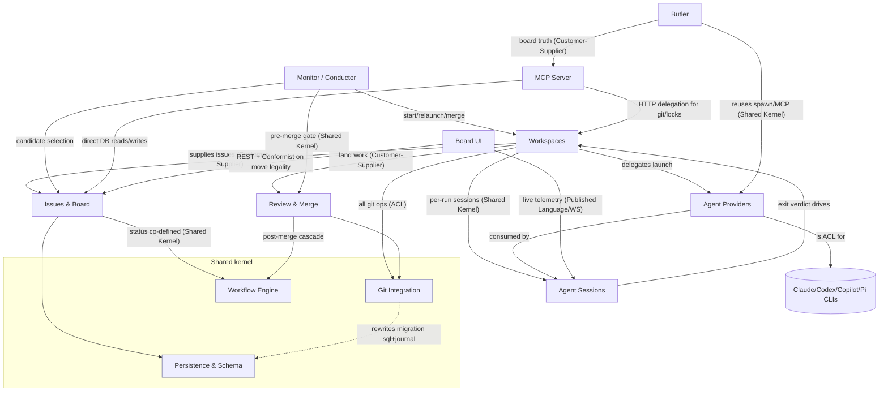

# agentic-kanban — Domain & Business Documentation

A local-first, single-user **kanban board for AI-driven coding work**. The product's
core idea: a *ticket* is a unit of coding work; a *workspace* binds that ticket to an
isolated git worktree and a launched AI coding agent (Claude/Codex/Copilot/Pi); the
agent's branch is reviewed, then merged into the default branch — at which point the
ticket is *delivered*. A control plane (Monitor/Conductor) can drive this loop with no
human in it. Everything is reverse-engineered from code here; each doc carries
`file:line` evidence and flags inferences it could not verify.

These docs are **capability modules**, not packages. The TS monorepo's packages
(`server`, `client`, `shared`, `mcp-server`) each host several capabilities; the
metrics' package-level clusters were sub-divided into the 12 contexts below.

## Start here (system entry points)
| Entry point | Kind | Leads to | `file:line` |
|---|---|---|---|
| Create workspace (provision worktree + launch agent) | REST | [workspaces](workspaces.md) | `packages/server/src/routes/workspaces.ts:188` |
| Issue CRUD / move / board read | REST | [issues-board](issues-board.md) | `packages/server/src/routes/issues.ts:64`, `routes/projects.ts:289` |
| MCP tool surface (how an agent drives the board) | stdio | [mcp-server](mcp-server.md) | `packages/mcp-server/src/index.ts:216` |
| The board UI route (hottest file, 718 commits) | UI | [board-ui](board-ui.md) | `packages/client/src/routes/BoardPage.tsx:92` |
| Monitor cycle (the no-human driver) | scheduled | [monitor-orchestration](monitor-orchestration.md) | `packages/server/src/startup/monitor-setup.ts:178` |
| Auto-merge tick (land delivered work) | scheduled | [review-merge](review-merge.md) | `packages/server/src/startup/auto-merge-orchestrator.ts:339` |
| Butler chat (talk to the board) | REST/UI | [butler](butler.md) | `packages/server/src/routes/butler.ts:193` |

## Bounded contexts (modules)
| Module | Capability | Files | Structure | Doc |
|---|---|---|---|---|
| Issues & Board | Kanban core: tickets, projects, configurable statuses/columns, tags, dependency edges, board read model | 19 | well | [issues-board](issues-board.md) |
| Workspaces & Worktrees | The atomic unit of agent work: worktree + branch + agent run → merge/close | 12 | well | [workspaces](workspaces.md) |
| Agent Providers | Anti-corruption seam over 4 heterogeneous AI coding CLIs | 13 | well | [agent-providers](agent-providers.md) |
| Agent Sessions & Streaming | Capture/stream/classify a running agent's output; the feedback channel | 15 | well | [agent-sessions](agent-sessions.md) |
| Workflow Engine | Per-project work lifecycle as a data-driven graph (nodes/edges/conditions/fork-join) | 15 | well | [workflow-engine](workflow-engine.md) |
| Monitor / Conductor / Autopilot | The no-human control plane; Start-Mode gate + cycle | 14 | **scattered** | [monitor-orchestration](monitor-orchestration.md) |
| Review & Merge | Landing work on the default branch; reconcilers keep DB honest with git | 15 | **scattered** | [review-merge](review-merge.md) |
| Butler | Warm per-project conversational assistant (Agent SDK) | 14 | well | [butler](butler.md) |
| Git Integration | The single sanctioned git seam over one spawn adapter | 18 | well | [git-integration](git-integration.md) |
| MCP Server | Agent-facing MCP tool surface (hybrid: direct DB + HTTP delegation) | 13 | well | [mcp-server](mcp-server.md) |
| Persistence & Schema | The shared data kernel; schema as Published Language | 11 | well | [persistence-schema](persistence-schema.md) |
| Board UI | React board: optimistic mutations + live-event reconciliation | 13 | well | [board-ui](board-ui.md) |

## Context map

## Cross-context relationships
| From | To | Relationship | Integration pattern | Evidence |
|---|---|---|---|---|
| Issues & Board | Workflow Engine | Status co-defined; board column derives from workspace's current workflow node | Shared Kernel / Customer-Supplier | `board-status.ts`, `syncCurrentNodeToStatus` |
| Workspaces | Agent Providers | Workspace asks provider for a neutral launch recipe | Customer-Supplier | `buildAgentLaunchConfig` |
| Workspaces | Agent Sessions | Each run is a session; activity-state reads latest session; DELETE cascades | Shared Kernel | `workspace-activity-state.ts` |
| Workspaces / Review-Merge | Git Integration | All git through one adapter; packages never spawn git | Anti-Corruption Layer / Conformist | `shared/lib/git-exec.ts` |
| Agent Providers | external CLIs | Translates neutral options → each CLI's command/flags/env; normalizes stdout | Anti-Corruption Layer | `agent-provider/registry.ts` |
| Agent Sessions | Workspaces | Exit classification verdict drives workspace next-state + monitor | Customer-Supplier | `session-exit-state-machine.ts` |
| Review-Merge | Workflow Engine | "merged" event triggers status sync + post-merge dependency cascade | Customer-Supplier | `exit-workflow.ts`, `syncCurrentNodeToStatus` |
| Monitor | Review-Merge | Manual review enforced as a pre-merge gate before landing | Shared Kernel | `auto-merge-orchestrator.ts` |
| Monitor | Preferences | All behavior pref-driven; Strategy-Bullseye tunables are the contract | Conformist / Published Language | `resolveMonitorTunables` |
| Butler | MCP Server | Butler treats MCP tools as authoritative board truth (must not scrape) | Customer-Supplier | `routes/butler.ts` |
| MCP Server | Issues & Board | Same `kanban.db`, direct Drizzle reads/writes | Shared database | `mcp-server/src/index.ts` |
| MCP Server | Workspaces | Anything touching git/sessions/locks delegated to REST over HTTP | Customer-Supplier | `tools/merge-workspace.ts` |
| All | Persistence & Schema | Drizzle row types are the internal domain language | Published Language | `shared/src/schema/index.ts` |
| Git Integration | Persistence & Schema | Rewrites the migration `.sql` + `_journal.json` that ARE the schema's on-disk form | (hard file coupling) | `migration-renumber.ts` |

## DDD assessment
- **The package boundaries are NOT the bounded contexts.** `server` alone holds at
  least 7 contexts (issues, workspaces, providers, sessions, monitor, review-merge,
  butler). Modularity is high *within* packages but the metric's clusters track
  packages, so the capability seams here are an inference, not a folder.
- **Genuinely clean contexts:** Agent Providers (a textbook ACL over external CLIs),
  Git Integration (a single-spawn-site seam, gate-enforced), Workflow Engine (data-as-
  graph behind a barrel). These have real, defended boundaries.
- **The two scattered contexts are the real DDD smell.** *Monitor/Conductor* and
  *Review/Merge* are each split across `services/` + `startup/*reconciler.ts` with
  behavior held together by **co-change, not imports** (the metrics show 149 hidden
  dependencies, 77% of all co-change). Their File Topology sections exist because the
  folder layout actively hides the capability. The reconcilers are a tell: they exist
  to repair DB-vs-git status drift that a single owning aggregate would never let
  happen — the "Done means code on master" invariant is enforced *after the fact* by a
  scanner instead of *by construction*.
- **Term collisions across contexts = boundary smells** (see glossary): **WIP** means
  two unrelated things (UI column load vs monitor agent throttle); **Drive** means both
  a one-switch pref and a DB record of an epic run; **Mode** has three vocabularies
  (`merge_strategy` vs `ReconcileStrategy` vs Start Mode). Each is a place where one
  word spans contexts that should each name their own concept.
- **Schema-as-shared-kernel is deliberate and healthy** (Published Language) but means
  every context is coupled to one data vocabulary — the `cascade-delete.ts` hand-rolled
  FK walk is the cost: it re-encodes the FK graph in code and can silently drift.

## Cross-cutting concerns
- **Preferences / config** — referenced by nearly every context (provider defaults,
  monitor tunables, auto-merge flags, disabled MCP tools) but **not yet a documented
  module**. It is the most-coupled untyped surface in the system (flat key/value prefs);
  CLAUDE.md records repeated drift incidents (provider default fan-out, stale
  `default_model`). A future doc-run should add a `preferences-config` module.
- **Quality metrics / analytics, drive-obstacles, voice-capture, scheduled-runs,
  milestones, showdowns** — a long tail of ~40 additional services/repositories not in
  this core set. They are real but peripheral to the central loop; document on demand.
- **Error handling** (`server/src/errors`) — centralized typed-domain-error mapping;
  routes do not hand-roll try/catch + message matching.

> Coverage note: this run documented the **12 core-domain contexts** (≈170 files).
> The repo has 1685 files; the analytics/drive long tail is intentionally out of scope
> for this pass. Re-run the `domain-docs` skill with an expanded plan to cover it.
