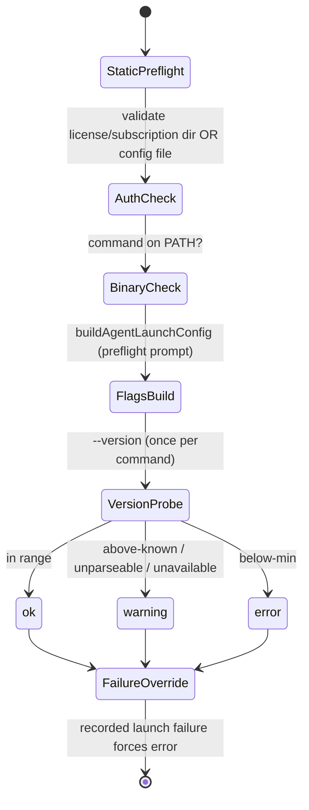

# Agent Providers (Claude / Codex / Copilot / Pi)

## Purpose & business capability

The board's whole reason to exist is that it dispatches coding work to autonomous AI
agents. But there is no single "AI agent" — there are four mutually-incompatible
third-party CLIs (Anthropic's `claude`, OpenAI's `codex`, GitHub's `copilot`, and
`pi`), each with its own invocation grammar, its own auth model, its own streaming
wire format, and its own breaking changes. This module is the **anti-corruption
layer** between the board's uniform notion of "launch an agent on this ticket" and
that messy external reality. It exists so that every other part of the server —
workspace launch, butler, auto-review, one-shot AI utilities, the monitor — can say
"build me a launch for provider X with profile Y and model Z" and "parse this stdout
line" without ever knowing a single provider-specific flag.

Concretely it owns four jobs: (1) **translate** a provider-neutral
`ProviderLaunchOptions` into a concrete `{command, args, env}` spawn config
(`buildLaunchConfig` per provider); (2) **normalize** every provider's stdout into one
`ParsedStreamEvent` model (`parseStreamEvent`); (3) **validate** that a chosen
provider+profile can actually launch — binary on PATH, auth present, CLI version
within a supported range — before a doomed agent burns a workspace
(`agent-profile-health.service.ts`, `agent-cli-version.service.ts`); and (4) **bootstrap
auth** for OAuth-style logins by popping a real terminal window
(`claude-login.service.ts`, `codex-login.service.ts`).

If this module vanished, the board could still track tickets but could not run a single
agent: there would be no way to spawn a CLI correctly, read its output, or tell the
user why a launch failed. It is the load-bearing seam where the product meets its
external tools.

## Ubiquitous language

| Term | Meaning *as used here* | Defined at |
|------|------------------------|------------|
| Provider | One supported AI coding CLI family. The closed set is the SSOT array `PROVIDER_NAMES`, and the registry must implement exactly it. | `agent-provider/types.ts:14` |
| ProviderName | Canonical internal id: `claude` / `codex` / `copilot` / `pi`. | `agent-provider/types.ts:15` |
| ProviderId | The *external/legacy* spelling used at API boundaries — note `claude-code` aliases to `claude`. | `agent-provider/types.ts:16` |
| Profile | A named auth/config selection for a provider (e.g. a Claude `settings_<name>.json`, a Codex license/config, a Copilot `agent:`/`model:` hint, a Pi `provider/model` string). `"default"` means the provider's own configured default. | `agent-provider/types.ts:41`, `helpers.ts:201` |
| Model | A tier/id passed via `--model` (`opus`/`sonnet`/`haiku` for Claude, `gpt-*` for Codex). Provider-agnostic preference, so it can be mis-targeted. | `provider-models.ts:14`, `:24` |
| AgentLaunchConfig | The provider-neutral spawn recipe: `command`, `args`, `useShell`, `env`, plus stdin-handling hints. The module's primary output. | `agent-provider/types.ts:18` |
| One-shot text mode (`oneShotText`) | A non-interactive, non-streaming launch for internal AI utility calls (issue enhancement, voice capture, stack detection) that only need the model's final plain-text answer. | `agent-provider/types.ts:59` |
| Plan mode (`planMode`) | A read-only "produce an implementation plan, change nothing" launch. Each provider enforces it differently (flag vs prompt-prefix vs denied tools). | `claude-provider.ts:113`, `codex-provider.ts:73`, `copilot-provider.ts:90` |
| Provider session id | The CLI's own resume handle (Claude `--resume`, Codex `resume`, Pi `--session`); stored in the legacy `sessions.claudeSessionId` column for all providers. | `agent-provider/types.ts:36`, server CLAUDE.md "Session resume chain" |
| Preflight | A pre-launch verdict (`ok`/`warning`/`error`) over a (provider, profile): auth present? binary on PATH? flags buildable? version in range? | `agent-profile-health.service.ts:187` |
| License ring / subscription ring | A rotation set of OAuth credential *directories* (Codex `CODEX_HOME`, Claude `CLAUDE_CONFIG_DIR`) — auth is a directory with `auth.json`/`.credentials.json`, not just an env var. | `agent-profile-health.service.ts:203`, `:207` |
| Custom endpoint profile | A Claude profile whose `settings.json` sets `ANTHROPIC_BASE_URL` (e.g. z.ai/glm) — routes to a non-Anthropic endpoint, so `--model` must be suppressed. | `helpers.ts:132` |

## Domain model & invariants

The module owns no persisted entity of its own; it owns the *contract* (`AgentProvider`
interface) and a set of policies reverse-engineered below. Each row is a business rule
plus its inferred reason.

| Invariant / rule / policy | Why (business reason, inferred) | Enforced at |
|---------------------------|----------------------------------|-------------|
| The set of providers is a single frozen array; the registry must implement *exactly* it. | Adding a 5th provider must be a one-line change that cannot silently drift from the registry — a parity test asserts it. | `agent-provider/types.ts:14`, `registry.ts:28-31` |
| Unknown/legacy/untrusted provider strings narrow to `claude`, never throw. | A stored pref or request field is untrusted input; defaulting to the safe, always-present provider keeps a typo from crashing a launch. `claude-code` → `claude`. | `registry.ts:44-47` |
| Claude is the fixed default when no provider is named; the old mutable default + `setDefaultProvider()` was deleted as a vestigial footgun. | Selection is *always* explicit via `options.provider`; a mutable global "default" had no effect on real paths and could mislead callers. | `registry.ts:10-15` |
| Profile-owned Anthropic env vars are stripped from the spawn env before a profile is applied. | The server's own `ANTHROPIC_*` must never leak into an agent that should authenticate via its selected profile — prevents cross-profile credential bleed. | `helpers.ts:119-125`, `:148-150` |
| If a Claude profile defines `ANTHROPIC_AUTH_TOKEN` but no API key, delete `ANTHROPIC_API_KEY` from the env. | Token + key both present confuses the CLI; the profile's chosen auth must win cleanly. | `helpers.ts:161-163` |
| For a custom-endpoint Claude profile, omit `--model`. | A non-Anthropic endpoint (z.ai/glm) does not understand Claude model aliases; the profile's own `ANTHROPIC_MODEL` env decides the model — passing `--model opus` would break it. | `claude-provider.ts:101`, `helpers.ts:132-143` |
| A `default_model` id is dropped unless it belongs to the chosen provider's family. | The model pref is a single provider-agnostic value; a leftover `gpt-5.5` passed to `claude.exe` kills the launch in ~5s. Unknown/custom ids pass through (don't strip what we don't recognize). | `provider-models.ts:45-67` |
| Codex `exec` flags (`--json`, sandbox, `--profile`, `--model`) MUST precede the `resume` subcommand. | `codex exec resume` rejects those flags after `resume` and exits code 2; ordering is load-bearing, not cosmetic. | `codex-provider.ts:77-93` |
| Pi launch must never pass `--approve`. | Pi 0.73.1 hard-rejects it; this is the canonical "unversioned CLI contract" breakage and the documented verified-good floor. | `agent-cli-version.service.ts:45-47`, server CLAUDE.md |
| Plan mode is enforced per-provider by the strongest available mechanism. | A "plan only, change nothing" run must be guaranteed: Claude uses `--permission-mode plan`, Codex a read-only sandbox + prompt prefix + machine-readable plan markers, Copilot `--plan` + an explicit `--deny-tool` list, Pi a prompt prefix. | `claude-provider.ts:113-116`, `codex-provider.ts:73,94`, `copilot-provider.ts:90-96`, `pi-provider.ts:86-99` |
| The plan output is wrapped in `===PLAN BEGIN===`/`===PLAN END===` markers for non-Claude providers. | Providers lacking native plan-permission must emit a parseable plan block; the markers are the agreed extraction contract consumed downstream (plan-mode reconciler). | `types.ts:4-5`, `helpers.ts:25-36` |
| A below-minimum CLI version is a hard error; newer-than-known / unparseable / unavailable is a non-blocking warning. | A wholesale rename/major-bump is the real failure mode to catch loudly; a probe failure must never block an otherwise-healthy launch. | `agent-profile-health.service.ts:307-329`, `agent-cli-version.service.ts:181-201` |
| The `--version` probe runs once per distinct (provider, command) pair, cached across profiles. | Many profiles share one binary; spawning `--version` N times is waste. | `agent-profile-health.service.ts:417-432` |
| A recorded launch *failure* forces a profile's health to `error` even if the static preflight is `ok`. | A profile that passed checks but crashed at launch is empirically broken; the last real failure overrides the optimistic static verdict. | `agent-profile-health.service.ts:453` |
| Error messages and flag values are sanitized (keys/tokens redacted) before storage/display. | Preflight surfaces flags and failures in the UI; secrets must never be persisted to a preference or shown. | `agent-profile-health.service.ts:114-129`, `:158-185` |
| OAuth login spawns a REAL, visible terminal window (`windowsHide:false`). | The OAuth callback server needs a foreground process; a hidden/background spawn tears the callback down and cancels login. | `claude-login.service.ts:20-31`, `codex-login.service.ts:19-29` |
| A VALID-JSON-but-unrecognized stream line is logged loudly via `parseStreamEventObserved`. | A silent swallow caused the recurring "0 tokens" misdiagnosis (#898); a CLI wire-format rename must surface, not drop events. | `types.ts:90-96` |
| `provider-exit-behavior` is deliberately NOT re-exported from the barrel. | It transitively pulls the DB/`node:fs` layer; barrel re-export would drag that graph into client-reachable consumers and break node:fs-mocking tests. | `agent-provider/index.ts:9-15` |

## Key workflows / use cases

### 1. Build a launch (the core flow)

Trigger: `agent.service.ts` is asked to start/resume a session.
`buildAgentLaunchConfig(options)` dispatches via `getProvider(options.provider)` to the
matching adapter's `buildLaunchConfig`, which returns an `AgentLaunchConfig`. The
service then spawns `command` with `args`/`env` and feeds the prompt per the stdin
hints (`agent.service.ts:440-534`).

```mermaid
sequenceDiagram
    participant Caller as agent.service.ts
    participant Reg as registry.getProvider
    participant P as <Provider>.buildLaunchConfig
    Caller->>Reg: buildAgentLaunchConfig(options)
    Reg->>P: dispatch by ProviderName
    P-->>Caller: {command, args, env, keepStdinOpen?, suppressStdinPrompt?, promptPrefix?}
    Note over Caller: suppressStdinPrompt → prompt is in argv (Copilot/Pi); stdin "ignore"
    Note over Caller: promptPrefix → prepended to stdin prompt (Codex plan/system instructions)
    Caller->>Caller: spawn(command, args, {env, shell:useShell, detached})
    Caller->>P: parseStreamEventObserved(line)  (per stdout line)
```

The three stdin hints encode each provider's prompt-delivery quirk: Claude reads the
prompt from stdin after `-p` (`keepStdinOpen` for multi-turn mock); Copilot and Pi take
the prompt in argv (`-p <prompt>`, so `suppressStdinPrompt`); Codex has no
system-prompt flag, so system instructions / plan instructions ride in via
`promptPrefix` prepended to the stdin prompt
(`types.ts:24-31`, consumed at `agent.service.ts:458-459`).

### 2. One-shot text utility call

Trigger: an internal AI utility (issue enhancement, voice capture, stack detection)
needs only a final plain-text answer. `oneShotText` selects a non-streaming launch:
Claude `--output-format text -p`, Codex `exec` *without* `--json` then `-`. This is the
single source of truth that `invokeClaudePrompt` used to reimplement outside the
abstraction — routing it through the adapter is what fixed Claude's text flags being
sent to `codex`, which rejects them (`types.ts:59-68`, `claude-provider.ts:49-69`,
`codex-provider.ts:31-55`).

### 3. Preflight a profile (Settings health dashboard)

Trigger: Settings opens / a profile is selected. `listAgentProfileHealth` enumerates
every (provider, profile) candidate, runs the synchronous `preflightAgentProfile`
(auth/config existence + binary-on-PATH + buildable flags), then folds in an async
`--version` probe, and finally overrides status to `error` if a real launch failure was
recorded (`agent-profile-health.service.ts:368-458`).



### 4. OAuth login bootstrap

Trigger: user picks a Codex license / Claude subscription that has no `auth.json` /
`.credentials.json`. The service creates the credential dir and pops a visible terminal
running `codex login` / `claude /login` with the right `CODEX_HOME` / `CLAUDE_CONFIG_DIR`
env, returning the equivalent manual command for a UI copy-button. Fire-and-forget;
launch failure is non-fatal because the manual command always works
(`codex-login.service.ts:15-39`, `claude-login.service.ts:16-40`).

## Entry points

| Entry point | Kind | What it lets a caller do | `file:line` |
|-------------|------|--------------------------|-------------|
| `buildAgentLaunchConfig(options)` | function (fan-in from agent.service, butler, review, preflight) | Get a ready-to-spawn config for any provider from neutral options | `registry.ts:33` |
| `getProvider(name?)` | function | Resolve a provider adapter (for `parseStreamEvent`/`profilePrefKey`) | `registry.ts:21` |
| `narrowProviderName(value)` | function | Coerce any untrusted string to a canonical `ProviderName` | `registry.ts:44` |
| `getProfilePrefKey(provider)` | function | Map a provider to its profile-pref key (`codex_profile`, …) | `registry.ts:54` |
| `listAgentProfileHealth(db, lists)` | service (Settings API) | Compute the health dashboard for all profiles | `agent-profile-health.service.ts:368` |
| `preflightAgentProfile / augmentPreflightWithVersion` | functions | Validate one profile (sync) and fold the version verdict (async) | `:187`, `:340` |
| `detectCliVersion(provider, command)` | service | Probe & range-check a CLI version | `agent-cli-version.service.ts:140` |
| `spawnClaudeLogin / spawnCodexLogin(dir)` | service (login API) | Open a real terminal for OAuth login | `claude-login.service.ts:16`, `codex-login.service.ts:15` |
| barrel `agent-provider/index.ts` (re-exported by legacy `agent-provider.ts`) | module | Stable import surface for all consumers | `index.ts:1-8`, `agent-provider.ts:2` |

## Logic-bearing code (where the real decisions live)

| File / function | What decision/logic it holds | `file:line` |
|-----------------|------------------------------|-------------|
| `agent-provider/types.ts` | The provider CONTRACT (`AgentProvider`, `ProviderLaunchOptions`, `AgentLaunchConfig`) + the `PROVIDER_NAMES` SSOT. Blast radius is high because every consumer types against it. | `types.ts:14,18,34,73` |
| `agent-provider/claude-provider.ts::buildLaunchConfig` | The richest adapter: mock vs real, one-shot text, MCP config wiring, profile `--settings`, custom-endpoint model suppression, resume, plan mode, Windows `where claude.exe` resolution. | `claude-provider.ts:17-128` |
| `agent-provider/helpers.ts` | The shared toolbox: env construction (`buildSpawnEnv`), custom-endpoint detection, quote-aware `splitArgs`, Copilot profile/text mapping, and the Windows binary resolvers for codex/copilot/pi. Three external fan-ins. | `helpers.ts:75-336` |
| `agent-provider/codex-provider.ts` | The exec-flag-ordering rule (flags before `resume`), sandbox-by-plan-mode, `promptPrefix` for system/plan instructions (no system-prompt flag), Windows direct-`node` resolution. | `codex-provider.ts:64-114` |
| `agent-cli-version.service.ts` | The supported-version policy table and the verdict semantics (`below-min`=error, `above-known`=warning). The defense against unversioned CLI contracts. | `agent-cli-version.service.ts:41-48,140-202` |
| `agent-profile-health.service.ts` | Auth-validation policy (license-ring dir vs config file), Pi-specific auth/dir rules, secret sanitization, and the failure-override on health status. | `agent-profile-health.service.ts:187-298,453` |
| `provider-models.ts::modelBelongsToProvider` | The cross-provider model-mismatch guard that prevents a stale `gpt-*` from killing a Claude launch. | `provider-models.ts:45-67` |

## Dependencies & bounded-context relationships

**Upstream (what this needs):**
- `preferences-config` — Conformist. The module reads provider/profile/model selections
  out of a `prefMap` (`provider`, `claude_profile`, `codex_profile`, `pi_profile`,
  `copilot_profile`, `codex_license_ring`, `claude_subscription_ring`); it conforms to
  whatever the preference layer stores and is the place that *owns* the provider→pref-key
  mapping (`getProfilePrefKey`, each adapter's `profilePrefKey`).
  `agent-profile-health.service.ts:80-100,203-208`.
- `agent-settings.service.ts` (`resolveAgentSettings`, `toExecutorProvider`) — turns the
  pref map into the `agentCommand`/`agentArgs`/profile used to build the launch.
- Shared kernel: `@agentic-kanban/shared/lib/agent-stream-parser` (the per-provider
  stream parsers the adapters delegate to) and `provider-models.ts`.

**Downstream (what needs this):**
- `agent-sessions` (`agent.service.ts`, `session-manager/*`) — Customer-Supplier; the
  primary consumer. It calls `buildAgentLaunchConfig`, spawns the process, and obeys the
  stdin hints (`agent.service.ts:440-534`).
- The butler (`butler-sdk.service.ts`), auto/manual review (`review.service.ts`),
  effective-config, project-runtime-config, strategy-objective, and the
  plan-mode reconciler — all fan in through the barrel.

**Integration style:** this module IS the **Anti-Corruption Layer** for four external
CLI "bounded contexts". The published language toward the rest of the server is
`ProviderLaunchOptions` in / `AgentLaunchConfig` + `ParsedStreamEvent` out.

**Hidden coupling (co-change, not import):** the launch *flags* here are silently
coupled to the *parsers* in `shared/lib/agent-stream` and to each CLI's actual wire
format — there is no compile-time link, which is exactly why `agent-cli-version.service`
and `parseStreamEventObserved` exist as runtime tripwires.

## File topology

Structure is well-formed (the C9 bounded context), so only a brief map:

| Sub-responsibility | Implemented in | Layer |
|--------------------|----------------|-------|
| Contract + SSOT provider set | `agent-provider/types.ts` | service (types) |
| Selection / dispatch / coercion | `agent-provider/registry.ts` | service |
| Shared spawn helpers, env, Windows resolvers, MCP config | `agent-provider/helpers.ts` | service |
| Per-provider launch + parse adapters | `agent-provider/{claude,codex,copilot,pi}-provider.ts` | service |
| Stable public barrel | `agent-provider/index.ts` + legacy `agent-provider.ts` | service |
| CLI version probe & range policy | `agent-cli-version.service.ts` | service |
| Profile preflight / health dashboard | `agent-profile-health.service.ts` | service |
| OAuth login bootstrap | `{claude,codex}-login.service.ts` | service |
| Model option lists + mismatch guard | `shared/src/lib/provider-models.ts` | shared (pure) |

## Risks, gaps & open questions

- **Unversioned external contracts (the headline risk).** Every launch flag is an
  unversioned dependency on a third-party CLI that ships breaking changes
  (`agent-cli-version.service.ts:7-20`). The version table's `maxKnown` is `null` for
  all four providers (`:42-47`), so the "above-known" warning path is currently
  unreachable — only `below-min` errors and unparseable/unavailable warnings fire.
  *Inferred, unverified:* this means a future major bump that keeps the same minSupported
  floor will pass preflight silently until a launch fails.
- **Model pref is provider-agnostic by design.** `modelBelongsToProvider` is a guard, not
  a fix — the real cross-provider drift (a single `default_model` shared across providers)
  is documented as a known design wart in the project's CLAUDE.md and tracked on the board.
- **`mock-agent` `--profile multi-turn`/`--resume` flags** appear in every adapter's mock
  branch (e.g. `claude-provider.ts:74-82`). These are the test-double's contract, not a
  real CLI's; they are documented here only so a maintainer doesn't mistake them for real
  provider flags.
- **Provider session id stored in `claudeSessionId` for ALL providers** (`types.ts:36`,
  server CLAUDE.md). A deliberate cross-provider overloading of a legacy column — correct
  per the documented decision, but a naming trap for newcomers.
- **Pi auth env list breadth** (`PI_API_KEY_ENV_KEYS`, `agent-profile-health.service.ts:53-61`)
  is a heuristic — presence of any one key is treated as "auth configured", which can pass
  preflight even if the key is for a provider Pi isn't routing to. *Inferred, unverified.*
- **Copilot has no `--model` validation** (`provider-models.ts:65-66`) because it has no
  model flag in the launch path; model selection for Copilot rides entirely in the
  `model:`/`agent:` profile string via `mapCopilotProfile` (`helpers.ts:201-214`).
