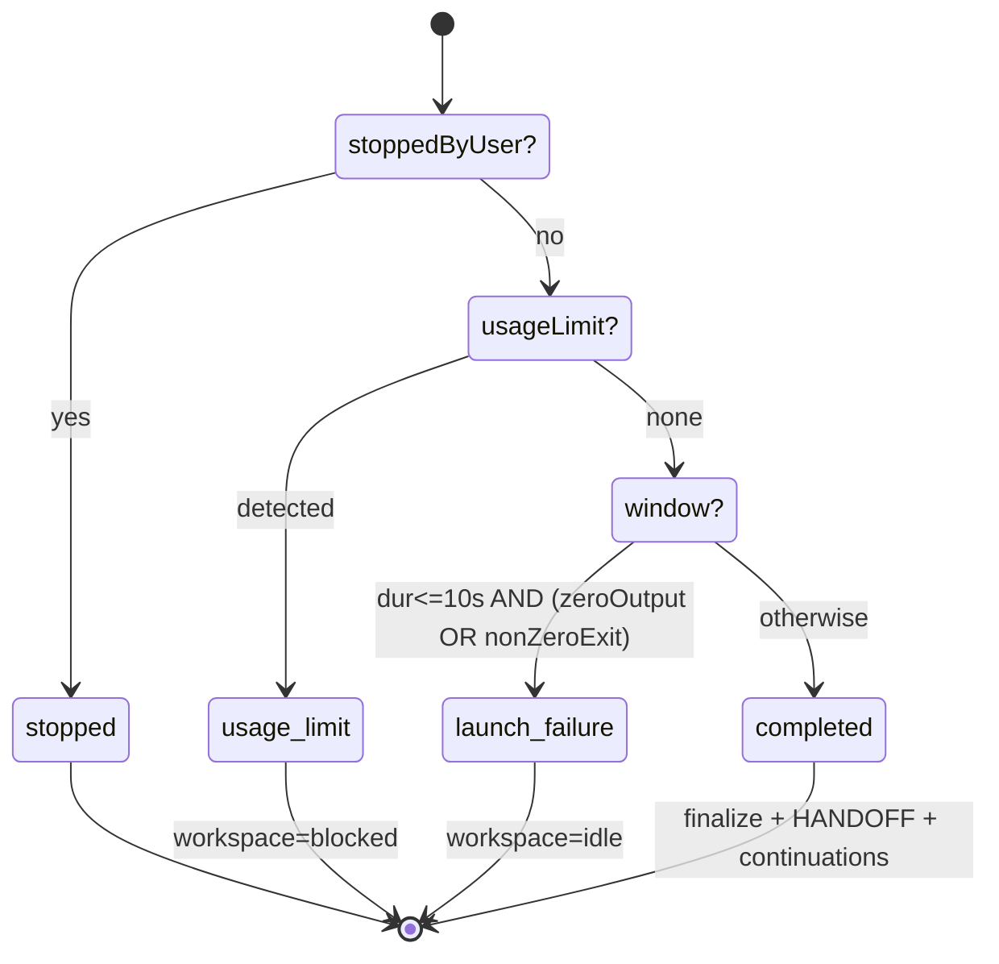

# Agent Sessions & Streaming

## Purpose & business capability

A **session** is the unit of "an agent actually ran." When the board launches a coding agent against a workspace, that subprocess produces a stream of provider-specific JSON over its lifetime; this module is the entire apparatus that turns that opaque stream into a first-class domain object the rest of the product can observe, persist, and reason about.

It answers four product questions that nothing else in the system can:
1. **What is the agent doing right now?** — live tool activity, todos, model, token/context usage, streamed to the UI over WebSocket (`broadcast.ts`, `board-events.ts`).
2. **How did the run end?** — the exit classification policy: did it really do work, did it crash on launch, did it hit a usage limit, did the user stop it (`session-exit-state-machine.ts`). This verdict drives the *workspace's* next state (idle / blocked / completed) and the whole autonomous monitor loop.
3. **What did it do?** — a durable transcript (`.out` file + `session_messages`) and a parsed, structured summary of files touched, commands run, errors, and friction (`session-summary.ts`, `session-output.ts`).
4. **What did it cost / how much friction?** — cost/token/turn stats and friction metrics persisted on the session row for the Insights rollups (`broadcast.ts`, `session.repository.ts`).

If this module vanished, the board would still be able to *spawn* agents (that is `agent-providers`/`agent.service`), but it would be blind: no live progress, no transcript, no way to tell a successful run from a failed launch, and therefore no autonomous orchestration (the monitor/Conductor decide what to do next purely from session-exit verdicts and stats). It is the **feedback channel** of the whole agentic system.

The most load-bearing single decision in the module is the **launch-failure classification** — the codification of the board's hard-won "a ~1s, zero-token session means the agent failed to launch, not that it finished instantly" rule (see Domain model).

## Ubiquitous language

| Term | Meaning *as used here* | Defined at |
|------|------------------------|------------|
| Session | One agent subprocess run against a workspace; a DB row with status/stats/exitCode + a message stream. | `session-lifecycle.ts:173`, `session.repository.ts` |
| Executor | The launched provider id as a *string* (`"claude-code"`, `"codex"`, `"copilot"`, `"pi"`) — the legacy persisted form; distinct from the narrowed `ProviderName`. | `session-lifecycle.ts:271`, `session-lifecycle.ts:705` |
| Provider session id | The *provider's own* resume token (Claude `session_id`, Pi `session` header), stored in `sessions.providerSessionId`. Provider-local — never passed across providers. | `session-lifecycle.ts:275`, `broadcast.ts:134` |
| Substantive output | The flag distinguishing a real run from a dead launch: true iff the agent emitted assistant text, tool activity, stats, or a turn-complete — NOT mere transport/keepalive/error noise. | `broadcast.ts:107` (`isSubstantiveEvent`), `session-lifecycle.ts:691` |
| Launch failure | A fast exit (≤10s) with either zero substantive output OR a non-zero exit code + error text — treated as "never really started," not as completed work. | `session-exit-state-machine.ts:96` |
| Usage limit | A provider quota hit (Codex usage-limit / Claude subscription reset) detected in the exit output; routes the workspace to `blocked` for credential rotation. | `session-exit-state-machine.ts:91`, `session-lifecycle.ts:705` |
| Exit route / phase | The pure verdict of the exit classifier: `stopped` \| `usage-limit` \| `launch-failure` \| `completed`, highest-priority first. | `session-exit-state-machine.ts:58` |
| Turn state | Multi-turn liveness of a session: `processing` (agent working) vs `waiting` (ready for a follow-up turn). | `types.ts:60`, `broadcast.ts:146` |
| Plan mode | A read-only "produce a plan first" run; on exit its plan is extracted from the raw buffer and either auto-continued or parked for approval. | `session-lifecycle.ts:576`, `session-lifecycle.ts:595` |
| Friction stats | Compact, fleet-aggregatable failure signal (tool fail-rate, repeated commands, error count) folded into `sessions.stats`. | `session-summary.ts:814`, `broadcast.ts:23` |
| Display event | A UI-facing, provider-normalized render instruction (init/assistant/tool_use/result/raw…) produced by the parser facade. | `agent-stream-parser.ts:10`, `agent-output-parser.ts:13` |
| Board event | A typed project-scoped change reason (`session_completed`, `workspace_idle`, …) broadcast to refresh every board view. | `board-events.ts:38` |
| Reattach | Restoring in-memory session state for a detached agent that survived a server hot-reload. | `session-lifecycle.ts:887` |

## Domain model & invariants

The module owns the **session** entity (rows in `sessions`), its **message stream** (`session_messages` + the on-disk `.out` file), and the *transient* in-memory state of every live session (`SessionState`, `types.ts:56`). Its rules are the reverse-engineered policy of "what counts as a real run and what happens when one ends."

| Invariant / rule / policy | Why (business reason, inferred) | Enforced at |
|---------------------------|----------------------------------|-------------|
| **Exit is classified by a strict priority: stopped → usage-limit → launch-failure → completed.** | Ordering is the policy. A user stop must never be reported as a crash; a quota hit must be recognized *before* the generic fast-exit window swallows it as a plain failure. Reordering silently corrupts every downstream decision. | `session-exit-state-machine.ts:88` |
| **A run that exits within 10s with no substantive output is a launch failure, not a completed run.** | The board's signature false-positive: a detached agent that dies on launch (bad cwd, mid-rebase worktree, auth error) looks like a "1s, 0-token success." Classifying it as failure marks the workspace `idle` (retryable) instead of `completed`. | `session-exit-state-machine.ts:25` (`ZERO_OUTPUT_LAUNCH_FAILURE_WINDOW_MS`), `:96` |
| **A fast (≤10s) *non-zero* exit with error text is also a launch failure**, even if some text was produced. | A model/auth error that prints a message then dies in 2s is still "never started real work" — distinguished from a zero-output crash only so the failure summary can quote the error. | `session-exit-state-machine.ts:98` |
| **Output must be drained to EOF before classification** (the context is built *after* drain). | The watcher polls every 500ms; an agent that writes output then crashes within one interval would fire `exit` before its tail is read, misclassifying a real run as zero-output. The pure classifier assumes `hadSubstantiveOutput` is already final. | `session-exit-state-machine.ts:30` (doc), server `CLAUDE.md` "Exit-before-output drain (#909)" |
| **Exit is idempotent — handled exactly once per session.** | Live `exit` event and the reattach PID-poll can both fire; double-finalize would double-write stats and double-fire workflow callbacks (re-launching the next ticket twice). | `session-lifecycle.ts:737` (`sessionExitHandled`), `:905` |
| **User-stopped sessions skip DB finalization** (`stopSession` already wrote `"stopped"`). | The stop verdict is authoritative; the exit handler must not overwrite it with a failure/completion status. | `session-lifecycle.ts:680`, `:718` |
| **A plan-mode run ALWAYS clears `planMode` on exit and lands in a visible state.** | The #924 strand: a plan run that left `planMode` stuck true made every follow-up turn re-run read-only forever. Three outcomes (plan→PLAN.md+continue/park, or no-plan→blocked) all clear it. | `session-lifecycle.ts:576`, `:595` |
| **Plan text is the strict `===PLAN BEGIN/END===` marker block scanned from the RAW buffer** (a non-zero exit invalidates it). | Provider-agnostic and immune to which parser field got populated (Codex's final message slipped past `sessionFinalText`); marker-less chatter must never be auto-continued as a "plan," and a crashed run can't have produced a real plan. | `session-lifecycle.ts:690`, `:611` |
| **Usage-limit exits block the workspace; launch failures idle it; completed runs finalize + write HANDOFF.md.** | Each verdict maps to the workspace state that makes the autonomous loop do the right thing next (rotate credentials / retry / proceed). | `session-lifecycle.ts:454`, `:494`, `:521` |
| **A Codex *builder* session may not launch with the `gpt-5.3-codex-spark` model; absent model defaults to `gpt-5.5`.** | Spark has ~no quota and is hostile to git/test work; launching a builder on it wastes a whole cycle. Non-builder sessions only warn. | `session-lifecycle.ts:211` |
| **A workspace's stored model is dropped if it doesn't belong to the launch provider.** | A cross-provider id (e.g. `gpt-5.5` baked into a Claude workspace) passed as `--model` kills the launch in ~5s — the recurring stall (#698/#696). | `session-lifecycle.ts:205` |
| **Only one auto-resume after an ExitPlanMode denial per workspace.** | Prevents an infinite resume loop when the agent keeps denying its own plan exit. | `session-lifecycle.ts:544` |
| **stdout is persisted to the `.out` file, not `session_messages`; only exit/stderr rows hit the DB.** | stdout is high-frequency; writing every chunk to SQLite floods the DB. The file is the transcript of record; DB is the durable index for non-stdout events. | `broadcast.ts:315`, `session.repository.ts:9` |
| **DB message writes are batched (50 rows / 250ms) and flushed on exit.** | Bound write amplification while guaranteeing no message is lost when the session ends. | `broadcast.ts:79`, `:371` |
| **`session_messages` is durably PRUNED on a background schedule, separately from the in-memory buffer free.** A 6-hour interval (first run +30s) (a) deletes all `session_messages` for workspaces merged/closed > 3 days ago (`MERGED_WORKSPACE_RETENTION_DAYS`, batched 500/stmt) and (b) caps each still-active/overflow session at 2000 rows (`MAX_MESSAGES_PER_ACTIVE_SESSION`), deleting the oldest excess. | DB size must stay bounded as workspace history grows; for done workspaces the `.out` file on disk is the canonical record, so the DB rows are pure index and safe to drop. Distinct from the per-session in-memory buffer free (`ws-handler.ts:32`) — that reclaims RAM for one ended session; this reclaims persistent DB rows fleet-wide. | `session-message-pruner.service.ts:25` (`pruneOldSessionMessages`), `:57` (`capSessionMessages`), `:77` (`startSessionMessagePruner`); started from `server-start.ts:222` |
| **A valid-JSON event of an UNKNOWN type is counted + logged, never silently dropped.** | Silent swallow of a renamed provider event was the root cause of recurring "0 tokens" misdiagnoses (#898) — drift must surface loudly. | `agent-stream-parser.ts:90`, `broadcast.ts:345` |
| **Late WS subscribers replay the full in-memory message buffer on connect.** | A UI opening mid-run (or reconnecting) must see the whole transcript, not just messages after it attached. | `ws-handler.ts:16` |
| **The message buffer is freed only when the last subscriber leaves AND the session has exited.** | Keeps replay possible for reconnects during a live run; avoids leaking buffers for ended, unwatched sessions. | `ws-handler.ts:32` |
| **A FK-constraint failure on message insert is swallowed (not logged as error).** | The session was deleted by a racing workspace cleanup — an expected race, not a fault. | `broadcast.ts:92` |

## Key workflows / use cases

### 1. Launch → stream → exit (the core lifecycle)

```mermaid
sequenceDiagram
  participant WS as Workspace/Monitor
  participant SL as startSession
  participant AG as agent.service (provider)
  participant BC as broadcast()
  participant UI as WS subscribers
  participant DB as sessions / .out

  WS->>SL: startSession(opts)
  SL->>SL: resolve model/profile, preflight, HANDOFF.md inject
  SL->>DB: insert session (status=running, launch diagnostics)
  SL->>AG: launch(...) -> per-event callback
  loop each provider stdout chunk
    AG-->>BC: stdout message
    BC->>BC: parse JSONL -> ParsedStreamEvent (observed)
    BC->>BC: applyStreamEvent (mark substantive, live stats, todos, stats)
    BC-->>UI: send raw message
    BC->>DB: buffer non-stdout -> batched insert
  end
  AG-->>BC: exit (after drainNow to EOF)
  BC->>BC: finalize buffer, capture sessionFinalText, friction fallback
  AG-->>SL: handleExitEvent(exitCode)
  SL->>SL: teardown state, build SessionExitContext
  SL->>SL: classifySessionExit -> route
  alt stopped
    SL->>WS: onSessionExit (no DB write)
  else usage-limit
    SL->>DB: rate-limit stats; workspace=blocked
  else launch-failure
    SL->>DB: failure stats + stderr; workspace=idle
  else completed
    SL->>DB: completed; write HANDOFF.md; scorecard/metrics; plan/auto-resume
  end
```

- **Trigger:** `POST /api/workspaces`, monitor auto-start, follow-up turn, review, or plan-implement (all via `startSession`, `session-lifecycle.ts:173`).
- **Outcome:** a finalized session row + `onSessionExit` callback that lets `workspaces`/the monitor advance the board.
- **Failure handling:** a throw during `launch` records a profile launch-failure, cleans zombie state, marks the session stopped, and rethrows (`session-lifecycle.ts:758`).

### 2. Exit classification (the decision)



Pure function `classifySessionExit` (`session-exit-state-machine.ts:88`); side effects live entirely in the lifecycle's `finalize*Exit` handlers (`:432`, `:465`, `:514`). Provider-specific knowledge (which usage limit) is injected via `getProviderExitBehavior(...).detectUsageLimit(messages)` so the core stays provider-neutral.

### 3. Multi-turn conversation

`sendTurn` (`session-lifecycle.ts:813`) gates a follow-up on `turnState === "waiting"` AND a verified-alive process; a dead process returns `stale:true` so the caller can `--resume` into a fresh session. Turn state flips to `waiting` only when the provider emits `turnComplete` *and* stdin is still open (`broadcast.ts:146`).

### 4. Reattach after restart

On boot, surviving detached PIDs are reattached: `reattachSession` (`:887`) restores context/provider so broadcast + exit handling work; `notifyExternalExit` (`:904`) mirrors the exit path for a PID-poll-detected exit (idempotent via the same `sessionExitHandled` guard).

### 5. Read back a session (REST)

`GET /api/sessions/:id/output|stats|summary|search` (`sessions.ts`). `output` is ETag-cached; `summary` runs `parseSessionSummary` server-side (no LLM) over the `.out` file (DB fallback). `search` is LIKE-based transcript search joined up the issue→project→status chain.

## Entry points

| Entry point | Kind | What it lets a caller do | `file:line` |
|-------------|------|--------------------------|-------------|
| `startSession` | factory method (called by routes/monitor/butler) | Launch an agent, persist a session, wire streaming + exit. | `session-lifecycle.ts:173` |
| `stopSession` / `sendTurn` / `cleanupStaleSession` / `reattachSession` / `notifyExternalExit` | factory methods | Stop, follow-up, recover, and re-bind sessions. | `session-lifecycle.ts:782`, `:813`, `:854`, `:887`, `:904` |
| `wsRoute()` → `/ws/sessions/:sessionId` | WebSocket | Subscribe to one session's live message stream (with buffer replay). | `ws-handler.ts:43` |
| `createSessionsRoute` → `/api/sessions/*` | REST API | output / stats / summary / transcript search. | `sessions.ts:45` |
| `createBoardEvents` → `/ws/board/:projectId` | WebSocket / event hub | Project-wide live invalidation + activity/stats/todos/approval pushes. | `board-events.ts:129` |
| `handleOutput` (= `broadcast`) | in-process callback | Feed a provider event into the stream pipeline (also used by the detached-file watcher). | `index.ts:25`, `broadcast.ts:301` |

## Logic-bearing code (where the real decisions live)

| File / function | What decision/logic it holds | `file:line` |
|-----------------|------------------------------|-------------|
| `session-exit-state-machine.ts` — `classifySessionExit` | The exit-verdict policy: priority ordering, the 10s launch-failure window, zero-output vs non-zero-error split. The single most important rule in the module. | `session-exit-state-machine.ts:88` |
| `session-lifecycle.ts` — `handleExitEvent` + `finalize*Exit` | Builds the explicit `SessionExitContext`, dispatches to terminal handlers; owns ALL exit side effects (DB writes, workspace status, HANDOFF.md, plan/auto-resume, butler events). | `session-lifecycle.ts:673`, `:432`, `:465`, `:514` |
| `session-lifecycle.ts` — `startSession` preamble | The launch-safety policies: cross-provider model guard, Codex-spark refusal, OAuth license/subscription home redirection, skip-permissions resolution, HANDOFF injection, preflight. | `session-lifecycle.ts:173`–`:421` |
| `session-lifecycle.ts` — `finalizePlanModeExit` | The #924 plan-mode contract: always clear planMode, write PLAN.md or block, auto-continue per harness pref. | `session-lifecycle.ts:595` |
| `broadcast.ts` — `applyStreamEvent` + `broadcast` | The live pipeline: substantive-output detection, live-stats/todos/subagent accounting, DB batching, file-vs-DB persistence split, friction fallback. | `broadcast.ts:120`, `:301` |
| `session-summary.ts` — `parseSessionSummary` | Provider-agnostic transcript → structured summary (files read/edited/written, commands, tasks, errors, model, rate-limits) across Claude/Codex/Copilot formats. | `session-summary.ts:691` |
| `session-summary.ts` — `computeFrictionStats` | The friction metric definition (fail-rate denominator, repeated-command waste signal). | `session-summary.ts:827` |
| `agent-stream-parser.ts` — `parseAgentStreamLineObserved` / `classifyAgentStreamLine` | The drift-observability policy: distinguish noise / recognized / unknown-type and record unknowns loudly. | `agent-stream-parser.ts:68`, `:90` |
| `session.repository.ts` — `getSessionOutput` / `getSessionSummaryData` / `loadSessionMessageRowsWithFileFallback` | The file-first-DB-fallback transcript read contract shared by every consumer. | `session.repository.ts:300`, `:387`, `:33` |

## Dependencies & bounded-context relationships

**Upstream (this module consumes):**
- **`agent-providers`** — *Anti-Corruption Layer + Conformist.* `agent.service.launch` spawns the subprocess; per-provider stream parsers (`agent-stream/{claude,codex,copilot,pi}.ts`) translate each vendor's wire format into the neutral `ParsedStreamEvent`; `getProviderExitBehavior` supplies usage-limit detection and instruction injection. This module *conforms* to whatever JSON the providers emit but isolates that variety behind the parser facade so its own logic stays provider-neutral.
- **`workspaces`** — *Customer-Supplier (this module is supplier of verdicts).* Reads workspace fields (workingDir, model, branch, planMode) at launch; on exit drives workspace status (`blocked`/`idle`/`active`/`awaiting-plan-approval`) and fires `onSessionExit`, which `workspaces`/the monitor use to decide the next move. `handoff.service`, `workspace-scorecard`, `workspace-code-metrics`, `preflight-check`, `plan-mode.service` are workspace-side collaborators invoked on the completed path.
- **`db` / repositories** — the two repositories are pure Drizzle access (lint-enforced infra purity); the `.out` file reader is a node-only filesystem *adapter* deliberately kept out of repositories.

**Downstream (consumes this module):**
- **The board UI** — via the session WebSocket (live transcript), `board-events` (project refresh + activity/stats/todos), and the REST read endpoints.
- **Insights / standup / reviewer-fix / transcript-search** — read `sessions.stats` (incl. friction) and the parsed summary; these are why stats are persisted on the row rather than recomputed.
- **The autonomous monitor / Conductor** — consumes exit verdicts and stats to start/merge/unstick tickets.

**Shared kernel:** `shared/src/lib/{agent-stream-parser,session-output,session-summary}.ts` are imported by server, mcp-server, AND the client (the client's `agent-output-parser.ts` wraps the same `parseAgentStreamLine` to render display events) — one parsing implementation, no forks (the #888/#892 facade work).

**Hidden coupling worth flagging:** `board-events.ts` is wired via route factory options and the `SessionManagerOptions` callbacks (`onActivity`/`onLiveStats`/`onTodos`/`onSessionExit`, `types.ts:16`), not by direct import — so the session manager broadcasts board changes without importing the board-events module (dependency injection avoids a cycle). The Codex usage-limit fallback exists in *two* places (`broadcast.ts:41` via `detectCodexUsageLimitMessages` and the exit machine via `getProviderExitBehavior`) — intentional belt-and-suspenders, but a term/logic duplication to keep in sync.

## File topology

Well-formed; the `session-manager/` sub-package is cohesive. Brief map:

| Sub-responsibility | Implemented in | Layer |
|--------------------|----------------|-------|
| Compose the session manager (DI of state/ws/broadcast/lifecycle) | `session-manager/index.ts` | service |
| In-memory session state shape + options/contracts | `session-manager/types.ts` | service |
| Launch, stop, turn, recover, exit orchestration + side effects | `session-manager/session-lifecycle.ts` | service |
| Pure exit verdict | `session-manager/session-exit-state-machine.ts` | domain policy |
| Live event pipeline, persistence batching, friction | `session-manager/broadcast.ts` | service |
| WS subscribe/replay/unsubscribe for one session | `session-manager/ws-handler.ts` | transport |
| Project-wide live event hub | `services/board-events.ts` | service/transport |
| `.out` transcript file read (node adapter) | `lib/session-output-reader.ts` → `shared/lib/session-files` | infra adapter |
| Provider-agnostic stream parse facade | `shared/lib/agent-stream-parser.ts` | shared kernel |
| Display-output extraction (meaningful lines) | `shared/lib/session-output.ts` | shared kernel |
| Transcript → structured summary + friction | `shared/lib/session-summary.ts` | shared kernel |
| Persistence reads (DB-pure) | `repositories/session.repository.ts`, `session-lifecycle.repository.ts` | repository |
| REST read/search endpoints | `routes/sessions.ts` | route |
| Client-side stream → display events | `client/src/lib/agent-output-parser.ts` | client |

## Risks, gaps & open questions

- **`executor` vs `ProviderName` duality is a live trap.** The persisted executor string (`"claude-code"`) and the narrowed `ProviderName` (`"claude"`) coexist; several branches key on the raw string (`executor === "claude-code"`, `:355`) and others narrow it. `narrowProviderName(executor)` is used for usage-limit detection (`:705`). A new provider id or a rename to the executor string would need careful auditing of both forms. *(inferred risk, partially verified by the explicit comments at `:704`.)*
- **Stale-session cleanup resets the workspace to `idle` unconditionally** (`:879`). For a multi-turn session whose process merely got reaped, this is correct; but if a workspace had a more specific status, it is flattened to idle. *(inferred, unverified.)*
- **Two usage-limit detection paths** (`broadcast.ts` Codex fallback vs the exit-machine provider behavior) can drift in what they consider a usage limit. They write overlapping `stats` fields; the merge order (`mergeExistingStats`) determines the winner. Worth a single source of truth. *(inferred risk.)*
- **`getSessionStats` throws on invalid JSON** (`session.repository.ts:373`) while most other call sites swallow parse errors — an inconsistent contract that could surface a 500 on a corrupt stats blob.
- **Transcript search is `LIKE %q%` over `session_messages.data`** (`session.repository.ts:466`) — but stdout no longer lands in `session_messages` (it's in the `.out` file). So search only covers non-stdout rows + historical sessions; **the live transcript of recent sessions is effectively unsearchable.** This looks like an unintended consequence of the file-persistence move (#…); flagged as a likely gap. *(inferred, unverified — worth confirming against product intent.)* **A SECOND, compounding reason** search degrades: the background pruner (`session-message-pruner.service.ts`, see Domain model) hard-deletes `session_messages` for workspaces merged/closed > 3 days ago and caps active sessions at 2000 rows — so even the non-stdout rows it could match disappear for old workspaces. The `.out` file is the canonical transcript after that point, but `search` never reads it, so historical full-text search is doubly unreliable (stdout-not-in-DB × pruned).
- **The `.out` transcript file has no documented retention.** stdout (the canonical transcript once DB rows are pruned) lives at `os.tmpdir()/kanban-session-<id>.out` and is never explicitly deleted by the pruner — it relies on OS temp-dir cleanup, which is unpredictable per-host. So the "canonical record" can vanish (or pile up) outside the system's control. *(minor inferred risk.)*
- **`drainNow()` ordering is a fragile, comment-protected invariant** (server `CLAUDE.md` #909): nothing in *this* module's types enforces that the provider drains before emitting `exit`; the guarantee lives in `agent.service`. A refactor there silently reopens the "1s/0-token false launch-failure" misclassification.
- **`board-events.ts` enumerates `workspace_closed` in the union (`:52`) but the doc-comment table omits it** — minor doc drift in the event catalog.
