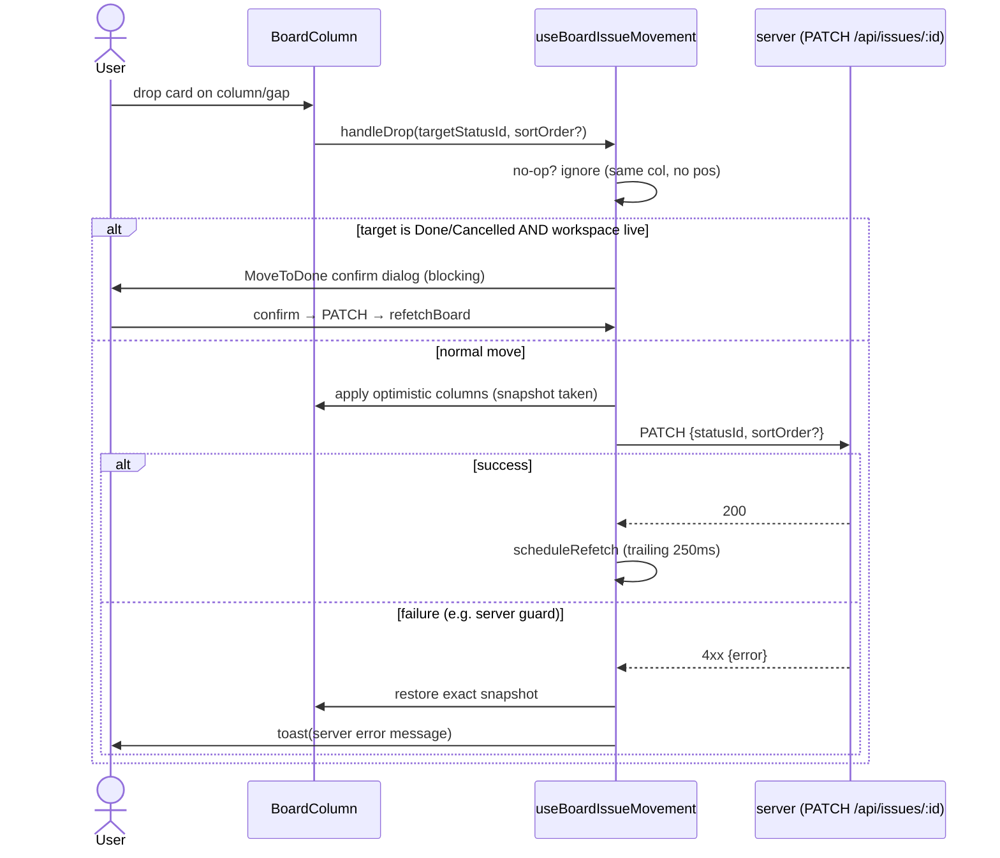
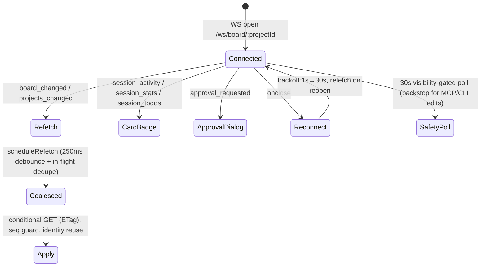

# Board UI (React client)

## Purpose & business capability
This module is the **product surface** of agentic-kanban: the screen a single human uses to watch and steer a fleet of AI coding agents. It renders the board (columns = workflow statuses, cards = tickets), lets the user move/create/edit/delete tickets by drag or keyboard, opens the issue-detail and workspace panels, and — critically for an agent-driven board — reflects **live agent activity** (which ticket an agent is working, token/tool stats, todos, approval requests) as it happens without a manual refresh.

The defining tension this module resolves: a board where **most state changes originate server-side** (agents merge branches, the monitor auto-starts work, MCP/CLI edits tickets) yet must *feel* directly manipulable. It does that with two halves working together — an **optimistic-mutation** layer (user actions apply instantly, then converge on the server) and a **live-event reconciliation** layer (server pushes drive a coalesced, identity-preserving refetch). If this module vanished, the server, agents, and MCP tools would all keep running, but the human would lose the only place to see what the agents are doing and to intervene (move a stuck ticket, approve a tool call, kick off a workspace).

**Is the client a thin view or does it duplicate server logic?** It is *mostly a thin, optimistic projection of server truth* with a deliberately small set of **client-local domain rules** that exist purely for UX latency and presentation: move legality is **not** authoritatively enforced here (the server is the gate — the client surfaces the server's rejection message, `useBoardIssueMovement.ts:157`), but a few real policies do live client-side: the **WIP-limit visual policy** (`wipLimits.ts`), the **sort-order gap arithmetic** for drag-drop positioning (`reorderIssues.ts:8`), the **MoveToDone confirm gate** and **dependency-impact preview** (`useBoardIssueMovement.ts:173,290`), and the **active/archive/backlog column partitioning** (`BoardPage.tsx:84,378`). These are duplicated *intent* (the server has its own rules) but serve the client's need to react before a round-trip.

## Ubiquitous language
| Term | Meaning *as used here* | Defined at |
|------|------------------------|------------|
| Column | A board lane bound to a **workflow status** (not a hardcoded stage); the same ticket set renders differently per project's configured workflow graph | `BoardColumn.tsx:296`, `useBoardDataController.ts:62` |
| Card | The visual unit for one ticket (`IssueWithStatus`); carries live session badges | `BoardColumnCard.tsx`, `IssueCard.tsx` |
| Archive columns | Statuses named `Done`/`Cancelled` — treated as **terminal**, collapsed into a separate group, and gated by a confirm dialog on entry | `BoardPage.tsx:84`, `useBoardIssueMovement.ts:14` |
| Backlog column | The status named `Backlog` — split out of the active lanes; tickets are "promoted" out of it | `BoardPage.tsx:85,373` |
| Swimlane | A horizontal sub-grouping of a column's cards by **priority** or **tag** dimension; dropping into a priority lane also reassigns priority | `BoardColumn.tsx:460`, `useBoardIssueMovement.ts:117` |
| WIP status | `under` / `at` / `over` — the column's load relative to its configured WIP limit; drives the red header tint | `wipLimits.ts:14`, `BoardColumn.tsx:310` |
| sortOrder | Integer rank of a card within its column; gaps of ~100 leave room to insert between neighbours | `reorderIssues.ts:13`, `issueMoveHelpers.ts:55` |
| Optimistic move | A local column mutation applied *before* the PATCH resolves, with an exact-snapshot rollback on failure | `useBoardIssueMovement.ts:200` |
| board_changed | The single WebSocket push that means "server board state moved; refetch" | `useBoardEvents.ts:28,150` |
| scheduleRefetch / coalesced refetch | A 250ms trailing-debounced, in-flight-deduped board GET that collapses an agent-cascade event burst into one fetch | `useBoardRefetch.ts:15,131,152` |
| liveStats / sessionActivity / sessionTodos | Per-issue ephemeral agent telemetry pushed over WS, held outside the board payload and pruned when the issue goes inactive | `useBoardRealtimeController.ts:31`, `useBoardRefetch.ts:117` |
| approval_requested | A push asking the human to approve an agent's tool call — surfaced as a dialog | `useBoardEvents.ts:80`, `BoardPage.tsx:99` |
| activeAgentsTarget | Sprint-capacity policy value; the target number of concurrently running agents (feeds the run-queue forecast) | `useBoardDataController.ts:38`, `BoardPage.tsx:433` |

## Domain model & invariants
The module owns **no persistent entity** — it projects `IssueWithStatus` / `StatusWithIssues` (the shared issues-board model) and `WorkspaceResponse` (workspaces). Its rules are presentation/interaction policies:

| Invariant / rule / policy | Why (business reason, inferred) | Enforced at |
|---------------------------|----------------------------------|-------------|
| **Server is the authority on move legality; the client never blocks a move on its own rules — it applies optimistically and surfaces the server's rejection message** | The board has many server-side guards (e.g. AK-535 terminal-move guard); duplicating them client-side would drift. The client's job is fast feedback + faithful error relay, not enforcement | `useBoardIssueMovement.ts:156-159,222-224` |
| **Moving a ticket into Done/Cancelled while it has a live (non-closed) workspace requires explicit confirmation** | Archiving a ticket whose agent is still running risks discarding in-flight work; a human must acknowledge | `useBoardIssueMovement.ts:173-188,249-262` |
| **Moving a ticket that has dependents shows a dependency-impact preview before committing** | Promoting/closing a ticket others depend on has ripple effects the user should see first | `useBoardIssueMovement.ts:290-303` |
| **A no-op drop (same column, no explicit position) is ignored** | Avoids a pointless PATCH + refetch when nothing changed | `useBoardIssueMovement.ts:168` |
| **WIP limit is a soft visual policy: a column over its limit tints red but the move is never blocked** | WIP limits here are an *advisory* signal to the human, not a hard cap (the server/monitor owns true throttling) | `wipLimits.ts:16`, `BoardColumn.tsx:310,344` |
| **A WIP limit must be a finite positive integer or it is treated as unset** | A zero/negative/garbage limit is meaningless; coerce to "no limit" rather than show nonsense | `wipLimits.ts:11`, `BoardColumn.tsx:222` |
| **Drop position is computed as the integer midpoint between neighbours; if no gap exists, nudge one past the lower card** | Lets a card land exactly where dropped without renumbering the whole column; the "+1 nudge" handles exhausted integer gaps | `reorderIssues.ts:18-20` |
| **A newly appended card gets `max(sortOrder)+100`** | Reserve insertion room so future drops between cards rarely run out of integer gap | `issueMoveHelpers.ts:55` |
| **Done/Cancelled are archive lanes (collapsed by default); Backlog is its own lane; everything else is active** | Encodes the board's mental model: active work in the middle, terminal work tucked away, backlog staged separately | `BoardPage.tsx:84,153,378-396` |
| **The "AI Reviewed" column renders only if it holds issues, or auto-review is on without auto-merge** | A staging lane for human merge that's noise when the workflow doesn't use it | `BoardPage.tsx:366` |
| **Out-of-order board responses are discarded via a monotonic sequence guard; only the newest applies** | Overlapping refetches (poll + WS burst) can resolve out of order and clobber fresh state with stale | `useBoardRefetch.ts:78,102-107` |
| **A forced refetch (after project switch) must NOT send `If-None-Match`** | Columns were just cleared; a 304 would early-return the empty board and leave the screen blank | `useBoardRefetch.ts:84,88` |
| **Board refreshes are suppressed while an inline create form is open, then flushed when it closes** | A WS `board_changed` mid-edit would unmount the form and lose the user's typing | `useBoardRealtimeController.ts:72`, `useBoardRefetch` callers; CLAUDE.md "Board refresh during create form" |
| **Live-session bookkeeping (stats/activity) is pruned for issues that go inactive after a refetch** | Stale agent telemetry must not linger on cards whose agent has stopped | `useBoardRefetch.ts:117-122` |
| **Selected issue is re-reconciled against fresh board data; if the ticket vanished, the panel closes** | The detail panel holds a snapshot; it must track edits/deletes that arrive via live events (F6 stale-data fix) | `BoardPage.tsx:216-220`, `selectedIssueSync.ts` |
| **The project "active agents" badge query is invalidated on every workspace/board live event** | That count rides the projects query, otherwise only refreshed on project-mgmt actions — it would show agents after they stopped | `BoardPage.tsx:199-210` |

## Key workflows / use cases

### Optimistic drag-move (the core interaction)

Trigger: drag drop or keyboard "move to next". Outcome: card lands instantly; server converges behind a debounced refetch; on rejection the UI rolls back to the captured snapshot and shows *why*. Orchestrated at `useBoardIssueMovement.ts:162-226`.

### Live-event reconciliation

Trigger: server WS push (`useBoardEvents.ts:147`). The WS is the single push channel (#907); the 30s poll is only a backstop for mutations that bypass the broadcast (MCP/CLI, second tab), skipped while the tab is hidden (`useBoardEvents.ts:206-216`). Agent merge/exit cascades fire 3–6 events in 1–2s, collapsed into one fetch (`useBoardRefetch.ts:126-130`).

### Other flows
- **Create issue inline**: `+` on the Todo column opens an inline form; board refreshes are queued, not applied, until it closes (`BoardPage.tsx:105`, `useBoardRealtimeController.ts:72`).
- **Backlog promotion**: drag/keyboard out of Backlog → optimistic move + PATCH, refetch on failure only (`useBoardIssueMovement.ts:311`).
- **Column reorder**: drag the column grip → optimistic re-sort + PATCH status sortOrder (`useBoardIssueMovement.ts:228`).
- **Open workspace / diff / butler**: card actions open the workspace panel or butler with the ticket pre-loaded (`useBoardPanelNavigation`, consumed in `BoardPage.tsx:270`).

## Entry points
| Entry point | Kind | What it lets a caller do | `file:line` |
|-------------|------|--------------------------|-------------|
| `BoardPage()` | UI route | Render and drive the whole board; composes ~20 extracted hooks and hands a flat props bag to `BoardPageView` | `BoardPage.tsx:92` |
| `apiFetch` / `apiPost/Put/Patch/Delete` | REST client | Typed fetch wrapper used by every mutation; throws an Error carrying the server's `error` message + status | `api.ts:1,34-48` |
| `useBoardEvents(projectId, onBoardChange, …)` | event | Subscribe to the board WebSocket (+ safety poll); fan out board/session/approval pushes to callbacks and a window event | `useBoardEvents.ts:99` |
| `useBoardDataController` | hook | Owns the TanStack queries (projects, board, tags, milestones, capacity) and the columns state/ref | `useBoardDataController.ts:19` |
| `useBoardRefetch.refetchBoard` | hook | Conditional GET of the board with ETag/seq/identity-reuse reconciliation | `useBoardRefetch.ts:71` |

## Logic-bearing code (where the real decisions live)
| File / function | What decision/logic it holds | `file:line` |
|-----------------|------------------------------|-------------|
| `useBoardIssueMovement.handleDrop` | The move state-machine: no-op skip, archive→confirm gate, optimistic apply, snapshot rollback, server-error relay | `useBoardIssueMovement.ts:162` |
| `useBoardIssueMovement.handleMoveToNext` | Keyboard advance with dependency-impact preview *and* MoveToDone gate composed together | `useBoardIssueMovement.ts:244` |
| `useBoardRefetch.refetchBoard` | Transport correctness: ETag conditional GET, monotonic sequence guard, identity reuse for memo, live-stat pruning, force-skip 304 on project switch | `useBoardRefetch.ts:71-124` |
| `useBoardRefetch.runCoalescedRefetch/scheduleRefetch` | Burst-coalescing policy (250ms debounce + in-flight dedupe with one follow-up) — the thing that keeps agent cascades from hammering the server | `useBoardRefetch.ts:131,152` |
| `issueMoveHelpers.moveIssueToStatus` | Pure cross-column optimistic transform: remove from source, re-stamp status/timestamps, position by sortOrder | `issueMoveHelpers.ts:31` |
| `reorderIssues.computeDropSortOrder` | The integer-gap sortOrder arithmetic (midpoint + nudge) for drop positioning | `reorderIssues.ts:8` |
| `wipLimits.evaluateWipLimit` / `getWipLimit` | WIP-limit policy: parse pref, classify under/at/over | `wipLimits.ts:7,16` |
| `boardColumnSort` | Per-column sort-mode persistence (default vs type) in localStorage, defensive against storage errors | `boardColumnSort.ts:22,32` |
| `BoardColumn` | Column rendering + local state: drag counters, scroll-shadow state, WIP edit, virtualization threshold (15 cards), swimlane dispatch | `BoardColumn.tsx:83,76,235` |
| `useBoardEvents.connect` | WS lifecycle + exponential reconnect backoff (1s→30s) and the re-dispatched window event for always-on widgets | `useBoardEvents.ts:125-184` |

## Dependencies & bounded-context relationships
- **issues-board (upstream, Conformist + Shared Kernel):** The board consumes `IssueWithStatus`/`StatusWithIssues` types verbatim from `@agentic-kanban/shared` (shared kernel) and conforms to the server's `/api/projects/:id/board` shape and its move-legality rules — the client does not re-derive them, it relays the server's verdict. Integration via REST PATCH + WS push.
- **workspaces (upstream, Customer-Supplier):** `WorkspacePanel` and the card's workspace badges consume `WorkspaceResponse`; the board's archive-confirm rule reads `issue.workspaceSummary.main.status` to decide whether a Done move risks live work (`useBoardIssueMovement.ts:175`). The workspace panel is a major sub-surface (its own hook cluster).
- **agent-sessions (upstream, Published Language via WS):** `session_activity`/`session_stats`/`session_todos`/`approval_requested` are a published event vocabulary (`useBoardEvents.ts:90`) the board conforms to; this is ephemeral, never persisted client-side, pruned on inactivity.
- **Hidden/structural dependency:** `BoardPage.tsx` co-changes with ~20 extracted hooks (`useBoard*`) and `BoardPageView` — it is the repo's hottest file (718 commits) and acts as the composition root. The decomposition into hooks/controllers is deliberate churn-management; the prop-bag handoff to `BoardPageView` (`BoardPage.tsx:542`) is the seam. The `clientInvalidation` surface bus (`BoardPage.tsx:199`) is an implicit cross-cutting dependency linking workspace/issue-detail events back to board + projects queries.

## File topology
_Brief (structure: well-formed)._ The capability is layered cleanly:
| Sub-responsibility | Implemented in | Layer |
|--------------------|----------------|-------|
| Composition root / route | `routes/BoardPage.tsx`, `routes/useBoardPageRoute.ts` | route |
| View shell (prop-bag consumer) | `components/BoardPageView.tsx`, `BoardKanbanView.tsx` | view |
| Column/card rendering | `components/BoardColumn.tsx`, `BoardColumnCard.tsx`, `IssueCard.tsx`, `BoardColumnSwimlanes.tsx` | view |
| Detail surfaces | `components/IssueDetailPanel.tsx`, `WorkspacePanel.tsx`, `BoardToolbar.tsx` | view |
| Data fetching | `hooks/useBoardDataController.ts`, `useBoardDataQueries.ts`, `useBoardRefetch.ts` | data |
| Live events | `lib/useBoardEvents.ts`, `hooks/useBoardRealtimeController.ts`, `useBoardLiveHandlers.ts` | data |
| Mutation/interaction | `hooks/useBoardIssueMovement.ts`, `createBoardIssueActions.ts`, `issueQuickUpdates.ts` | domain (client) |
| Pure client rules | `lib/{issueMoveHelpers,reorderIssues,wipLimits,boardColumnSort,boardFiltering,selectedIssueSync}.ts` | domain (pure) |
| Transport | `lib/api.ts` | infra |

## Risks, gaps & open questions
- **WIP-limit double meaning (term collision):** column-level WIP limit (`wip_limit_<statusId>` pref, `wipLimits.ts:1`) is a *visual-only* policy, while the board *monitor's* WIP (`nudge_wip_limit`, feeding `buildRunQueueForecast`, `BoardPage.tsx:434`) is the real throttle. Two different "WIP" concepts share a word; a maintainer could conflate them. The client one never blocks anything.
- **Move legality is asymmetric:** the optimistic move applies *before* the server validates, so a server-rejected move briefly shows the card in the wrong place then snaps back. The snapshot rollback restores exact prior state (`useBoardIssueMovement.ts:219`), but the momentary flicker is by design — *inferred, unverified* that this is acceptable UX vs a pre-flight check.
- **`handlePromoteBacklogIssue` has no optimistic rollback to snapshot** — on failure it just refetches and rethrows (`useBoardIssueMovement.ts:311-319`), unlike the other move paths which restore an exact snapshot. Minor inconsistency; the refetch corrects state but without the instant revert.
- **Poll vs WS overlap:** the 30s safety poll and WS both call `onBoardChange`; the sequence guard + coalescing prevent clobbering, but on a busy board this is two refresh sources whose interplay is only *inferred-correct* from the seq guard, not separately tested here.
- **Archive/Backlog/AI-Reviewed columns are matched by hardcoded English status names** (`BoardPage.tsx:84,85`, `useBoardIssueMovement.ts:14`, `BoardColumn.tsx:75`). Despite columns being workflow-configurable, these name-string sets couple the UI partitioning to specific status names — a project renaming "Done" would silently lose archive behavior. Likely a known trade-off; flagged as fragility.
- **`BoardPage.tsx` god-route (718 commits):** decomposed into many hooks but still the composition root with a very wide prop-bag handoff. Not a correctness bug, but the highest-churn integration point — most board changes touch it.
