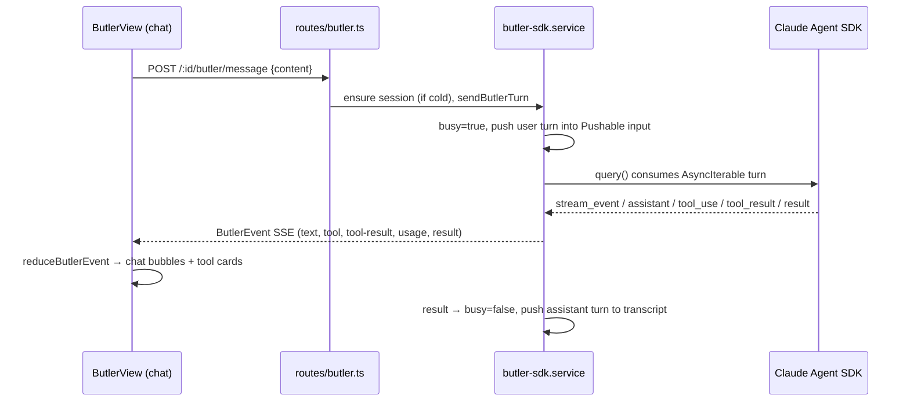
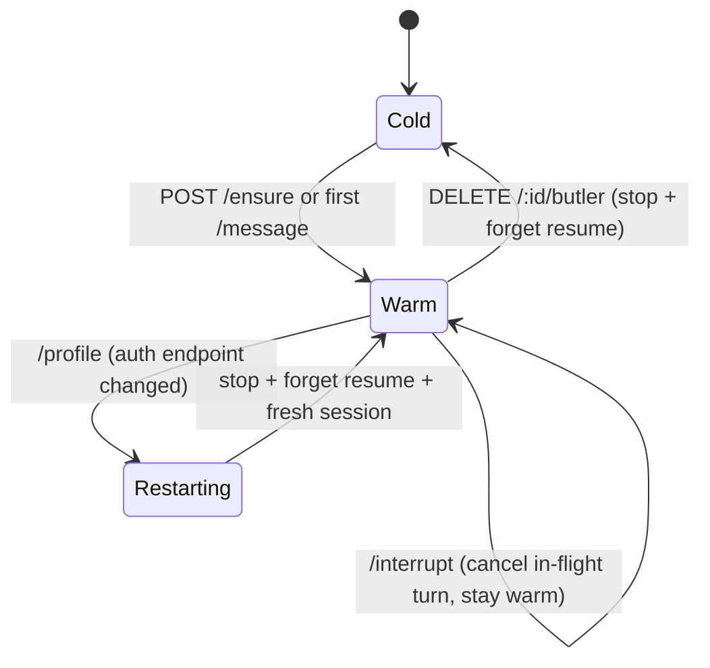

# Butler (warm conversational assistant)

## Purpose & business capability

The Butler is the board's **conversational front door**. Every other agent in this
system is a *fire-and-forget worker*: you hand it a ticket, it spins up a worktree,
implements, and exits. The Butler is the opposite — a **warm, always-available
assistant you talk to**, scoped to one project, that answers questions about the
board, the codebase, and past work, and can *kick off* the worker agents on your
behalf without ever leaving the chat (`butler-sdk.service.ts:163`, system prompt).

The business need: a solo operator driving an autonomous board needs a place to ask
"what's the state of things?", "how was #834 implemented?", "start work on #34", or
"make a ticket to refactor X" — in natural language, with conversation memory, and
get either a direct answer or a *verified* board action. Without the Butler the user
would have to drop into MCP/CLI/REST tooling for every such question. It is the human
↔ board interface that speaks English instead of API calls.

"Warm" is the load-bearing word. The Butler keeps a single live LLM session per
project **in the server process**, fed turn-by-turn through one streaming `query()`
call, so conversation context survives across messages with no per-turn cold start
(`butler-sdk.service.ts:1-15`, `:707` `runLoop`). It also survives **server
restarts**: the SDK session id is persisted and replayed as a `resume`
(`routes/butler.ts:370`). If the Butler vanished, the product would lose its only
natural-language control surface — the chat tab, the per-ticket "Chat about this
ticket" retrospectives (`butler-ticket-prompt.ts`), the voice-dictation assistant,
and the system-event notifier (`butler-event-feed.ts`) all hang off it.

## How the Butler differs from a Builder agent

| | **Builder** (per-ticket worker) | **Butler** (this module) |
|--|--|--|
| Lifecycle | Spawned per ticket, exits when done | One warm session per project, lives across turns + restarts |
| Mechanism | CLI subprocess in a git worktree | In-process **Claude Agent SDK library call** (claude) / CLI codex (`butler-sdk.service.ts:382`) |
| Working dir | An isolated worktree | The project's main repo path (`routes/butler.ts:341`, `project.repoPath`) |
| Streaming | stdout file drain | Native async-iterator token stream (`runLoop`, `:716`) |
| Purpose | *Does* the implementation | *Talks*, answers, and *delegates* to Builders |
| Write scope | Full worktree | Read-anywhere; may edit only client/docs, must ticket backend changes (`butler-sdk.service.ts:177`) |

**Why the SDK instead of a warm CLI:** a `claude.exe` kept warm with stdin open does
not stream on Windows (it buffers stdout until stdin closes). The Agent SDK is a
library call with a native async iterator, so it streams token deltas with no
stdio/TTY buffering (`butler-sdk.service.ts:1-15`).

## Ubiquitous language

| Term | Meaning *as used here* | Defined at |
|------|------------------------|------------|
| Butler | A warm, per-project conversational agent embedded in the board UI | `butler-sdk.service.ts:163` |
| Butler **definition** | A named, **global** butler *persona* (id + display name + model + optional provider), e.g. "Smart"/opus, "Quick"/haiku. Shared across all projects | `butler-definitions.service.ts:14` |
| **default** butler | The always-present legacy butler; its id maps to the original unsuffixed pref keys (resume id, history) so existing state carries over | `butler-definitions.service.ts:31` |
| Warm session | A live in-process LLM `query()` for one (project, butler), holding conversation context between turns | `butler-sdk.service.ts:93` (`ButlerSession`) |
| Session key | Map key: plain `projectId` for the default butler (back-compat), `${projectId}::${butlerId}` otherwise | `butler-sdk.service.ts:137` |
| Turn | One user→assistant exchange pushed into the warm session | `sendButlerTurn`, `:761` |
| Backend | The runtime that serves a butler: `claude` (SDK), `codex` (CLI subprocess), or `mock` | `butler-sdk.service.ts:101` |
| Profile | Auth/endpoint identity (CLI login / API key / Bedrock). **Per-project, shared by all of a project's butlers** | `routes/butler.ts:87` |
| Model | Provider model alias ("", opus, sonnet, haiku). **Lives on the butler definition** (global), switchable live | `butler-definitions.service.ts:17` |
| ButlerEvent | The streamed event vocabulary the session broadcasts to chat listeners | `butler-sdk.service.ts:31` |
| Board guide | A bundled UI how-to string written to a temp file and referenced (not inlined) so the butler reads it on demand | `butler/board-guide.ts:15` |
| Event feed | Opt-in pipe that injects critical board events as `[system event]` turns | `butler-event-feed.ts:1` |
| Tab | A client-side open butler in the chat UI; tabs + active tab persist in localStorage | `ButlerView.tsx:77`, `:379` |

**Term-collision note:** "profile" here is auth/endpoint (per-project). Elsewhere in
the board "claude_profile" is a global pref; the Butler layers a per-project override
`butler_profile_<projectId>` on top (`routes/butler.ts:87`, `:283`). "Model" used to
be a per-project pref (`butler_model_<projectId>`) but is now a property of the
*global* definition (`server/CLAUDE.md` Butler section) — **except** the agent-questions
recommender still reads the legacy per-project `butler_model_${projectId}` pref
(`recommendation.ts:94`), so that one path can drift from the definition's model.

## Domain model & invariants

| Invariant / rule / policy | Why (business reason, inferred) | Enforced at |
|---------------------------|----------------------------------|-------------|
| **One warm session per (project, butler)** | A second `ensure` returns the existing session — conversation context must not fork or double-bill | `butler-sdk.service.ts:314-315` |
| **The "default" butler can be renamed/re-modelled but never deleted** | It is the legacy keystone holding back-compat pref keys; removing it would orphan resume id + history | `butler-definitions.service.ts:116`, `:60` |
| **At most 4 butlers** (`MAX_BUTLERS`) | "Keeps the set semantic and the UI legible" — a switcher, not an unbounded zoo | `butler-definitions.service.ts:28`, `:79` |
| **Definitions are global; sessions+context are per-project** | A persona ("Quick") means the same everywhere, but each project's conversation is its own | `butler-definitions.service.ts:1-9` |
| **Profile is per-project and shared by all butlers; model is per-butler** | Auth endpoint is a project-level fact; "smartness" is what distinguishes one butler from another | `routes/butler.ts:86`, `butler-definitions.service.ts:8` |
| **Switching model preserves context (live `setModel`); switching profile RESTARTS** | A model swap is a control request mid-conversation; a different auth endpoint cannot resume the same transcript | `butler-sdk.service.ts:221`, `routes/butler.ts:497-505` |
| **A turn is rejected (409) while the butler is busy** | Single in-flight turn per session; no concurrent streams into one context | `sendButlerTurn` `:768`, `routes/butler.ts:567` |
| **`permissionMode: bypassPermissions`** | There is no human in the chat loop to approve tool prompts — the butler must act unattended | `butler-sdk.service.ts:371` |
| **Butler may edit client/docs but NOT backend code** — *enforced only in the recommender's fallback prompt; absent from the chat prompt* | The server hot-reloads on file change; a backend edit would kill the butler's own process mid-turn → it must file a ticket instead. **Caveat:** this rule lives ONLY in `buildButlerSystemPrompt`. Neither `DEFAULT_BUTLER_PROMPT` (`routes/butler.ts:108-182`) nor the editable `butler` builtin skill (the real chat-butler prompt) contains it — so the **chat** butler is *not* told to avoid backend edits | `butler-sdk.service.ts:177` (service fallback only) |
| **Never report success unverified** | Hallucinated "merged/launched" would corrupt the user's mental model of the board — must re-check via `get_issue`/`get_board_status` | `butler-sdk.service.ts:176`, `routes/butler.ts:161` |
| **Start work only via one-step `POST /api/workspaces`** (never `start_workspace`, never raw `git worktree`) | `start_workspace` makes a bare worktree without launching an agent or moving the issue — the full workflow wouldn't run | `butler-sdk.service.ts:175`, `routes/butler.ts:154` |
| **Stale/unresumable session → drop resume, start fresh, re-send the in-flight turn** | A persisted-but-dead resume id would brick *every* future turn; the user's message must not be silently dropped | `butler-sdk.service.ts:692` (`recoverButlerResume`), `:505` (codex) |
| **Context usage = `getContextUsage()`, not summed turn usage** | `cache_read_input_tokens` accumulates per tool round-trip; summing balloons to ~400k for a 30k context (a lie to the user) | `butler-sdk.service.ts:531-556` |
| **Event feed rate-limited: 1 turn / 30s/project, bursts collapse to a summary** | The butler must not be spammed by every merge retry; bursts become one `Nx kind` line | `butler-event-feed.ts:33`, `:51` |
| **Event feed only ever targets the DEFAULT butler** | `getButlerSession(projectId)` / `sendButlerTurn(projectId, …)` are called with **no** `butlerId` (`:63-64`, `:77-78`, `:102`), so the composite key resolves to the default session — **named butlers never receive system-event turns** | `butler-event-feed.ts:63`, `:77`, `:102` |
| **Past-session transcript access is allowlisted to this project's tracked ids** | Security: a session id from another project must not be readable through this project's route | `routes/butler.ts:664-667` |
| **History capped at 50 session ids, most-recent-first** | Bounded rolling memory of which sessions belong to a butler | `routes/butler.ts:64`, `:76` |

## Key workflows / use cases

### A turn through the warm session (claude backend)

Trigger: user sends a message (or CLI/MCP `ask`, or a board system event). Steps:
ensure a warm session → push the turn into the single `Pushable` input stream
(`butler-sdk.service.ts:789`) → the SDK emits messages, dispatched by
`dispatchButlerMessage` (`:677`) into `ButlerEvent`s → the client's pure reducer
folds them into chat state (`butler-event-reducer.ts:117`). Outcome: streamed answer +
collapsible tool-call cards. Failure handling: `runLoop`'s catch classifies the error
(`classifyButlerLoopError`) into aborted / transient / resume-reset / fatal and only
`fatal` reaches the user as an error bubble (`butler-sdk.service.ts:720-752`).

### Synchronous ask (CLI / MCP)

`POST /:id/butler/ask` is the primitive for callers that **cannot read the in-memory
SSE stream** (separate processes — the CLI `butler ask`, the MCP `ask_butler` tool).
It subscribes, sends the turn with `emitUserText` so any open UI also shows the
prompt, buffers `text` events, and resolves on `result`/`error` or a 120s timeout
(`routes/butler.ts:574-616`).

### Profile/model switching state machine

"Clear context" / "new session" / saving a customized skill all funnel through
`DELETE` then re-`ensure`, which re-reads the (possibly edited) butler skill — that is
*how a user applies a behavior change* (`routes/butler.ts:673-683`, `ButlerView.tsx:650`).

### Board events → butler (AK-75)

Emitters (merge-workflow, exit-workflow, monitor-cycle, approvals, workspace-crud)
fire `emitButlerSystemEvent` (`butler-event-feed.ts:97`). If the feed is enabled and a
session is warm, the event is injected as a `[system event] …` turn so the butler is
*informed* of merge failures, agent crashes, stuck workspaces, etc. and can react when
asked. Bursts inside the 30s window collapse into one summary line (`:51`). Note: the
feed only ever drives the **default** butler — all `getButlerSession`/`sendButlerTurn`
calls here omit `butlerId` (`:63-64`, `:77-78`, `:102`), so named butlers never get
system-event turns.

## Entry points

| Entry point | Kind | What it lets a caller do | `file:line` |
|-------------|------|--------------------------|-------------|
| `POST /:id/butler/message` | API | Push a turn into the warm session (async, streamed via SSE) | `routes/butler.ts:555` |
| `GET /:id/butler/stream` | API (SSE) | Subscribe to the live `ButlerEvent` stream with heartbeats | `routes/butler.ts:619` |
| `POST /:id/butler/ask` | API | Synchronous turn for CLI/MCP (no SSE access) | `routes/butler.ts:574` |
| `POST /:id/butler/ensure` | API | Start the warm session if cold | `routes/butler.ts:541` |
| `POST /:id/butler/interrupt` | API | Cancel the in-flight turn, keep the session warm | `routes/butler.ts:549` |
| `POST /:id/butler/model` / `/profile` | API | Switch model (live) / profile (restart) | `routes/butler.ts:476`, `:497` |
| `GET\|PUT /:id/butler/skill` | API | Read/upsert the project-scoped butler behavior override | `routes/butler.ts:519`, `:529` |
| `GET /:id/butlers`, `GET /:id/butler` | API | Switcher state + per-butler runtime state | `routes/butler.ts:384`, `:411` |
| `GET\|POST\|PUT\|DELETE /api/butler-definitions` | API | Global named-butler CRUD (capped at 4) | `routes/butler-definitions.ts:17` |
| `GET /:id/butler/commands`, `/sessions`, `/sessions/:sid/messages` | API | Slash-command autocomplete + past-session history | `routes/butler.ts:440`, `:641`, `:657` |
| `ButlerView` | UI | Tabbed chat client (per-butler tabs, voice, history, customize) | `ButlerView.tsx:70` |

## Logic-bearing code (where the real decisions live)

| File / function | What decision/logic it holds | `file:line` |
|-----------------|------------------------------|-------------|
| `butler-sdk.service.ts` `runLoop` | The warm-session lifecycle: consume the SDK stream, dispatch messages, and the **error-recovery policy** (aborted/transient/resume-reset/fatal). Read this first | `:707` |
| `butler-sdk.service.ts` `recoverButlerResume` | The thinking-signature-400 + stale-resume recovery: drop `resume`, restart fresh, re-send the in-flight user turn so it isn't lost | `:692` |
| `isInvalidThinkingSignatureError` / `isStaleResumeError` / `isStaleCodexResumeError` | The three recoverable failure signatures. Thinking-block signatures are bound to the org/endpoint, so a profile-flip makes the persisted transcript un-sendable → must start fresh | `:564`, `:577`, `:591` |
| `butler-sdk.service.ts` `runProviderTurn` | The **codex backend**: a CLI subprocess per turn, parsing stream events, with its own stale-resume retry and CODEX_HOME/license handling | `:396` |
| `butler-event-reducer.ts` `reduceButlerEvent` | The **pure** client state machine folding SSE events into chat bubbles + tool cards; injected `now`/`rand` for deterministic tests | `:117` |
| `routes/butler.ts` `resolveButlerBackend` | The provider/profile resolution cascade: butler-def provider > Strategy Bullseye > global settings, then per-project profile override, plus codex OAuth-license CODEX_HOME logic | `:242` |
| `routes/butler.ts` `startSession` | Wires definition (model/provider) + resolved backend + persisted resume + resolved prompt into `ensureButlerSession`; mock-profile detection | `:332` |
| `butler-definitions.service.ts` | The global persona store (JSON pref), cap, default-butler guarantee, slug generation | whole file |
| `routes/butler.ts` `DEFAULT_BUTLER_PROMPT` | The fallback butler instructions (delegate-aggressively, verify-never-fabricate, formatting, one-step start) — the behavioral contract when no editable skill exists | `:108` |

## Dependencies & bounded-context relationships

**Upstream (what the Butler needs):**
- **agent-providers** — Shared Kernel / Anti-Corruption. `buildSpawnEnv`,
  `getMcpServersConfig`, `getProvider`, `resolveEffectiveProviderProfile`, the
  Strategy-Bullseye selection, and the codex license ring are all reused so the
  butler authenticates and resolves a provider *the same way the Builder does*
  (`butler-sdk.service.ts:18-21`, `routes/butler.ts:40-47`). It deliberately does not
  hand-roll its own provider cascade.
- **mcp-server** — Customer-Supplier (the MCP tools are the *supplier* of board
  truth). The butler is instructed to treat `list_issues`/`get_board_status`/
  `get_issue`/`search_sessions`/`openspec_*` as authoritative and never scrape board
  state (`butler-sdk.service.ts:171-173`). The init handler tracks whether the
  `agentic-kanban` MCP server connected (`:633`) and surfaces it as a green dot.
- **issues-board** — Conformist. The butler *uses* the board's published flows
  (one-step `POST /api/workspaces`, `move_issue`, `merge_workspace`, review) rather
  than replicating them; the bundled board guide describes the human UI of this
  context (`butler/board-guide.ts`).
- Preferences repository — all butler config (definitions, per-project profile,
  resume id, session history, event-feed toggles) is stored as preferences.

**Downstream (what needs the Butler):**
- The **client ButlerView** (the chat tab) and the per-ticket "Chat about this ticket"
  retrospective (`butler-ticket-prompt.ts` builds the opening prompt, #838).
- The **board-event feed** (`butler-event-feed.ts`) pushes INTO the butler — an
  inverted dependency: the issues-board/monitor contexts emit events the butler
  consumes.
- CLI (`pnpm cli -- butler ask/list`) and the MCP `ask_butler` tool, both via
  `/ask`.
- The **agent-questions recommender** (`services/agent-questions/recommendation.ts`) —
  a second, non-route entry point that warms and uses the **default** butler session
  (`getButlerSession`, `ensureButlerSession`, `sendButlerTurn`, `subscribeButler`) to
  produce per-question answer recommendations, **even before the user ever opens the
  Butler view** (`recommendQuestionsForSet`, `:81`; on-demand start `:88-104`). Two
  consequences worth flagging: it runs on the **service fallback prompt** (no
  `systemPromptAppend` passed — see Risks), and it still reads the **legacy per-project
  model pref** `butler_model_${projectId}` (`:94`) even though the model now lives on
  the global butler definition — a real inconsistency with the rest of the module.

**Hidden coupling:** `classifyButlerLoopError` (`lib/butler-loop-classify.ts`) and
`isTransientNetworkError` (`startup/transient-errors.ts`) live outside this module's
file list but encode the butler's error policy — changing them changes when a user
sees an error bubble vs a silent recovery.

## File topology (brief — structure is well-formed)

| Sub-responsibility | Implemented in | Layer |
|--------------------|----------------|-------|
| Warm-session lifecycle, streaming, recovery | `services/butler-sdk.service.ts` | server service |
| Global persona store (definitions) | `services/butler-definitions.service.ts` | server service |
| Past-session transcript parsing (from `~/.claude/projects` JSONL) | `services/butler-transcripts.service.ts` | server service |
| Board-event → butler injection | `services/butler-event-feed.ts` | server service |
| Bundled UI how-to guide | `butler/board-guide.ts` | server asset |
| Per-project butler HTTP surface | `routes/butler.ts` | server route |
| Global definition CRUD | `routes/butler-definitions.ts` | server route |
| "Chat about this ticket" opening prompt | `shared/lib/butler-ticket-prompt.ts` | shared lib |
| Chat container (state, streams, tabs, voice, shortcuts) | `client/ButlerView.tsx` | client |
| Chat presenter (JSX) | `client/ButlerViewBody.tsx` | client |
| Chat bubbles + tool-call cards (markdown) | `client/ButlerChatParts.tsx` | client |
| Manage-butlers modal | `client/ButlerManageModal.tsx` | client |
| Pure event reducer | `client/lib/butler-event-reducer.ts` | client lib |
| Display formatters (window/ts/tool-hint/labels) | `client/lib/butler-format.ts` | client lib |

## Risks, gaps & open questions

- **Two divergent system prompts.** `buildButlerSystemPrompt` (`butler-sdk.service.ts:163`)
  is the in-service fallback; `DEFAULT_BUTLER_PROMPT` (`routes/butler.ts:108`) is the
  route-level fallback (the editable `butler` agent skill is the real source). They
  encode the *same intent* but differ in wording/coverage (the route version has the
  delegate-aggressively and formatting sections; the service version has the
  backend-edit prohibition the others lack — see invariant below). The service prompt is
  **not** dead: it is the active prompt for the **agent-questions recommendation flow**, a
  second, non-route caller. `recommendation.ts:96-103` calls `ensureButlerSession(...)`
  with **no** `systemPromptAppend`, so `ensureButlerSession` (`butler-sdk.service.ts:318`)
  falls back to `buildButlerSystemPrompt`. The chat path (route) always resolves and
  passes a prompt from the editable `butler` skill, the recommender path never does — so
  the two prompts diverging is a **real behavioral split** (the recommender butler and the
  chat butler obey different instructions), not a dead branch.
- **`butler-sdk.ts` is a baselined god-module** (cohesion baseline 30 per
  `shared/CLAUDE.md`). It carries codex-CLI logic, claude-SDK logic, recovery, and
  state in one file — the gate allows shrink only. A future split (claude vs codex
  backend) is the natural decomposition.
- **Codex/mock are first-class backends but the chat UI's pure reducer and several
  helpers are claude-shaped** (e.g. `formatToolLabel` special-cases Claude tool names;
  codex tool activity is best-effort). Not a bug, but tool-card fidelity is
  provider-dependent.
- **Copilot/pi are not wired as butler backends** — they resolve through the shared
  resolver but map onto the claude SDK at launch (`routes/butler.ts:91-96`). A user
  could pick a provider whose butler silently runs as claude.
- **Event-feed delivery is best-effort and silent.** If no session is warm the event
  is dropped (`butler-event-feed.ts:102`); there is no queue, so events that occur
  while the butler is cold are lost (by design, but worth knowing).
- **Transcript reading depends on Claude's on-disk JSONL encoding** (`encodeCwd`,
  `transcripts.service.ts:39`) and the `sdk-cli`/`cli` entrypoint values — a future SDK
  format change would silently empty the History panel. Codex sessions have no
  equivalent on-disk history reader here, so a codex butler's History is empty.
- **Worktree DB caveat** (from `server/CLAUDE.md`): a butler started in a worktree dev
  server resolves a *different* `kanban.db`, so it answers about different data than
  the main board. Not enforced in this module's code.
