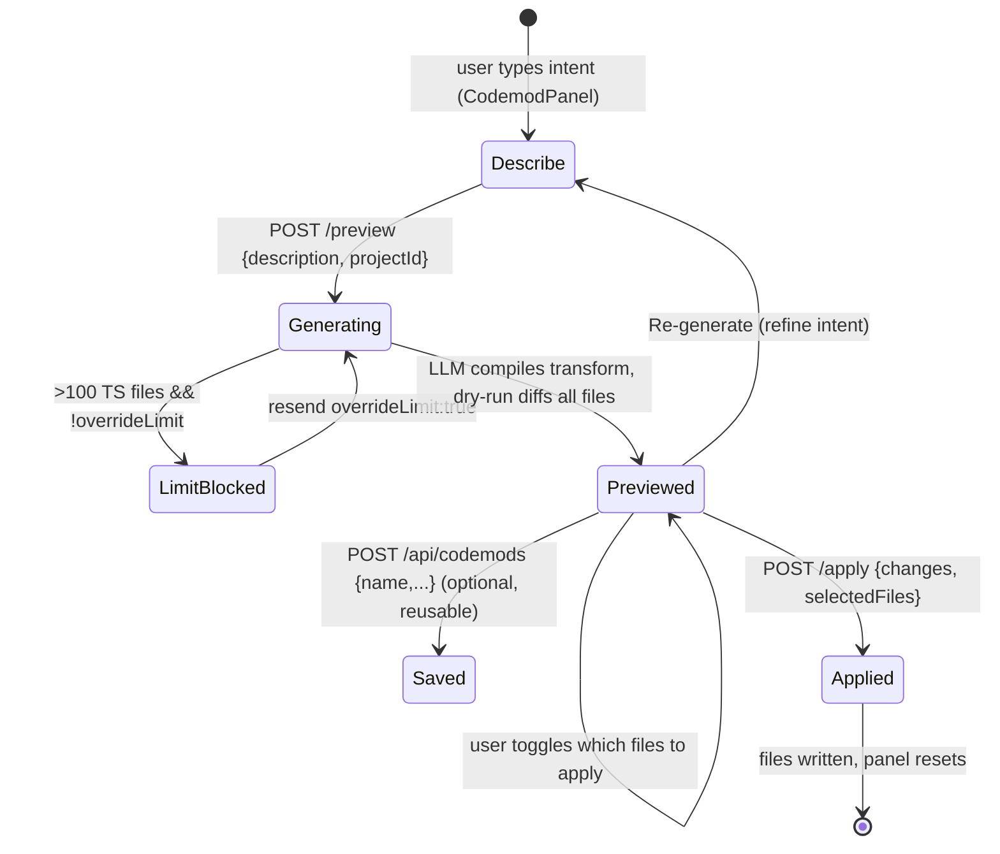

# Codemod Factory

## Purpose & business capability

A kanban board for AI coding tasks normally drives change one ticket, one worktree,
one branch at a time. Some refactors don't fit that shape: they are mechanical,
repo-wide, and identical in every file ("rename `UserService` to `AccountService`
everywhere", "make every method returning `Promise<T>` async"). Spinning up a builder
agent in a worktree for that is heavy, slow, and risks the agent improvising. The
Codemod Factory is the board's answer: the user states the *intent* in plain English,
an LLM compiles it into a precise **ts-morph** AST transform, and the change is shown
as a per-file diff across the whole project **before** anything touches disk.

The business value is a **trustworthy preview→apply gate over a destructive, blast-radius
operation**. A codemod can rewrite every TypeScript file in a repo; the module's whole
design is about making that safe — show exactly what would change, let the user pick
which files, refuse to run silently on huge projects, and (critically) refuse to write
outside the project repo at all. It is a power tool with the safety interlocks visible.

A secondary capability is **reuse**: a working transform can be saved as a named,
reusable codemod (persisted as a special kind of agent skill), so a recurring repo-wide
edit becomes a one-click operation rather than a re-derivation.

Consumers: a human at the board (the `CodemodPanel` overlay). If this module vanished,
the board would lose its only mechanism for human-gated, project-wide structural
refactors that bypass the per-ticket agent/worktree pipeline; users would fall back to
running ts-morph/ast-grep by hand outside the product.

## Ubiquitous language

| Term | Meaning *as used here* | Defined at |
|------|------------------------|------------|
| Codemod | A repo-wide structural transform. Concretely, the **body** of a per-file transform function operating on a ts-morph `SourceFile` — not a full script, not a regex. | `codemod.service.ts:202-221` |
| Transform code | The raw JS/TS string the LLM emits and the engine compiles into an `AsyncFunction(sourceFile)`. The unit of execution. | `codemod.service.ts:279-285` |
| Description / intent | The user's plain-English statement of the refactor; the prompt input that the LLM compiles into transform code. | `codemod.service.ts:189`, `CodemodPanel.tsx:209-216` |
| Preview | A **dry-run**: run the transform over every file in memory, diff against original, and report which files *would* change. Writes nothing. | `codemod.service.ts:230-325` |
| Apply | The write step: persist the previewed `modified` text for the user-selected files to disk. The only step that mutates the repo. | `codemod.service.ts:347-372` |
| Selected files | The subset of changed files the user checked in the preview; apply writes only these (empty set = all). | `codemod.service.ts:363`, `CodemodPanel.tsx:152` |
| File limit | Hard ceiling (`CODEMOD_FILE_LIMIT = 100`) above which a preview refuses to run without explicit `overrideLimit` confirmation. | `codemod.service.ts:10`, `:244-248` |
| Saved codemod | A reusable codemod persisted in the `agent_skills` table with `type='codemod'` — the script lives in the skill's `prompt` column. No dedicated table. | `routes/codemods.ts:107-141` |
| repoPath | The project's checkout root. Doubles as the **security boundary** — every apply target must resolve inside it. | `codemod.service.ts:342-346` |

## Domain model & invariants

The module owns no persistent entity of its own. Its only durable artifact —
a *saved codemod* — is overloaded onto the existing `agent_skills` table via a `type`
discriminator (`'codemod'`), reusing the agent-skills repository wholesale. The
in-flight entities (transform code, file diffs) are ephemeral, recomputed per request.

| Invariant / rule / policy | Why (business reason, inferred) | Enforced at |
|---------------------------|----------------------------------|-------------|
| **Apply never writes outside the project repo.** Every target path is resolved to absolute and must equal `repoPath` or sit under `repoPath + sep`; `..` traversal and foreign absolute paths are rejected. | Client supplies `filePath`+`content`; without this a malicious or buggy client could overwrite arbitrary files on the host. This is the module's core safety contract. **VERIFIED** below. | `codemod.service.ts:331-337` (guard `isInside`), invoked at `:358` |
| **`repoPath`/`projectId` is required for apply.** No projectId → 400 (route) / `ValidationError` (service); the boundary cannot be omitted. | The repo root *is* the sandbox; an apply with no boundary would have nothing to validate against — required-by-contract, not convenience. | `routes/codemods.ts:75-77`, `codemod.service.ts:407-408`, contract documented `:342-346` |
| **Preview is a pure dry-run; it never writes.** After diffing each file the in-memory `SourceFile` is reset to its original text. | The whole UX promise is "see before you change"; a preview with side effects would break trust and corrupt the project view. | `codemod.service.ts:316` (`replaceWithText(original)`) |
| **A project with >100 TS files needs explicit confirmation to preview.** Throws a `ValidationError` instructing the caller to resend `overrideLimit: true`. | Blast-radius guard: on a large repo an imprecise transform could rewrite hundreds of files; force the human to acknowledge scale before generating diffs. | `codemod.service.ts:244-248` |
| **Files outside `repoPath` are excluded from preview** (e.g. `.d.ts` pulled in via tsconfig from node_modules). | A codemod is scoped to the *project's own* source, not its dependencies' type declarations. | `codemod.service.ts:293` |
| **Vendored/build dirs are never walked.** `node_modules`, `.git`, `dist`, `build`, `.next`, `coverage`, `__pycache__`, and any dotfile/dotdir are skipped. | Only first-party source is a legitimate codemod target; rewriting build output or deps is meaningless and dangerous. | `codemod.service.ts:36`, `:48` |
| **A per-file transform that throws is skipped, not fatal.** | One malformed file (parse edge case) must not abort a project-wide refactor; partial success over all-or-nothing for a best-effort mechanical edit. | `codemod.service.ts:298-300` |
| **Invalid transform code fails loudly at compile, not at write.** `new AsyncFunction(...)` wrapped; syntax errors become a `ValidationError`. | The LLM can emit broken code; surface it as a clean validation error in preview rather than a runtime crash mid-apply. | `codemod.service.ts:280-285` |
| **Saved-codemod names are unique per scope.** A name collision with an existing `type='codemod'` skill → 409. | Saved codemods are addressable by name for reuse; duplicates would make "the X codemod" ambiguous. | `routes/codemods.ts:120-125` |
| **Generated transform must only mutate `sourceFile`** (no `save()`, no imports, no `project.save()`). | The harness controls persistence and diffing; a transform that saves itself would bypass the preview gate and the path-security boundary. Enforced by *prompt contract*, not by a runtime sandbox — see Risks. | `codemod.service.ts:208-213` |

## Key workflows / use cases

### Generate → Preview → Apply (the primary flow)

- **Trigger:** user opens the panel (`x` key or command palette "Codemod Factory",
  `shortcutRegistry.ts:39`, `useBoardKeyboardShortcuts.ts:77`), types a refactor, clicks
  Generate Preview.
- **Generate + Preview (one call):** `POST /api/codemods/preview` →
  `codemodService.preview()` (`codemod.service.ts:384`). It resolves the project's
  `repoPath`, collects all TS/TSX files, asks the LLM (`generateCodemodScript`,
  `:189`) for transform-function-body code seeded with up to 10 sample file paths,
  then dry-runs it via `previewCodemod` (`:234`). Returns the generated `script`,
  per-file diffs (unified-diff text + full `original`/`modified`), `totalTsFiles`,
  and `limitReached`. A caller may pass a pre-existing `script` to skip LLM generation
  (`:392-396`) — this is how a *saved* codemod is re-run.
- **Outcome:** the panel shows a stats bar, the generated ts-morph script (collapsible),
  and a checkbox list of changed files with colorized diffs; all files selected by
  default (`CodemodPanel.tsx:114`).
- **Apply:** `POST /api/codemods/apply` → `codemodService.apply()` (`:402`) →
  `applyCodemod` (`:347`) writes the `modified` text for selected files, returning
  `{applied, skipped}`.
- **Failure handling:** file-limit block surfaces as a yellow warning with a "run on
  all files" override button (`CodemodPanel.tsx:220-230`); invalid script / write-outside
  errors surface as toasts; per-file transform errors are silently skipped server-side.

### Save & reuse

`POST /api/codemods` persists `{name, description, script}` as an `agent_skills` row,
then patches its `type` to `'codemod'` (`routes/codemods.ts:127-138`). `GET
/api/codemods?projectId=` lists saved codemods by filtering skills on `type==='codemod'`
(`:95-100`); `GET /api/codemods/:id` fetches one. (The client panel currently saves but
the listing/re-run-saved UI is minimal — see Risks.)

## Entry points

| Entry point | Kind | What it lets a caller do | `file:line` |
|-------------|------|--------------------------|-------------|
| `POST /api/codemods/preview` | API | Compile intent→transform (or run a supplied script) and get dry-run per-file diffs | `routes/codemods.ts:23` |
| `POST /api/codemods/apply` | API | Write previewed changes for selected files (boundary-checked) | `routes/codemods.ts:68` |
| `GET /api/codemods?projectId=` | API | List saved codemods for a project (+ global) | `routes/codemods.ts:95` |
| `POST /api/codemods` | API | Save a working transform as a reusable named codemod | `routes/codemods.ts:107` |
| `GET /api/codemods/:id` | API | Fetch one saved codemod | `routes/codemods.ts:147` |
| `CodemodPanel` overlay | UI | Full describe→preview→select→apply→save workflow | `CodemodPanel.tsx:79`, mounted `BoardOverlayPanels.tsx:231` |
| `x` key / command palette | UI door | Toggle the panel open | `useBoardKeyboardShortcuts.ts:77`, `shortcutRegistry.ts:39` |

No MCP tool and no CLI command expose codemods — this capability is **HTTP + UI only**
(confirmed: no matches under `packages/mcp-server`).

## Logic-bearing code (where the real decisions live)

| File / function | What decision/logic it holds | `file:line` |
|-----------------|------------------------------|-------------|
| `applyCodemod` + `isInside` | The security boundary — the one place that writes to disk and the guard that confines writes to the repo. **Read first.** | `codemod.service.ts:347-372`, `:331-337` |
| `previewCodemod` | The dry-run engine: file collection, the >100-file gate, compiling LLM text into an `AsyncFunction`, per-file run/diff/reset, out-of-repo exclusion. | `codemod.service.ts:234-325` |
| `generateCodemodScript` | The intent→code compiler: the prompt contract that constrains what the LLM may emit (mutate `sourceFile` only, no save/import, AST not regex). | `codemod.service.ts:189-228` |
| `collectTsFiles` | What counts as a codemod target — skip-list policy for vendored/build dirs and dotfiles. | `codemod.service.ts:35-70` |
| `computeUnifiedDiff` / `computeLcs` / `buildHunks` | Hand-rolled LCS unified-diff generator with a 500-line cap per file (perf bound, not correctness). The diff the user trusts to decide. | `codemod.service.ts:75-184` |
| `createCodemodService` | Wires service methods to `repoPath` resolution; the seam where `projectId` becomes the security boundary. | `codemod.service.ts:374-412` |

## Dependencies & bounded-context relationships

- **Upstream (needs):**
  - `ts-morph` (external) — the AST engine; transforms operate on its `SourceFile`. **Anti-Corruption boundary is thin/absent**: the LLM-generated code calls ts-morph's API directly, so the project is coupled to ts-morph's surface (Conformist).
  - `claude-cli.service` (`invokeClaudePrompt`) — the LLM that compiles intent→transform. Published-language style (a fixed prompt contract).
  - `agent-skill.repository` — both `getProjectRepoPath` (boundary resolution) and the full save/list/get of saved codemods. **Shared Kernel**: saved codemods are agent skills wearing a `type='codemod'` hat; they share the table and repository, not a copy.
  - `projects` (via repoPath) — the project supplies the sandbox root.
- **Downstream (needs this):** only the `CodemodPanel` UI. Nothing else in the server
  consumes codemods.
- **Hidden coupling:** the saved-codemod feature has **no dedicated schema** — it
  co-evolves with `agent_skills`. A change to how skills are stored or how `type` is
  interpreted silently affects codemod persistence even with no import edge to this file.

## File topology

Well-formed: one service (logic), one route (HTTP surface), one panel (UI), one mount
point. Each maps cleanly to a layer; no scattering.

| Sub-responsibility | Implemented in | Layer |
|--------------------|----------------|-------|
| Intent→transform compile, dry-run, diff, apply, security guard | `packages/server/src/services/codemod.service.ts` | service |
| HTTP surface + request validation + saved-codemod CRUD | `packages/server/src/routes/codemods.ts` | route (mounted `routes/index.ts:90`) |
| Describe→preview→select→apply→save UX | `packages/client/src/components/CodemodPanel.tsx` | client component |
| Overlay mount + open/close wiring | `packages/client/src/components/BoardOverlayPanels.tsx:231` | client |
| Keyboard/command-palette door | `useBoardKeyboardShortcuts.ts:77`, `shortcutRegistry.ts:39` | client |
| Saved-codemod persistence | `agent_skills` table, `type='codemod'` | DB (reused) |

## Risks, gaps & open questions

- **Arbitrary code execution by design (inferred, by reading).** Preview compiles
  LLM-emitted text via `new AsyncFunction(...)` and runs it in-process
  (`codemod.service.ts:281`). The "only mutate `sourceFile`, no imports/save" rule is a
  **prompt contract, not a runtime sandbox** (`:208-213`) — a transform that ignored it
  (e.g. accessed Node globals available in the function scope) is not technically
  prevented at preview time. The path-security boundary protects *writes*, not the
  *execution* of generated code. Acceptable for a local, single-user tool; would be a
  serious hole in any multi-tenant deployment. Flagged, unverified as an exploit.
- **Apply trusts client-supplied `modified` content.** The apply step writes whatever
  `modified` text the client sends for an in-repo path (`:364`); it does not re-derive
  the diff from the transform. The path boundary is enforced, but the *content* is not
  re-validated against the previewed script — a client could apply different content
  than was previewed (within the repo). Local-tool-acceptable; note for hardening.
- **Diff is capped at 500 lines per file** (`:98-99`, `:132-133`) — the *preview* diff
  for very long files is truncated, but apply writes the full `modified` text. So the
  user may not see all changes they apply in a large file. Cosmetic/trust gap.
- **No dedicated migration/table for saved codemods** — overloaded on `agent_skills.type`.
  Listing relies on a runtime `type === 'codemod'` filter (`routes/codemods.ts:98`),
  and save does a create-then-update-type two-step (`:127-138`) rather than an atomic
  insert. Drift risk if agent-skills storage changes.
- **Saved-codemod re-run UX is thin.** The service supports running a supplied `script`
  (`preview(..., {script})`), but the panel only *saves*; there is no visible
  list/pick/re-run-saved control in `CodemodPanel.tsx`. The capability exists at the
  API but is under-surfaced in the UI. Inferred from the absence of a load path.
- **Path-normalization mismatch (Windows).** Preview compares `filePath.startsWith(
  repoPath.replace(/\\/g, "/"))` (`:293`) while `relative()` is called with backslashed
  paths re-normalized (`:305`); apply uses `resolve()`/`sep` (`:332-336`). Multiple
  path representations coexist; works but is fragile on Windows — worth a single
  normalization helper.

---

### Security invariant — VERIFIED

**Apply confines all writes to the project repo.** `applyCodemod` rejects any change
whose `filePath` does not resolve inside `repoPath`, calling the guard `isInside(repoPath,
change.filePath)` at **`codemod.service.ts:358`** (throws `ValidationError "Refusing to
write outside the project"`). The guard `isInside` (`codemod.service.ts:331-337`) resolves
both root and target to absolute paths so `..` segments cannot escape, allows
target-equals-root, and otherwise requires the target to start with `root + sep`. The
required-`repoPath`-as-security-boundary contract is documented at
`codemod.service.ts:342-346` and re-stated in the route doc (`routes/codemods.ts:64-67`),
with `projectId` enforced required at `routes/codemods.ts:75-77` and
`codemod.service.ts:407-408`.

Business reason: a `fix(codemods)` commit closed a path-traversal / arbitrary-write hole
where client-supplied `filePath`/`content` were written unvalidated — a client (or
attacker) could overwrite files anywhere on the host. The boundary turns "write where the
client says" into "write only inside the project the client named."

> Note: the prompt referenced the guard as `isInsideRoot` at lines 328-336; the actual
> symbol at HEAD `29e016dc` is `isInside` (`:331-337`), invoked at `:358`, contract at
> `:342-346`. Lines cited above reflect the code as read.
