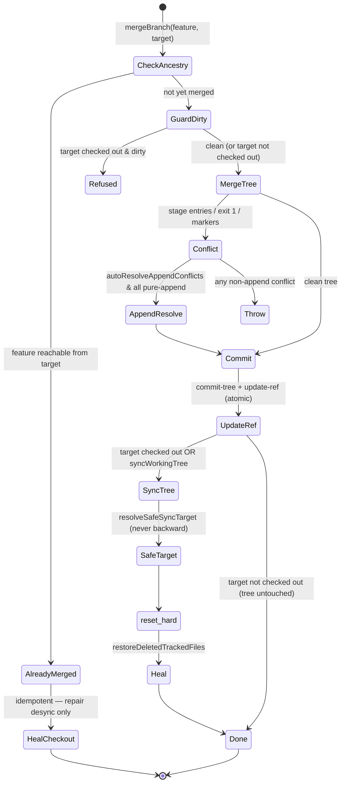

# Git Integration (worktree / merge / diff service)

## Purpose & business capability

The board's domain is *AI agents doing coding work in parallel against one real git repository*. Every such agent needs an isolated place to commit (a worktree on its own branch), and the board needs to inspect that work (diff), judge whether it can land (conflict detection), and land it (merge / rebase) — all without corrupting the human's checkout or trampling another agent's in-flight work. This module is the entire git-facing surface that makes that safe.

It exists because git, run naively from a multi-process server on Windows, is a minefield: detached HEADs in worktrees swallow commits, `reset --hard` to a stale SHA mass-deletes tracked files, a checked-out branch desyncs when its ref is advanced behind its back, Windows junctions let a `worktree remove` recursively delete the *shared* dependency store, and parallel branches collide on drizzle migration numbers. Each of those is a real production incident encoded as a guard here (see the `#NNN` issue references throughout). The module's job is to make the *correct, safe* git operation the only one callable.

Consumers: the server's workspace/review/merge services and the deterministic monitor, the MCP server (agents call these tools), and the CLI — all reach it through the facade barrel (`git-service.ts`) re-exported by `server/src/services/git.service.ts` and `mcp-server/src/git-service.ts`. If this module vanished, the board could create tickets but could never give an agent a workspace, show a diff, detect a conflict, or merge — the entire build→review→merge loop is git, and this is the only git.

## Ubiquitous language

| Term | Meaning *as used here* | Defined at |
|------|------------------------|------------|
| Worktree | A git working directory under `<repo>/../.worktrees/<branch>` where ONE agent builds ONE ticket in isolation; the unit of parallelism | `git-service/worktree.ts:44` |
| Adapter / spawn site | The single `child_process` boundary to the `git` CLI; git is treated as an external system behind a port | `git-exec.ts:58` |
| `execGit` (internal) | The shared-package convenience wrapper (`gitExecOrThrow` + trim) every sub-module uses; NOT a second spawn site | `git-service/internal.ts:6` |
| Base branch | The branch a feature was cut from / will land into (the project's default branch, e.g. `master`); LOCAL ref is authoritative, not `origin/*` | `git-service/rebase.ts:60` |
| Plumbing merge | Landing a branch via `merge-tree`→`commit-tree`→`update-ref` so the working tree/index are left untouched unless the target is checked out | `git-service/merge.ts:124` |
| Detached HEAD | A worktree state where commits go nowhere; merges become silent no-ops. Reattached by `ensureOnBranch`/`syncBranchToHead` | `git-service/branch-attach.ts:9` |
| Append-only conflict | A conflict where every conflicting file is a pure tail-append by both sides (shared base is a prefix of both) — auto-resolvable by concatenation | `git-service/append-resolve.ts:21` |
| Direct workspace | A workspace with no worktree; works in the main checkout, diffed via `git diff HEAD` (baseBranch sentinel `"HEAD"`) | `git-service/diff.ts:57`, `diff.ts:73` |
| Deferred working-tree sync | A merge that advances the ref but postpones the `reset --hard` to after the HTTP response, tagged `[pending-wt-sync:<sha>]` | `git-service/merge.ts:363` |
| Hotspot | A source file ranked by churn (additions+deletions over a window) for the Crime Scene / Hot Files UI | `git-info.service.ts:347` |
| Junction | A Windows directory link; worktrees junction `node_modules` into the shared store — must be unlinked, never traversed, on removal | `git-service/worktree.ts:224` |

## Domain model & invariants

The module owns no DB rows; its "entities" are git refs, worktrees, trees, and commits. Its value is the **rules it enforces** so callers can't do the unsafe thing. (Couples to `persistence-schema` only by *operating on the paths/branches that the schema records* — see Dependencies.)

| Invariant / rule / policy | Why (business reason) | Enforced at |
|---------------------------|------------------------|-------------|
| **All git spawns go through one adapter.** Spawning `git` via `child_process` anywhere else is forbidden and gated by a test that scans every package `src/`. | "Single source of truth" was a lie across ~17 files: each had its own `execFile("git",…)` so Windows quirks (`windowsHide`), buffer limits, timeouts, and error shape drifted. One port = one place to fix git behavior. | `git-exec.ts:58`; gate `packages/shared/__tests__/git-exec-single-spawn.test.ts` |
| **`gitExec` NEVER throws on non-zero exit** — returns `{stdout,stderr,code,error}`. | Many git commands use the exit code as data (`diff --quiet`, `merge-tree` exits 1 on conflict but its stdout is still valid). Throwing would discard the meaningful output. | `git-exec.ts:58-72` |
| **Conflict detection is read-only** (`merge-tree --write-tree`), never touches the working tree or index. | The board probes "would this merge?" constantly and concurrently while agents and dev servers hold the tree; a mutating dry-run would corrupt live state. | `git-service/conflict.ts:9`, `conflict.ts:42` |
| **A worktree's HEAD must be attached to its branch before merge.** Detached HEAD → commits dangling → merge is a no-op (work silently lost). | Failed rebases routinely leave detached HEAD; `syncBranchToHead` force-updates the branch ref to HEAD so the agent's commits are captured. | `git-service/branch-attach.ts:9`, `branch-attach.ts:33` |
| **Never `reset --hard` to a SHA that isn't a descendant of the checkout's HEAD.** Resolve a "safe sync target" first; if the SHA is stale/divergent, sync to HEAD instead. | A stale deferred SHA reset the entire `packages/shared` tree off disk (100+ files) → backend crash (#771). A backward reset deletes every file added since. | `git-service/merge.ts:435` (`resolveSafeSyncTarget`), called from `merge.ts:409` |
| **Never `git reset --soft <branch>` in a worktree** (distinct failure mode from the `--hard` mass-deletion guard above). | A `reset --soft` to a branch ref inside a linked worktree corrupts the worktree's `.git` (the `HEAD`/index pointers desync from the shared object store) — the worktree becomes unusable. Reattach the branch via `syncBranchToHead`/`ensureOnBranch` instead of resetting. | rule per project `CLAUDE.md` (Architecture Patterns → Git service invariants); `git-service/branch-attach.ts:9` |
| **Refuse to merge into a checked-out branch that has uncommitted tracked changes.** | The post-merge `reset --hard` would discard the human's/agent's uncommitted work. Block up-front instead. | `git-service/merge.ts:227-236` |
| **After any hard sync, self-heal tracked files deleted relative to HEAD.** | An interrupted `reset --hard` (dropped connection mid-merge) left tracked files missing on disk while HEAD still referenced them; server wouldn't start until restored (#692). | `git-service/merge.ts:462` (`restoreDeletedTrackedFiles`) |
| **Merge refuses to commit conflict markers** — three independent gates: stage-entry parse, `merge-tree` exit-1 flag, and a marker scan of changed blobs. | A git-version quirk emitted markers into blob content with no stage entries; the board committed `<<<<<<<` into a startup file → esbuild crash (#598-600). Belt-and-suspenders because the failure is catastrophic. | `git-service/merge.ts:301`, `merge.ts:310`, `merge.ts:314-326` |
| **Marker scan excludes `.md` files and scopes to feature-changed files only.** | Docs/skill/test files legitimately contain `<<<<<<<` strings; scanning the whole tree (or `.md`s) produced false-positive merge failures. | `git-service/merge.ts:24` (`^<<<<<<<` anchor), `merge.ts:37`, `merge.ts:317-322` |
| **Rebase/diff onto the LOCAL base branch, not `origin/*`.** Fall back to remote only if local is absent. | Local-first app: manual merge only, no push, so local `master` is often far ahead of a stale `origin/master`; rebasing onto origin replays local-only history and conflicts spuriously. | `git-service/rebase.ts:60-72`, `rebase.ts:111-117` |
| **Commit leftover uncommitted changes before a rebase, don't bail.** | Agents leave stray `.gitignore`/`CLAUDE.local.md` edits; a dirty tree makes `git rebase` fail with an empty conflict list, so auto-merge skipped the workspace *forever*. Committing preserves the work and unblocks. | `git-service/rebase.ts:51`, `rebase.ts:12` (`commitLeftoverChanges`) |
| **Pure-append conflicts may be auto-resolved by concatenation — but ONLY if every conflicting file is pure-append, and the merge is seeded from the conflicted merged tree (not the target tree).** | A wave of parallel tickets all appending to one hot file (shared smoke test, changelog) otherwise thrashes fix-and-merge. Seeding from the target tree would silently drop the feature's clean changes (silent merge loss). Any edited/overlapping file still throws. (#763) | `git-service/append-resolve.ts:21`, `merge.ts:56` (seed comment at `merge.ts:60-69`), opt-in `merge.ts:280` |
| **Worktree removal breaks every junction (top-level + nested `packages/*/node_modules`) before deleting, and never recurses INTO a link.** | A Windows junction let `worktree remove`/`fs.rm` traverse into the main checkout and delete the *shared* dependency store — data-loss (#518/#780). | `git-service/worktree.ts:224` (`breakJunctionsRecursively`), `worktree.ts:161` |
| **Recursive delete refuses any path that isn't strictly inside `.worktrees/`.** | A path-computation bug must never let the cleanup `rm -rf` the repo root or a drive root. | `git-service/worktree.ts:283-285` |
| **Drizzle migrations on a feature branch are auto-renumbered above the base's highest before merge; the journal is rebuilt with the base's exact prefix.** | Parallel branches independently pick the same `NNNN` — first merges clean, later ones collide silently (corrupt drizzle ordering) or loudly (journal text conflict). Rebuild = conflict-free merge. | `git-service/migration-renumber.ts:84` |
| **Default-branch detection prefers `main` then `master`; repo path resolves to the git toplevel.** | Registering from a subdirectory (e.g. `packages/server`) must produce the SAME project as registering from root — prevents duplicate projects. | `git-info.service.ts:35`, `git-info.service.ts:54` |
| **A branch reused with no unique commits beyond base is hard-refreshed onto the up-to-date base.** | A branch cut then never built on would otherwise rebuild against a stale pre-merge base (#778); a branch WITH its own commits is never discarded (#781). | `git-service/worktree.ts:127-140` |

## Key workflows / use cases

### 1. Create a workspace (isolate an agent's work)
Trigger: `POST /api/workspaces`. Steps (`createWorktree`, `worktree.ts:44`): prune stale registrations → reuse a healthy existing worktree if the branch still resolves, else prune it → sanitize the branch into a directory name → clear/relocate any leftover directory (Windows-lock aware, numeric-suffix fallback) → create the branch from `baseBranch` if absent (or refresh a never-built reused branch) → `git worktree add` → **`ensureOnBranch`** to guarantee non-detached HEAD. Outcome: an isolated checkout the agent commits into. Failure: throws; the caller still returns 201 with an `error` field.

### 2. Prepare for review (rebase) and detect conflicts
`prepareForReview` (`rebase.ts:36`): abort any stale rebase → **commit leftovers** → fetch (best-effort) → rebase onto the LOCAL base → on conflict, collect `--diff-filter=U` files and abort to leave the tree clean. Read-only pre-flight uses `detectConflictsByBranch` (`conflict.ts:42`) and `detectAppendOnlyResolvableConflicts` (`conflict.ts:74`) to route an append-cluster member to a normal merge instead of fix-and-merge.

### 3. Land a branch (the terminal step)

Orchestrated in `mergeBranch` (`merge.ts:146`). The `deferWorkingTreeSync` path (`merge.ts:351`, applied by `applyDeferredWorkingTreeSync` `merge.ts:373`) postpones the `reset --hard` past the HTTP response so tsx hot-reload doesn't kill the in-flight connection.

### 4. Migration auto-renumber on merge
`autoRenumberMigrations` (`migration-renumber.ts:84`): read base migration state from the MAIN checkout (settled, authoritative) → renumber the feature's added migrations above base's max (all-or-nothing to preserve order) → rebuild `_journal.json` as `[...baseEntries, ...renumberedFeatureEntries]` → commit ONLY migration paths → merge base in (`--no-ff --no-commit`), abort if anything non-migration conflicts → re-assert the rebuilt journal → sync branch ref. Idempotent; no-op when the feature added no migrations.

### 5. Project stats / hotspots (server-only, read)
`getProjectGitStats(Async)` (`git-info.service.ts:481`/`530`): commit count + recent commits + a source-tree LOC walk + a windowed `--numstat` churn scan → weekly history + ranked hotspots, with a capped full-history fallback for dormant repos. 60s HEAD-keyed cache; the async twin dedupes concurrent cold computes via an in-flight promise map.

## Entry points

| Entry point | Kind | What it lets a caller do | `file:line` |
|-------------|------|--------------------------|-------------|
| `git-service.ts` facade barrel | Library (deep-path import only) | The whole high-level API (worktree/branch/diff/conflict/merge/rebase/history/renumber) | `git-service.ts:19` |
| `gitExec` / `gitExecOrThrow` / `gitExecSync` | Library (the ONLY git spawn) | Run git with normalized never-throw / throw / sync contracts | `git-exec.ts:58`, `git-exec.ts:79`, `git-exec.ts:97` |
| `server/src/services/git.service.ts` | Re-export (server) | Server services consume the shared API unchanged | `git.service.ts:1` |
| `mcp-server/src/git-service.ts` | Re-export (MCP) | MCP tools consume the shared API unchanged | `git-service.ts:1` |
| `git-info.service.ts` (`detectRepoInfo`, `getProjectGitStats`) | Library (server-only) | Validate/register a repo; compute churn metrics | `git-info.service.ts:48`, `git-info.service.ts:481` |
| `branch.ts` (`sanitizeBranchName`, `suggestBranchName`) | Library (pure, client-safe) | Derive a legal/`feature/ak-<n>-…` branch name from an issue | `branch.ts:1`, `branch.ts:12` |
| `diff-stats.service.ts` (`parseDiffStats`) | Library (pure) | Count files/insertions/deletions from a unified-diff string | `diff-stats.service.ts:2` |

## Logic-bearing code (where the real decisions live)

| File / function | What decision/logic it holds | `file:line` |
|-----------------|------------------------------|-------------|
| `merge.ts` `mergeBranch` | The whole land-safely state machine: ancestry-idempotency, dirty-target refusal, read-only merge-tree, append auto-resolve, three conflict-marker gates, deferred sync | `git-service/merge.ts:146` |
| `merge.ts` `syncWorkingTreeHard` / `resolveSafeSyncTarget` | The #771 mass-deletion guard — never reset backward; sync forward to HEAD; self-heal deletions | `git-service/merge.ts:409`, `merge.ts:435` |
| `git-exec.ts` | The spawn contract: never-throw vs throw vs sync, exit-code semantics, `windowsHide`, buffer/timeout/env/stdin | `git-exec.ts:58-101` |
| `worktree.ts` `createWorktree` + `breakJunctionsRecursively` | Worktree lifecycle + the Windows junction data-loss guard + safe-path refusal | `git-service/worktree.ts:44`, `worktree.ts:224`, `worktree.ts:270` |
| `migration-renumber.ts` `autoRenumberMigrations` | Cross-branch drizzle collision resolution + journal rebuild | `git-service/migration-renumber.ts:84` |
| `branch-attach.ts` | Detached-HEAD recovery that makes worktree merges reliable | `git-service/branch-attach.ts:9`, `branch-attach.ts:33` |
| `append-resolve.ts` `resolveAppendOnlyFile` | The pure-append predicate + concatenation order (target-tail then feature-tail) | `git-service/append-resolve.ts:21` |
| `conflict.ts` | Read-only conflict detection + append-only routing pre-flight | `git-service/conflict.ts:9`, `conflict.ts:74` |
| `git-info.service.ts` `parseHistoryLog` | Churn→hotspot ranking + weekly net (prod vs test) binning | `git-info.service.ts:270`, `git-info.service.ts:117` (test/source regexes) |

## Dependencies & bounded-context relationships

**Upstream (what this needs):**
- **The `git` CLI** — an external system, wrapped behind the `git-exec.ts` port (Anti-Corruption Layer). This is the module's whole reason for being a single seam.
- **The filesystem** (`node:fs`) — for untracked-file diff content, worktree directory/junction management, journal read/write. This is why the module is node-only and must never be value-exported through the client-reachable barrel (#791): the facade `git-service.ts` is reachable only via its deep path and is enforced out of `lib/index.ts` by `barrel-client-safety.test.ts`.

**Downstream (who needs this):** server workspace/review/merge services + deterministic monitor, MCP tools, CLI — all via the two thin re-export shims (`git.service.ts`, `mcp-server/git-service.ts`). Integration style: **Shared Kernel** — one implementation, two `export *` shims; the shims add nothing, so server and MCP cannot diverge.

**Relationship to `persistence-schema` (Customer–Supplier; this module is supplier of git facts, consumer of schema-recorded paths):**
- The schema records the values this module operates on: a workspace row's worktree path / branch / `baseCommitSha`, a project's `repoPath` / `defaultBranch`. `checkBranchTipIsAncestor` (`history.ts:161`) and `getCommitsForBranch` (`history.ts:102`) are written to take the workspace's recorded `baseCommitSha` as `baseRef`.
- **Most importantly it operates ON the drizzle migration files that ARE the schema's on-disk form**: `autoRenumberMigrations` rewrites `packages/shared/drizzle/*.sql` + `meta/_journal.json` (`migration-renumber.ts:7-9`). It deliberately reads base migration state from the MAIN checkout, the authoritative settled ref. This is the hard coupling: a change to how migrations/journal are numbered or located must change this module in lockstep.
- No direct import of `drizzle-orm` or any DB row type — the coupling is by file path and ref, not by code. So it stays a leaf in the dependency graph.

## File topology  _(brief — structure is well-formed)_

The facade `git-service.ts` is a pure barrel; the implementation is split into cohesive sub-modules that import each other directly (never the barrel) so the graph stays acyclic.

| Sub-responsibility | Implemented in | Layer |
|--------------------|----------------|-------|
| Single git spawn adapter (port) | `git-exec.ts` | shared/lib (node-only) |
| Shared exec convenience + line/working-tree helpers | `git-service/internal.ts` | shared/lib |
| Worktree lifecycle + Windows-junction safety | `git-service/worktree.ts` | shared/lib |
| Detached-HEAD recovery | `git-service/branch-attach.ts` | shared/lib |
| Branch list/delete/ancestry/rev-parse | `git-service/branch.ts` | shared/lib |
| Diff (branch, working-tree, shortstat, names) incl. untracked | `git-service/diff.ts` | shared/lib |
| Read-only conflict detection + append routing | `git-service/conflict.ts` | shared/lib |
| Plumbing merge + safe sync + append auto-resolve | `git-service/merge.ts` | shared/lib |
| Append-only resolution primitive | `git-service/append-resolve.ts` | shared/lib |
| Rebase / merge-base-into-branch / leftover commit | `git-service/rebase.ts` | shared/lib |
| History/ahead-behind/commit metadata | `git-service/history.ts` | shared/lib |
| Drizzle migration auto-renumber | `git-service/migration-renumber.ts` | shared/lib |
| Pure branch-name derivation (client-safe) | `branch.ts` | shared/lib |
| Pure diff-string stat parsing | `diff-stats.service.ts` | server/services |
| Repo detection + churn/hotspot metrics (spawns via adapter) | `git-info.service.ts` | server/services |
| Server / MCP re-export shims | `git.service.ts`, `mcp-server/git-service.ts` | server / mcp |

Note: `git-info.service.ts` and `diff-stats.service.ts` live in `server/services` and are NOT re-exported by the facade — they import the adapter (`git-exec`) directly. So there are two legitimate adapter *consumers* at the server layer, but still ONE spawn site.

## Risks, gaps & open questions

- **Two parsers for "diff stats" exist.** `diff-stats.service.ts` `parseDiffStats` (counts `+++`/`+`/`-` lines from a diff string) overlaps in intent with `diff.ts` `getDiffShortstat` (parses `git diff --shortstat`). They can disagree on the same change (the string parser counts every `+` line; shortstat uses git's own count). *Inferred, unverified*: callers pick whichever matches their available input (a diff string vs a worktree path); worth confirming no UI shows both side-by-side.
- **`getProjectGitStats` (sync) is dead-path-in-waiting.** Its own doc comment (`git-info.service.ts:525`) says the async twin should replace it once `project.service.ts` flips the call site; until then the sync version blocks the event loop on a cold compute. Two near-identical implementations must be kept in sync meanwhile — a drift risk.
- **`getDiff`/`getDiffFromRepo` default `baseBranch` to `"main"`** (`diff.ts:39`, `diff.ts:51`) while the repo's actual default is detected as `main`-then-`master`. A caller that omits the base on a `master` repo would diff against a nonexistent `main`. *Inferred, unverified* that all real callers pass an explicit base.
- **Untracked-file diff synthesis is hand-rolled** (`diff.ts:6`) — it fabricates `diff --git`/`@@` headers and treats unreadable files as binary (header-only). Line counts can be off-by-one around trailing newlines; it's display-grade, not apply-grade. Fine for review UI, would be wrong if ever fed to `git apply`.
- **Append auto-resolve ordering is target-then-feature** (`append-resolve.ts:33`), chosen as "deterministic", not semantically correct. For an order-sensitive appended file (rare) the concatenation could interleave wrongly; it's gated behind explicit opt-in and a pure-append predicate, so blast radius is bounded.
- **`commitLeftoverChanges` commits with a synthetic identity** (`rebase.ts:18-22`) and `git add -A` — it will sweep in ANY uncommitted file in the worktree, not just the stray artifact it's meant to capture. The scope-discipline rule elsewhere in the repo is at tension with this convenience; acceptable because the worktree is single-agent and the alternative was an infinite skip loop.
- The "single spawn site" claim rests entirely on `git-exec-single-spawn.test.ts` continuing to scan all package `src/`; a new package added outside its scan would silently reopen the drift. *Verified the rule is documented and the adapter is the only spawn here; did not re-run the gate test.*
