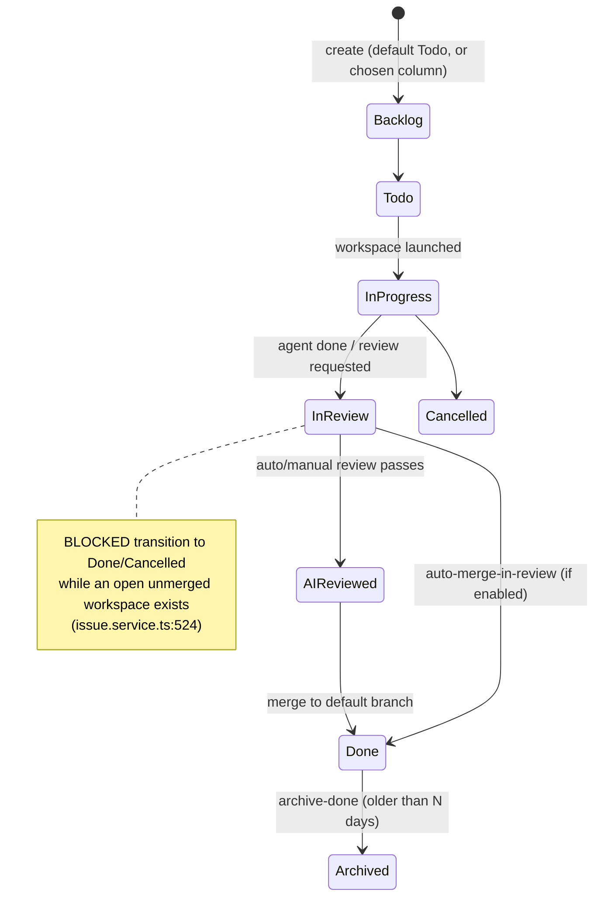

# Issues & Board (kanban core)

## Purpose & business capability

This module is the **domain substrate of the whole product**: the nouns every other capability orchestrates over. A *project* is one git repository under management; an *issue* is one unit of AI-driven coding work inside it; a *status* is a configurable column the issue moves through; *tags* annotate issues; *dependency edges* express ordering and coupling between issues. Everything else in the app — workspaces, the agent monitor, the Conductor, analytics, the Butler — exists to move issues across the board or to read the board's state.

The capability it provides is **a stable, per-project work backlog with a configurable workflow**, plus the **aggregated read models** that let humans (the React board) and agents (the MCP `get_board_status` tool) see the same picture of what work exists, what is blocked, what is in flight, and what needs human attention. If this module vanished there would be no tickets to assign agents to, no columns to flow them through, and no board to observe — the product would have nothing to manage.

Two design commitments shape it. First, the **board status is a derived view, not a stored truth**: an issue's effective column is computed from its most-relevant workspace's current workflow node, falling back to its own `statusId` (`board-status.ts:45`). Second, **classification policy (what "needs attention" / "pending merge" means) lives in a shared, transport-neutral leaf** so a human and an agent never disagree about the board (`board-status-classifiers.ts:3`).

## Ubiquitous language

| Term | Meaning *as used here* | Defined at |
|------|------------------------|------------|
| Project | One managed git repository; owns issues, statuses, worktrees, setup scripts. `repoPath` is its identity in the filesystem. | `schema/projects.ts:3` |
| Issue / Ticket | A unit of coding work. "Ticket #N" in the UI = `issueNumber` (per-project), not the UUID `id`. `#N` is never a GitHub PR. | `schema/issues.ts:6` |
| `issueNumber` | Human-facing per-project sequential number (`MAX+1`), distinct from the global UUID `id`. Unique within a project. | `issue-number.repository.ts:65`, `schema/issues.ts:43` |
| Status (column) | A named lane configured per project (`project_statuses`), ordered by `sortOrder`. NOT a global enum — each project defines its own. | `schema/project-statuses.ts:5` |
| Terminal status | The absorbing states. Two distinct sets: the **Archived-inclusive** terminal view `{Done, Cancelled, Archived}` (`LEGACY_TERMINAL_STATUS_NAMES`, `status-view.ts:1`) consumed by `isTerminalStatusView` (`status-view.ts:42`); and the **narrower** board-exclusion set `{Done, Cancelled}` used to build `terminalStatusIds` for default board filtering (`board-status.ts:91`). Issues here are excluded from the active board by default. | `status-view.ts:1,42`, `board-status.ts:91` |
| `currentNodeId` | The workflow-graph node the issue sits on; the board status is *derived* from it when a workflow template applies (`null` = legacy status-only flow). | `schema/issues.ts:29` |
| Dependency edge | A typed relation between two issues. 7 types; only `depends_on`/`blocked_by` block; `parent_of`/`child_of` express hierarchy; `related_to`/`duplicates`/`coupled_with` are symmetric peers. | `schema/issue-dependencies.ts:5` |
| `coupled_with` | Symmetric edge: two issues touch the same code and are best built together. Basis for "contraction" (collapsing a coupled set into one ticket). | `schema/issue-dependencies.ts:33` |
| Contraction | Collapsing a connected `coupled_with` component onto one *lead* issue; the lead absorbs the set's external sequential edges, members become `duplicates` of the lead and go terminal. The documented INVERSE of epic decomposition. | `dependency-graph.ts:143`, `issue.service.ts:851` |
| Board status (read model) | The assembled per-issue overview (effective status, workspace, diff, attention/merge classification) served to the UI and MCP. | `board-status.ts:64` |
| Attention bucket | A flag that an In-Review issue is stuck (closed workspace / no diff / zero diff) and needs a human. | `board-status-classifiers.ts:31` |
| Merge state bucket | A flag that an idle In-Review workspace is queued for auto-merge. | `board-status-classifiers.ts:64` |
| `skipAutoReview` | Per-issue opt-out of the automatic review gate before merge. | `schema/issues.ts:19` |
| Drive | A record tying a parent/meta issue to an auto-decomposed batch of children (created alongside a batch). | `issue.service.ts:472` |

## Domain model & invariants

The module owns five tables: `issues`, `projects`, `project_statuses`, `tags`/`issue_tags`, `issue_dependencies`. The internal model is the Drizzle row; the wire contract is the hand-authored DTO (`BoardStatusResponse` etc.) — Drizzle never crosses the network (per the shared-package boundary rule).

| Invariant / rule / policy | Why (business reason, inferred) | Enforced at |
|---------------------------|----------------------------------|-------------|
| An issue must have a non-empty `title`. | A titleless work unit is meaningless to the board, the agent prompt, and the monitor — rejected at the boundary so no half-formed unit enters. | `routes/issues.ts:284`, `issue.service.ts:388` |
| Every issue belongs to exactly one project and one status (both FK-required). | An issue with no project has no repo to act on; no status has no column to render. | `schema/issues.ts:14-15` |
| `issueNumber` is allocated `MAX(issue_number)+1` per project, retried up to 3× on the unique-index collision. | Human-friendly stable numbering; parallel creates race on the same next number, so the unique index + retry is the concurrency guard (single source of truth, was copy-pasted & drifted). | `issue-number.repository.ts:65`, `issue.service.ts:78`, `schema/issues.ts:43` |
| A non-terminal → terminal move (Done/Cancelled) is BLOCKED while the issue has an open, non-direct, unmerged workspace. | Marking Done while a branch is still open silently strands the branch ("silent merge loss", AK-535). The guard runs BEFORE the write so a blocked move is a no-op. | `issue.service.ts:524`, `:609` (bulk) |
| Transitioning INTO a terminal status closes any still-open workspace for the issue. | Otherwise the monitor keeps relaunching the now-pointless idle workspace every cycle (#776). Only fires on the non-terminal→terminal edge (re-saving a Done issue is a no-op). | `issue.service.ts:551` |
| Adding a directional dependency (`depends_on`/`blocked_by`/`parent_of`/`child_of`) that would create a cycle is rejected. | A dependency loop corrupts the board's ordering/blocking logic; cycle detection is correctness-critical and centralized so server, MCP, and batch paths can't drift. | `issue.service.ts:678`, `dependency-graph.ts:64`, `board-column.service.ts:77` |
| Symmetric edges (`related_to`/`duplicates`/`coupled_with`) never participate in cycle checks; stored `(from,to)` order is meaningless. | They model undirected affinity, not ordering, so a "loop" is not a contradiction. | `schema/issue-dependencies.ts:33`, `issue.service.ts:173` |
| An issue cannot depend on itself; a dependency cannot cross projects; a duplicate edge `(issue,dependsOn,type)` is rejected. | Self/cross-project/duplicate edges are nonsensical for a per-project backlog; enforced both in code and by a DB unique index. | `issue.service.ts:660,674`, `schema/issue-dependencies.ts:46` |
| An issue is "blocked" iff it has a `depends_on`/`blocked_by` edge to an unresolved issue; an absent blocker counts as blocking. "Resolved" = `isResolvedDependencyStatusView` (`status-view.ts:58-60`), i.e. the blocker's status is in `LEGACY_RESOLVED_DEPENDENCY_STATUS_NAMES = {Done, AI Reviewed, Cancelled}` (`status-view.ts:2`) — a WIDER set than terminal, so an AI-Reviewed blocker already unblocks dependents. | Blocked issues must not be auto-started by the monitor; a missing blocker is treated conservatively as still-blocking. | `board-column.service.ts:39-43`, `status-view.ts:58-60` |
| Bulk update/contract refuse to operate across more than one project. | The board is per-project; a cross-project batch has no coherent meaning and would corrupt counts. | `issue.service.ts:596,878` |
| Contraction requires the supplied `issueIds` to EXACTLY equal the lead's `coupled_with` connected component, with no open workspaces. | Partial contraction would orphan edges or drop in-flight work; the component must be whole and quiescent before collapse. | `issue.service.ts:891,898,907` |
| `externalUrl` must be absent or a well-formed http(s) URL (no `javascript:`/`data:`). | The URL is opened in a new browser tab; rejecting other schemes prevents smuggling executable payloads. | `issue.service.ts:114` |
| `getBoardStatus` (server board status + MCP) excludes Done/Cancelled issues unless `includeClosed`. | The board is a view of *active* work; closed issues are history, not the working set. Takes ONLY `includeClosed` (no `includeArchived` param); filters on the narrow `{Done, Cancelled}` set. | `board-status.ts:34-38,98` |
| `GET /:id/board` → `projectService.getBoard` excludes the Archived column unless `includeArchived`. | A separate read model with its own flag — takes ONLY `includeArchived` (no `includeClosed`); the query string toggles whether the Archived column is returned. | `routes/projects.ts:291,315` |
| A project gets a fixed 7-status workflow on registration (Backlog→Todo→In Progress→In Review→AI Reviewed→Done→Cancelled). | A new repo needs a usable board immediately; "Todo" is the default landing column (`isDefault`). | `issue.repository.ts:41`, `:51` |
| A status with linked issues cannot be deleted. | Deleting a column out from under live issues would leave them dangling (FK + no fallback column). | `project.repository.ts:224` (409 return; SELECT at `:218`) |

## Key workflows / use cases

### Issue lifecycle (status as a derived view)

The legal column set is per-project and reorderable; the diagram shows the seeded default. The *effective* status of an issue is recomputed on every board read: if the issue's most-relevant workspace sits on a workflow node, that node's status name wins over the issue's own `statusId` (`board-status.ts:45-61`). This is the "status as view" model (#78) — the issue row's `statusId` is the fallback, not the authority, when a workflow template is in play.

### Board status assembly (the read model)
Trigger: `getBoardStatus` (server board endpoint, MCP `get_board_status`). Steps (`board-status.ts:64`): resolve project (active-project pref if none given) → load statuses + terminal set → load issues (LEFT JOIN workflow node) → filter terminal unless `includeClosed` → load workspaces, sessions, workflow-node statuses → for each issue pick the main workspace by status priority then recency → assemble entry → enrich with diff stats / last output / conflict cache (60s TTL) → **classify** `mergeState` then `attention` purely. Outcome: a `BoardStatusResponse` with per-issue overview + totals. Failure: unknown project → `NotFoundError`; per-issue enrichment failures degrade that field.

### Batch create with declared coupling
Trigger: `POST /api/issues/batch` (`routes/issues.ts:157`). The generating agent (Butler/REST) can DECLARE dependency edges by 0-based index alongside the issues; edges are validated (range, no self, no dup, no directional cycle) and inserted in the SAME transaction as the issues (`issue.service.ts:395,442`). Outcome: the monitor can never observe a coupled/blocked ticket before its edge exists (#765/#918). Optional `parentIssueId` wires `child_of` and `driveTarget` creates a Drive.

### Contraction (inverse of decomposition)
Trigger: `POST /api/issues/contract-coupled` (`routes/issues.ts:204`). `planContraction` (`dependency-graph.ts:143`) computes the atomic edge mutations: repoint every external `depends_on`/`blocked_by` edge touching a non-lead member onto the lead (dedup, no self-edges), drop the internal `coupled_with` edges. Then members become `duplicates` of the lead, get a "Absorbed into #N" pointer appended, and are moved to Cancelled/Done (`issue.service.ts:928-950`). Outcome: a coupled set collapses into one buildable ticket without dangling edges.

## Entry points

| Entry point | Kind | What it lets a caller do | `file:line` |
|-------------|------|--------------------------|-------------|
| `GET /api/issues?projectId=` (`?slim=1`, `?statusName=`) | API | List a project's issues; slim omits description (~60% of payload). | `routes/issues.ts:64` |
| `POST /api/issues` | API | Create one issue (title required). | `routes/issues.ts:268` |
| `POST /api/issues/batch` | API | Atomically create N issues + declared dependency edges + optional parent/Drive. | `routes/issues.ts:157` |
| `PATCH /api/issues/:id`, `PATCH /api/issues/bulk` | API | Update fields / status (terminal-move guard applies). | `routes/issues.ts:527,248` |
| `POST/DELETE /api/issues/:id/dependencies`, `/dependencies/batch` | API | Add/remove typed dependency edges (cycle-checked). | `routes/issues.ts:597,181` |
| `POST /api/issues/contract`, `/contract-coupled`, `/contract/confirm` | API | Propose/apply contraction of a coupled component. | `routes/issues.ts:128,204,135` |
| `POST /api/issues/archive-done` | API | Move Done issues older than N days to Archived. | `routes/issues.ts:229` |
| `GET /api/projects/:id/board` | API | The board read model (ETag/304 fast path). | `routes/projects.ts:289` |
| `GET/POST/PATCH/DELETE /api/projects/:id/statuses` | API | Configure the per-project workflow columns. | `routes/projects.ts:167-198` |
| `POST /api/projects`, `/create`, `PATCH/DELETE /:id`, archive/unarchive | API | Register/create/update/archive a managed repo. | `routes/projects.ts:80-141` |
| `GET/POST/PATCH/DELETE /api/tags`, `/tags/merge` | API | Manage tags + merge duplicates. | `routes/tags.ts:11-47` |
| `getBoardStatus(...)` | function (server + MCP) | Assemble the classified board overview. | `board-status.ts:64` |

## Logic-bearing code (where the real decisions live)

| File / function | What decision/logic it holds | `file:line` |
|-----------------|------------------------------|-------------|
| `issue.service.ts` (`updateIssue`, `createIssuesBatch`, `contractCoupledIssues`, `validateBatchDependencies`) | The terminal-move guard, workspace auto-close, per-issue-number retry, same-transaction edge seeding, contraction orchestration — the bulk of the write-side business rules. | `issue.service.ts:484,367,851,182` |
| `dependency-graph.ts` (shared) | Cycle detection (`wouldCreateCycle`/`hasPath`), `coupled_with` component resolution, and `planContraction` edge-inheritance — correctness-critical, centralized so 3 call sites can't drift. | `dependency-graph.ts:64,88,143` |
| `board-status.ts` (`getBoardStatus`, `selectMainWorkspace`) | How an issue's *effective* column is derived (workspace node > issue status), and how the whole board overview is assembled and totaled. | `board-status.ts:45,64` |
| `board-status-classifiers.ts` (shared) | The policy for "needs attention" (closed-in-review / stale-in-review / idle-awaiting) and "pending auto-merge" — one definition for human and agent. | `board-status-classifiers.ts:31,64` |
| `board-column.service.ts` (`buildBlockedMap`) | The blocked-vs-unblocked rule the monitor relies on to decide what may auto-start. | `board-column.service.ts:15` |
| `status-view.ts` (shared) | The three terminal/resolution predicates, shared by server + MCP. (a) `isTerminalStatusView` — a `Done`/`Cancelled`/`Archived` STATUS counts terminal even if the workflow `currentNode` never reached an `end` node (the #537 status↔node desync rule; else dependents never resolve). (b) `isResolvedDependencyStatusView` resolves deps against the WIDER `{Done, AI Reviewed, Cancelled}` set, so an AI-Reviewed blocker unblocks dependents. (c) `computeBlockerReadiness` — the #784 "Done ≠ on master" rule: a blocker only unblocks when terminal AND landed-on-base (`mergedAt` set, `isDirect`, or no workspace). | `status-view.ts:33-45,58-60,98-105` |
| `issue-number.repository.ts` | The single sanctioned `MAX(issue_number)+1` allocator (enforced by a gate test). | `issue-number.repository.ts:65` |
| `issue-summary-projection.ts` | Pure projection of a session stats blob into the issue summary's wire shape (historical defaults: `numTurns` 1, model fallback). | `issue-summary-projection.ts:30` |

## Dependencies & bounded-context relationships

- **workflow-engine** (Shared Kernel / Customer-Supplier): issue status is co-defined with the workflow graph. The module calls `syncCurrentNodeToStatus` on every status write (`issue.service.ts:341,538`) and derives effective status from `workflowNodes.statusName` (`board-status.ts:122`). `currentNodeId`/`workflowTemplateId` on the issue row are the join points. This module is the *supplier* of the issue/status rows the workflow engine moves.
- **persistence-schema** (Shared Kernel): owns the `issues`/`projects`/`project_statuses`/`tags`/`issue_dependencies` tables; internal type = Drizzle `$inferSelect`; wire DTOs are the published language to the client.
- **workspaces** (Customer-Supplier, this module is supplier-of-issues / consumer-of-workspace-state): the board read model reads workspace status, diff cache, conflict cache, sessions to compute the per-issue overview (`board-status.ts:114`, `issue.repository.ts:454`). The terminal-move guard depends on `findOpenUnmergedWorkspace` (`issue.service.ts:526`). Note the deliberate avoidance of importing the workspace service to dodge an import cycle — status writes do a direct DB close instead (`issue.service.ts:548`).
- **Hidden / co-change couplings**: `board-aggregation.service.ts` is a thin facade re-exporting `workspace-summary`, `session-stats`, `board-column`, `diff-stats` sub-services (`board-aggregation.service.ts:1`) — import the sub-services directly. The MCP server keeps a *mirror* allocator (`db-utils.ts#nextIssueNumber`) and consumes the same shared `dependency-graph`/`board-status-classifiers` leaves; these are co-change points enforced by gate tests (`issue-number-single-source.test.ts`, the classifier centralization comment at `board-status-classifiers.ts:9`).
- **Downstream consumers**: the React board, the in-process monitor/Conductor (reads blocked-map + attention buckets to decide auto-starts), analytics routes (burndown/CFD/throughput/lead-time all read issue create/status-change timestamps), and the Butler.

## File topology
_Brief — structure is well-formed (layered routes → services → repositories → schema)._

| Sub-responsibility | Implemented in | Layer |
|--------------------|----------------|-------|
| Wire schema for tickets/projects/columns/tags/edges | `packages/shared/src/schema/*.ts` | shared schema |
| Issue/dependency/contraction write rules | `services/issue.service.ts` | server service |
| Board read model assembly | `services/board-status.ts` (+ `board-column`, `board-aggregation` facade) | server service |
| Classification policy (attention/merge) — shared with MCP | `packages/shared/src/lib/board-status-classifiers.ts` | shared leaf |
| Cycle detection + coupling/contraction graph math — shared with MCP | `packages/shared/src/lib/dependency-graph.ts` | shared leaf |
| Per-project issue-number allocation | `repositories/issue-number.repository.ts` | server repo |
| DB reads/writes for issues/projects/board-status | `repositories/{issue,project,board-status}.repository.ts` | server repo |
| HTTP surface | `routes/{issues,projects,tags}.ts` | server route |

## Risks, gaps & open questions

- **Two issue-create paths with subtly different semantics.** `issue.service.createIssue` (REST/MCP, resolves workflow template + currentNode) and `issue.repository.createIssueWithNextNumber`/`createSubIssueWithParentLink` (CLI, deliberately skip workflow resolution) both allocate numbers but only the latter pair note they are "NOT a transaction" for the MAX-read+insert (`issue.repository.ts:711,776`). The 3× retry papers over the race; under heavy parallel CLI creates a number could still collide after 3 tries → `CONFLICT`. **Inferred, unverified**: whether 3 attempts is empirically sufficient.
- **Terminal-status detection is partly string-based.** `terminalStatusIds` is built by matching status names `"Done"`/`"Cancelled"` (`board-status.ts:91`); a project that renames or localizes these columns would lose terminal semantics. The workflow-node path (`isTerminalStatusView`) is more robust but the legacy fallback is name-coupled. Likely intentional given the seeded defaults, but a real constraint on custom workflows.
- **`archiveDoneIssues` requires a status literally named "Archived"** (`issue.service.ts:1162`) and Done detection via `getDoneStatusIds` — same naming coupling; a project without an "Archived" column gets a `NOT_FOUND`.
- **Attention classifier only covers In-Review.** `classifyBoardStatusIssueAttention` returns a bucket only for `statusName === "In Review"` (`board-status-classifiers.ts:34`); a stuck In-Progress issue (e.g. dead agent) is not surfaced here — that detection lives elsewhere (workspace risk / monitor). Worth knowing the board's "attention" flag is review-stage-only.
- **`board-aggregation.service.ts` is a facade only** — the header tells callers to import sub-services directly (`board-aggregation.service.ts:1`). It is named as an entry point but holds no logic; the real board read model is `board-status.ts` + `project.service.getBoard` (the latter outside this module's file set).
- **Cross-project guard relies on row-count equality**, not explicit per-row checks, in a few places (`issue.service.ts:591` bulk-update: `rows.length !== new Set(ids).size`). Correct, but a deleted-mid-request issue surfaces as a generic NOT_FOUND rather than naming the missing id.
