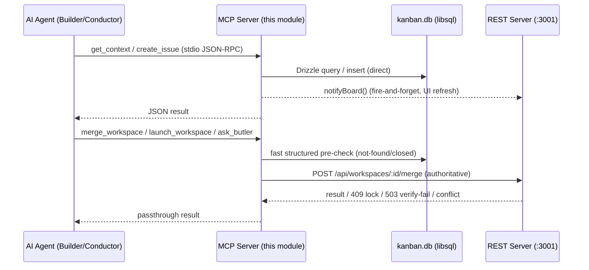

# MCP Server (agent-facing tool surface)

## Purpose & business capability
This is the board's **machine-facing front door**. A human uses the React UI and the REST API; an AI coding agent (a Builder in a worktree, the Conductor monitor, or a Smith analysis session) speaks [Model Context Protocol](https://modelcontextprotocol.io) over stdio and gets the *same* board operations exposed as named, typed tools (`create_issue`, `move_issue`, `merge_workspace`, `get_context`, …). The whole point of the module is to let the agents that *do the work* also *manage the work* — file tickets, move them across the workflow, spin up and merge their own workspaces, review diffs, and query "what are my agents doing right now" — without a human in the loop and without the agent having to hand-roll HTTP calls.

It exists because the product's core loop is autonomous: the Conductor and Builder agents must manipulate the board programmatically. MCP is the published language they share with the board. If this module vanished, every agent-driven workflow (auto-start, dependency cascades, self-review, autonomous epic "drives") would lose its control plane — the board would degrade to a manual, human-clicks-buttons tool. The CLAUDE.md tool-precedence rule "**MCP → CLI → REST**" makes this the *preferred* integration path, not a fallback.

The catalog is large (90 tools across 14 categories — defs at `mcp-tool-definitions.ts:40`, the `McpToolCategory` union at `:1-15`) and deliberately mirrors the human featureset: the design intent, stated repeatedly in tool comments, is that **an agent over MCP must never get a weaker or staler operation than a human over the UI** (`merge-workspace.ts:14`, `get-board-status.ts:8`).

> Provider note: MCP itself is provider-neutral — Claude Code, Codex, and Copilot agents all consume this surface. The one Claude-specific coupling is the Butler tool family (`ask_butler` et al.), which fronts a warm Claude Agent-SDK assistant (`ask-butler.ts:15`).

## Ubiquitous language
| Term | Meaning *as used here* | Defined at |
|------|------------------------|------------|
| Tool | One MCP-callable board operation; a Zod-typed schema + async handler registered on the server | `index.ts:104`, every `tools/*.ts` |
| Registrar | `register<Name>(server, deps?)` function that installs one tool; the unit of the catalog | `index.ts:104` |
| Active project | The project a tool operates on when no `projectId` is passed — resolved from the `activeProjectId` preference | `db-utils.ts:109` |
| Tool category | UI/governance grouping (board, issues, workspaces, sessions, tags, review, dependencies, workflow, skills, specs, drives, projects, settings, butler) | `mcp-tool-definitions.ts:1-15` |
| Disabled tool | A tool name listed in the `disabled_mcp_tools` preference; skipped at registration so it never appears to agents | `index.ts:198` |
| Direct workspace | `isDirect=true` — commits straight to master, has no branch to merge; exempt from merge guards | `db-utils.ts:168` |
| Terminal status | Done/Cancelled — the statuses whose entry is guarded against stranding an unmerged branch | `update-issue.ts:42`, shared `isTerminalStatusName` |
| notifyBoard | Fire-and-forget ping to the REST server so connected browsers refresh after an MCP mutation | `notify.ts:8` |
| ToolDeps | Injected dependency bundle (db, schema, notifyBoard, git diff fns) — defaults to prod singletons, swapped for in-memory in tests | `tools/deps.ts:16` |

## Domain model & invariants
The module owns **no tables of its own** — it is a *projection of capability* over the issues-board, workspaces, sessions, and preferences entities. Its domain value is the set of **policies it enforces at the agent boundary**.

| Invariant / rule / policy | Why (business reason, inferred) | Enforced at |
|---------------------------|----------------------------------|-------------|
| **Every project-scoped tool resolves to an active project or fails with a fix-it message** | An agent that operates on the wrong (or no) project silently corrupts the board; emptiness is rejected at the door with an actionable error | `db-utils.ts:109`, `get-context.ts:15`, `create-issue.ts:23` |
| **An issue cannot move to a terminal status while it has an open, non-direct, unmerged workspace** | Skipping `merge_workspace` and just flipping the issue to Done strands the branch → silent merge loss (AK-535). The agent is told to call `merge_workspace` (which merges *and* auto-transitions) instead | `move-issue.ts:37`, `update-issue.ts:42`, guard `db-utils.ts:168` |
| **Direct workspaces are exempt from the unmerged-workspace guard** | They commit to master directly; there is no branch to lose, so the guard would be a false block | `db-utils.ts:179` |
| **A workflow-driven issue may only move along a legal outgoing edge of its current node** | The board supports configurable workflow graphs; arbitrary status jumps would violate the graph. Agent is handed the valid next stages or told to use `propose_transition` | `move-issue.ts:56` |
| **Issue-number allocation retries up to 3× on the unique-constraint collision** | Parallel agents racing `create_issue` would otherwise fail; the per-project `(project_id, issue_number)` uniqueness is honored by retry, not by locking | `create-issue.ts:8`, detector `db-utils.ts:29` |
| **Merge is delegated to the REST server, never re-implemented inline** | The authoritative merge path owns the per-repo lock, pre-merge backup/rollback, conflict→fix-and-merge recovery, and timeline recording; an inline MCP merge bypassed all four and was "strictly less safe than a human's" | `merge-workspace.ts:8` |
| **Board-status / classification logic is imported from `@agentic-kanban/shared`, not copied** | Local copies drifted and emitted a poorer board than the server's; agents must see the identical projection humans do | `get-board-status.ts:8`, `get-board-status.ts:17` |
| **Agent-skill names may not contain `/`, `\`, or `..`; names are unique per scope** | Skill names become filesystem paths (`.claude/skills/<name>/SKILL.md`); path-traversal and collisions are rejected at creation | `create-agent-skill.ts:19`, `create-agent-skill.ts:26` |
| **A disabled tool is never registered** | Operators can shrink the agent's authority (the `disabled_mcp_tools` pref) without redeploying; the tool simply doesn't exist for that session | `index.ts:198`, `index.ts:221` |
| **Async rejections are caught and logged to stderr; the process stays up** | A stray drizzle rejection would crash stdio → the agent's client reports "server not connected" and *every* board op fails. Resilience mirrors the main server | `index.ts:246` |
| **stderr only for logs, never stdout** | stdout is the JSON-RPC stream; any stray write corrupts the protocol | `index.ts:236`, `index.ts:245` |
| **Status-change mutations fire the project's outbound webhook (best-effort)** | The board is an event source; external systems subscribe to issue transitions regardless of whether a human or agent caused them | `update-issue.ts:70`, `move-issue.ts:92` |
| **The outbound webhook URL is validated LOOPBACK-ONLY — the only egress boundary** | The URL comes from the attacker-influenceable `outbound_webhook_url_<projectId>` pref; `validateWebhookUrl` rejects any non-http(s) scheme and any host except `localhost`/`127.0.0.1`/`::1`, so a malicious pref can't turn a status change into an SSRF/exfiltration probe of arbitrary hosts | `shared/src/lib/outbound-webhook.ts:44-59` |

## Key workflows / use cases

### How the MCP server reaches the board — a deliberate hybrid (DB-direct + REST-delegate)
This is the central architectural fact. The MCP server is its **own process** with its **own libsql/Drizzle connection** to the same `kanban.db` (`db.ts:58`). It is *not* a thin REST client.

- **Reads and simple mutations go straight to the DB.** `get_context`, `create_issue`, `update_issue`, `move_issue`, `get_board_status`, skill CRUD, preferences — all run Drizzle queries directly (`get-context.ts:19`, `create-issue.ts:50`). After a mutation they fire `notifyBoard()` so open browsers refresh (`notify.ts:8`); this is a UI-freshness ping, not the operation itself.
- **Operations that need live process/git state are delegated over HTTP to the REST server** at `127.0.0.1:<port>` (`server-url.ts:13`). `merge_workspace` → `POST /api/workspaces/:id/merge` (`merge-workspace.ts:49`), `launch_workspace` → `/launch` (`launch-workspace.ts:66`), `ask_butler` → `/butler/ask` (`ask-butler.ts:24`), `propose_transition` → an internal workflow-advanced hook (`notify.ts:23`).

The dividing line is a **domain rule, not an accident**: anything that touches the git worktree, the agent session manager, merge locks, or the warm Butler process *must* go through the one process that owns that state. Pure DB facts can be served directly for speed and to keep working even when the REST server is down. So the relationship to the REST API is **partly conformist delegation (Anti-Corruption-free passthrough for the dangerous ops) and partly shared-database integration (direct reads/writes for the safe ones)** — it does *not* blanket-duplicate REST logic, and where duplication crept in (board-status classifiers) it was deliberately collapsed back to a shared kernel (`get-board-status.ts:8`).

### Tool registration & governance (server bootstrap)
Trigger: process start (`main()`, `index.ts:216`). Steps: read `disabled_mcp_tools` pref → iterate the `TOOL_REGISTRARS` map → register each non-disabled tool → connect stdio transport → log counts to stderr. Outcome: a live JSON-RPC server exposing N tools. Failure: a fatal throw exits 1 (`index.ts:253`), but async rejections are swallowed to keep the connection alive (`index.ts:246`).

### Active-project resolution (every project-scoped call)
`resolveActiveProjectId(db, schema, providedId?)` (`db-utils.ts:109`): if `projectId` is passed, use it; else read the `activeProjectId` preference; else return the standardized "No active project. Run `pnpm cli -- register <path>` first." error. This is why CLAUDE.md warns the active project ID changes on DB wipe — agents should resolve it live via `get_context`, not hardcode it.

## Entry points
| Entry point | Kind | What it lets a caller do | `file:line` |
|-------------|------|--------------------------|-------------|
| `main()` over `StdioServerTransport` | process/JSON-RPC | Speak MCP over stdio; this is the only transport | `index.ts:216`, `index.ts:234` |
| `TOOL_REGISTRARS` map | registration table | The authoritative list of ~95 tool names → registrars | `index.ts:104` |
| `MCP_TOOL_DEFINITIONS` | published catalog (shared) | The wire contract describing every tool to the UI/governance layer (name, description, category) | `mcp-tool-definitions.ts:40` |
| `get_context` | tool | Orient: project info, issue counts by status, active workspace count | `get-context.ts:7` |
| `update_issue` / `move_issue` | tool | The busiest mutation door — edit fields and walk the workflow | `update-issue.ts:8`, `move-issue.ts:9` |

## Logic-bearing code (where the real decisions live)
| File / function | What decision/logic it holds | `file:line` |
|-----------------|------------------------------|-------------|
| `index.ts` | The catalog + the disabled-tool gate + crash-resilience policy; read first to see the whole surface | `index.ts:104`, `index.ts:198`, `index.ts:246` |
| `db-utils.ts` | The shared rule engine: active-project resolution, status-by-name, the **terminal-status / open-workspace guard**, issue-number allocation, structured error factories. Most domain rules live here, shared so move/update can't drift | `db-utils.ts:109`, `db-utils.ts:168`, `db-utils.ts:191` |
| `move-issue.ts` / `update-issue.ts` | Workflow-edge legality + terminal-status merge-loss guard + outbound webhook firing | `move-issue.ts:37`, `move-issue.ts:56`, `update-issue.ts:42` |
| `merge-workspace.ts` | The delegate-don't-reimplement policy and the local fast-fail pre-checks; the canonical example of "agents get the same safety net as humans" | `merge-workspace.ts:8`, `merge-workspace.ts:35` |
| `get-board-status.ts` | "What are my agents doing right now" — assembles per-issue state from *shared* classifiers/projections to stay identical to the server's | `get-board-status.ts:8`, `get-board-status.ts:22` |
| `db.ts` | DB-path resolution policy (dev DB beats published DB) + pragma discipline so MCP can't bypass FK enforcement | `db.ts:15`, `db.ts:32` |
| `tools/deps.ts` | The dependency-injection seam that makes every tool unit-testable without spawning stdio | `tools/deps.ts:16` |
| `notify.ts` / `server-url.ts` | The two ways out to the REST process: UI-refresh ping vs. authoritative delegation, plus port resolution | `notify.ts:8`, `server-url.ts:3` |

### Notable tools beyond the core CRUD
The catalog reveals the breadth of agent self-management: **Drives** (`drives.ts` — first-class records of an autonomous epic push under a "completion contract"), **session forensics** (`analyze-session`, `get-fleet-friction`, `session-review-effectiveness`, `reviewer-fixes` — the Smith/compounding-engineering surface), **dependency graph ops** (`update-dependencies-batch` with cycle detection, `contract-coupled-issues`), **OpenSpec living specs** (`openspec.ts`), **workflow-template CRUD** (configurable workflow graphs), **project lifecycle** (`register/create/unregister/cleanup/init_project`), **evidence capture** (`attach_artifact` — how an agent records proof-of-work: a text/link/image/`.webm` "visual proof" artifact keyed to a workspace and resolved back to its issue; `attach-artifact.ts:9`), and the **Butler family** (10 tools fronting a warm per-project Claude assistant). The agent can effectively run the entire board.

## Dependencies & bounded-context relationships
- **Upstream (needs):**
  - `issues-board` — owns issues/statuses/workflow nodes; MCP reads/writes these tables directly. **Integration: shared database** (same `kanban.db`).
  - `workspaces` — for `merge/launch/start/stop/close/relaunch`, MCP delegates to the REST server that owns worktree + session-manager + merge-lock state. **Integration: Customer-Supplier / conformist** (MCP is the customer, REST owns the contract).
  - `butler` — `ask_butler` and the `butler_*` tools are thin HTTP fronts over the Butler's per-project warm session. **Integration: conformist delegation.**
  - `@agentic-kanban/shared` — the **Published Language / Shared Kernel**: schema, `mcp-tool-definitions`, board-status classifiers, workflow-engine, webhook builders, session-file readers. The deliberate single-source-of-truth that prevents MCP↔server drift.
- **Downstream (needs this):** every AI agent provider (Claude Code, Codex, Copilot Builders; the Conductor monitor; Smith analysis sessions). The board's autonomy depends on it.
- **Hidden coupling:** MCP and the REST server **co-change** whenever a board capability is added (a new REST endpoint usually wants a mirror MCP tool) even with no import edge between the two packages — they are bound by the shared schema and the shared tool-definition catalog, not by code references. The repeated "this drifted from the server's; now both use the shared helper" comments (`get-board-status.ts:8`) are evidence of this co-change pressure.

## File topology  _(brief — structure is well-formed)_
One package, flat tool catalog. `index.ts` = registry/bootstrap. `tools/*.ts` = one file per tool (registrar pattern). `db.ts`/`db-utils.ts`/`notify.ts`/`server-url.ts`/`git-service.ts` = the shared infra every tool draws on. `tools/deps.ts` = the DI seam. The capability map is legible from the `TOOL_REGISTRARS` table alone.

## Risks, gaps & open questions
- **Two processes, one DB, two access modes.** Direct-DB reads can serve **stale-relative-to-process state** for anything that lives in REST-server memory (in-flight session status, merge locks). The module mitigates this by delegating exactly those ops, but a future tool that reads such state directly from the DB would silently diverge. *(inferred, unverified — no test pins this boundary.)*
- **No authentication / authorization on the surface.** Any process that can spawn the stdio server and reach `kanban.db` has full board authority (delete issues, merge, register projects). This is intentional for a local-first single-user app, but the only authority knob is `disabled_mcp_tools` (`index.ts:198`) — a coarse, global, per-key list, not per-agent scoping. *(inferred.)*
- **`notifyBoard` and webhooks are fire-and-forget.** A mutation succeeds even if the UI ping or outbound webhook silently fails (`notify.ts:13`, `update-issue.ts:77`). Acceptable (polling/back-fill catches up) but means webhook delivery is best-effort, not guaranteed — external consumers must not treat absence of a webhook as absence of a transition. *(verified from code; delivery semantics inferred.)*
- **DB-path resolution can pick the wrong board.** `resolveDbPath` prefers the monorepo dev DB over the published one (`db.ts:19`); the comment documents a real past incident (butler #45) where a spawned MCP server read the stale published DB. The current order fixes the dev case but the precedence is a fragile, environment-sensitive heuristic. *(verified — comment + code.)*
- **`get_context` counts active workspaces globally, not per-project.** The workspace count query filters only by `status = "active"` with no `projectId` predicate (`get-context.ts:35`), while issue counts are project-scoped. In a multi-project board the `activeWorkspaces` number bleeds across projects. *(verified from code — likely a latent bug, flagged.)*
- **Catalog size vs. agent context budget.** 90 tools is a large surface to advertise to every agent; the `disabled_mcp_tools` gate exists, but there is no per-role default trimming. *(inferred.)*
