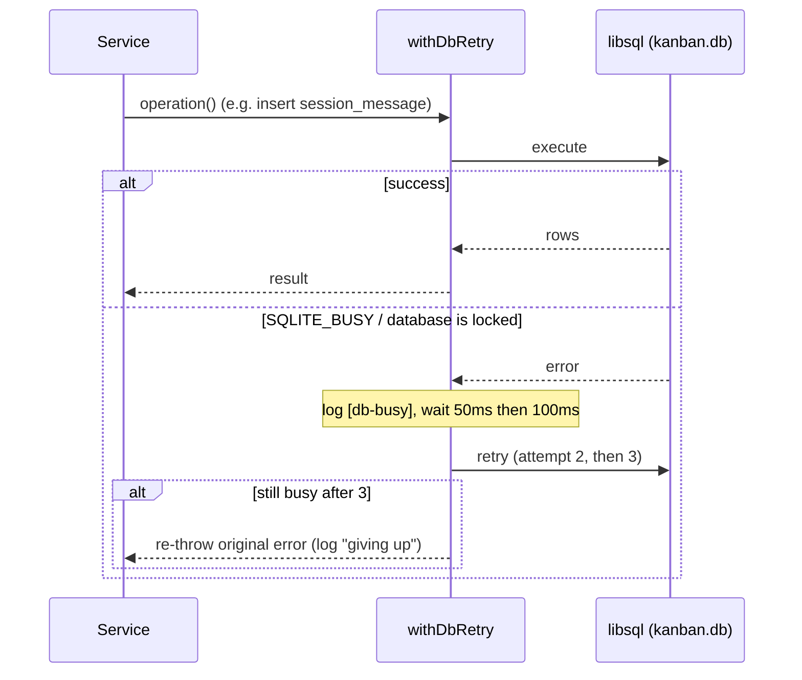

# Persistence & Schema (data kernel)

## Purpose & business capability

This module is the **single physical truth** of the whole product: every kanban
issue, every workspace, every line of agent output, and every user preference is a
row in one SQLite file (`kanban.db`). It exists to give a *solo, local-first*
application a durable, transactional store that survives server restarts and
hot-reloads, with no network database to operate.

It serves two distinct audiences at once:

1. **As a Published Language.** `schema/index.ts` is a barrel that re-exports ~29
   tables plus their relations and enum constants
   (`packages/shared/src/schema/index.ts:1`). Because it lives in the `shared`
   package, *every* other module — server services, repositories, the MCP server,
   the CLI — imports its row types directly (`typeof table.$inferSelect` is the
   codebase's internal entity type, by deliberate design; see
   `packages/shared/CLAUDE.md`). The schema is therefore not just storage layout: it
   is the **shared vocabulary** in which the rest of the system talks about the
   domain. A column added here becomes a fact the whole product can reason about.

2. **As a runtime kernel.** `db/index.ts` opens the connection, applies durability
   PRAGMAs, and hands out the `db`/`writeDb` query handles every service uses
   (`packages/server/src/db/index.ts:52`).

What would break if it vanished: everything. There is no other store. More subtly,
the *correctness* guarantees here — FK integrity, busy-retry under contention, and
deletion completeness — are what keep the board from silently corrupting when
**many agents write concurrently** (the defining stress of this app: parallel
worktree agents all streaming output into one file).

## Ubiquitous language

| Term | Meaning *as used here* | Defined at |
|------|------------------------|------------|
| Schema (Published Language) | The set of Drizzle table definitions re-exported from one barrel; the canonical data vocabulary shared across all packages | `packages/shared/src/schema/index.ts:1` |
| `db` (read handle) | Drizzle handle on the **read** connection — board/API queries; reads proceed against the last WAL checkpoint while writes commit | `packages/server/src/db/index.ts:52` |
| `writeDb` (write handle) | Drizzle handle on a **separate** write connection dedicated to the high-volume session-message stream, so reads never queue behind it | `packages/server/src/db/index.ts:53` |
| `withDbRetry` | The bounded SQLITE_BUSY retry wrapper — the policy that lock contention is *transient and retryable*, not fatal | `packages/server/src/db/retry.ts:26` |
| `withTransaction` | "Multi-write or nothing" helper: a drizzle transaction wrapped in busy-retry | `packages/server/src/db/index.ts:72` |
| `DATA_DIR` / `getDbUrl` | Resolution of *where* the one sacred `kanban.db` lives (env override → local checkout → `~/.agentic-kanban`) | `packages/server/src/db/data-dir.ts:15` |
| Managed FK action | A foreign key that declares a non-default `ON DELETE`/`ON UPDATE` (`cascade` or `set null`), as opposed to SQLite's default `NO ACTION` | `packages/shared/src/lib/fk-actions.ts:186` |
| FK-action drift | A live DB enforcing a different `ON DELETE`/`ON UPDATE` than the schema declares — a silent integrity hole | `packages/shared/src/lib/fk-actions.ts:9` |
| Cascade delete (application-level) | The hand-coded, ordered deletion walk that removes an issue/workspace and all its dependents, because most FKs are *not* `ON DELETE CASCADE` | `packages/shared/src/lib/cascade-delete.ts:21` |
| Migration journal | `meta/_journal.json` — the authoritative apply-*order* of migrations (not lexical); the gate for whether a `.sql` file runs at all | `packages/server/src/__tests__/helpers/migrations.ts:16` |
| `providerSessionId` / `claudeSessionId` slot | The agent-provider's own resume id, stored in one column reused across providers (Claude, Pi) | `packages/shared/src/schema/sessions.ts:14` |

## Domain model & invariants

The module owns the **entire relational graph**. The reference spine is:
`projects → issues → workspaces → sessions → session_messages`, with issues also
hanging tags, dependencies, artifacts, comments, time-entries, showdowns, and
milestones, and workspaces also hanging `diff_comments` (inline review comments on a
workspace diff — file path, old/new line, side, body, `resolvedAt`; `packages/shared/src/schema/diff-comments.ts:5`).
The diff-review UI that consumes that table (DiffViewer + inline comments) is a queued
board-ui surface (see `_coverage.md`), but the **table itself is part of this data kernel**
and is one of the workspace-subtree children the cascade walk deletes (`cascade-delete.ts:131`).
Below are the *rules* the kernel enforces (not the field list).

| Invariant / rule / policy | Why (business reason, inferred) | Enforced at |
|---------------------------|----------------------------------|-------------|
| **FK enforcement must be ON, per connection, or every `ON DELETE` clause is inert.** | SQLite disables FK enforcement by default; without `PRAGMA foreign_keys=ON` a "cascade" is a lie and orphan rows accrue. The code logs loudly on failure and re-checks at startup. | `packages/server/src/db/index.ts:11`, `:32` |
| **Reads and writes use separate connections (WAL reader/writer isolation).** | A board aggregation query must not queue behind the firehose of agent `session_messages` inserts; WAL only isolates them if they're distinct connections. | `packages/server/src/db/index.ts:29`, `:44` |
| **A locked DB is retried, not failed — up to 3 attempts with 50ms→100ms backoff.** | Parallel worktree agents + the monitor + the UI all hit one SQLite file; `SQLITE_BUSY`/"database is locked" is expected transient contention, not an error to surface. The 10s `busy_timeout` PRAGMA is the first line; `withDbRetry` is the second. | `packages/server/src/db/retry.ts:1`, `:30`; PRAGMA `index.ts:15` |
| **`SQLITE_BUSY` is matched by code OR by message substring** (`SQLITE_BUSY`, `EBUSY`, `database is locked`). | libsql surfaces lock contention inconsistently across native vs. message paths; matching both avoids a missed retry that would bubble a spurious 500 to the user. | `packages/server/src/db/retry.ts:4` |
| **An issue/workspace delete must remove *all* dependents, in dependency order, atomically — and assert nothing remains.** | Most FKs are plain `NO ACTION` (see drift note), so the DB will *not* cascade for us; an incomplete delete either FK-fails on the final row or leaves orphans. The walk runs in one transaction and re-queries every child table to prove emptiness. | `packages/shared/src/lib/cascade-delete.ts:21`, `:43`, `:153` |
| **Several FKs declare `ON DELETE CASCADE`/`SET NULL`; the issue/workspace deletion-subtree children the app-level walk handles are predominantly `NO ACTION`.** | Cascade/set-null are declared where DB-level propagation is safe and cheap: `session_messages → sessions`, `issue_dependencies → issues` (both edges), plus projects-/drives-/milestones-/workflows-scoped children (incl. `workflow_transitions → workspaces`). The deletion-subtree children of issues/workspaces stay mostly `NO ACTION` so the app-level walk controls order and can assert completeness. | `packages/shared/src/schema/session-messages.ts:9`, `issue-dependencies.ts:41`, `:42`, `drives.ts:18`, `:21`, `drive-obstacles.ts:38`, `:40`, `milestones.ts:8`, `workflows.ts:73`, `:104`, `:107`, `:110`, `:137` |
| **The schema's declared FK actions must equal what the live DB enforces.** | A schema that *says* cascade while an old live DB enforces RESTRICT is the exact bug #858 hit: the final issue-row delete FK-fails. The drift detector is the single source of truth for "what cascades should exist." | `packages/shared/src/lib/fk-actions.ts:82`, `:162` |
| **FK actions can only be repaired by a full table rebuild, never an in-place ALTER, and only the FK clauses are rewritten.** | SQLite cannot ALTER a FK action; the documented 12-step rebuild is the only safe path. Reusing live column DDL verbatim guarantees a repair can *never* alter a column's type/default/nullability — it only touches `ON DELETE`/`ON UPDATE`. | `packages/shared/src/lib/fk-actions-repair.ts:1`, `:65`, `:111` |
| **`foreign_keys=OFF` is set once around the whole drifted-table loop (restored in a single `finally`); each table then rebuilds in its own `BEGIN`/`COMMIT` with a `foreign_key_check`, and a failed check rolls that table back.** | Integrity repair must itself be integrity-safe: never leave the DB half-rebuilt. FK enforcement is disabled loop-wide (not per-transaction) and restored once in a `finally`; the per-table transaction + check still isolates each rebuild. | `packages/shared/src/lib/fk-actions-repair.ts:168`, `:176`, `:190` |
| **A migration runs only if it has a journal entry; order is the journal's `when`, not the filename.** | `drizzle-kit` silently skips un-journaled `.sql` files and applies by journal order; a later migration with an earlier timestamp runs first and `ALTER`s a not-yet-created table. The test helper reads the journal, never a hardcoded list. | `packages/server/src/__tests__/helpers/migrations.ts:16` |
| **Issue numbers are unique per project** (not globally). | `#N` is the human handle for a ticket *within a project*; a unique index on `(project_id, issue_number)` lets two projects both have a `#1`. | `packages/shared/src/schema/issues.ts:43` |
| **The DB file is resolved by existence, defaulting to `~/.agentic-kanban`.** | A worktree has no checked-out `kanban.db`, so a worktree dev-server falls through to the home dir — a *different* database, hence no lock contention with the main board (this is a feature, not a bug; see Risks). | `packages/server/src/db/data-dir.ts:9`, `:15` |
| **`kanban.db` is never deleted/reset/truncated; individual records are removed only via MCP/API (the cascade walk above).** A `validate-command-safety.js` PreToolUse hook hard-blocks destructive DB commands (`db:reset`, `rm`/`Remove-Item`/truncate/redirect over the file, any path form). | The file IS the entire *live* product state, and there is no network/off-machine copy — so it must never be casually wiped. A wipe is, however, **recoverable**: a verified rotating backup subsystem (see Lifecycle & recovery) keeps up to 5 local snapshots and `pnpm db:restore` rebuilds from the latest good one (local-only — gone if the disk is). The hook is the enforcement half of the sanctity rule — when it fires, stop and ask; never weaken or route around it. Lock/WAL/migration problems use the `db-doctor` skill (`pnpm db:repair`), which never deletes. | project `CLAUDE.md` (Hard Constraints); hook `.claude/hooks/validate-command-safety.js` |
| **A backup is verified before it is accepted, and refused if it looks empty-when-live-is-not.** Every snapshot must pass `PRAGMA integrity_check == "ok"` AND a row-count guard: a backup reporting 0 issues (or 0 projects) while the live DB has any is rejected as corrupt/empty rather than rotated in. | A silently-empty "backup" is worse than none — it rotates a good copy out and is the trap that caused a past silent data loss. Verification turns a backup into a *promise* of restorability; the tmp→verify→promote→atomic-rename sequence means a half-written or unverifiable snapshot never becomes a retained backup. | `packages/server/src/db/backup.ts:190` (`verifyBackup`), `:197`, `:202`, `:337` |

## Key workflows / use cases

### 1. Connection bring-up (module load)
Trigger: server imports `db/index.ts`.
Steps: `ensureDataDir()` (mkdir if absent) → resolve `getDbUrl()` → open **read**
client, apply PRAGMAs → open **write** client, apply PRAGMAs → export `db`/`writeDb`.
Failure handling: a failed `applyPragmas` is **logged, not fatal** — but a failed
`foreign_keys=ON` is independently re-checked at startup (`assertForeignKeysEnabled`
in startup-tasks) so it can't pass silently (`packages/server/src/db/index.ts:32`).

### 2. Write under contention

Orchestrated at `packages/server/src/db/retry.ts:30`. `withTransaction` wraps a whole
drizzle transaction in this same retry so a multi-write unit is "all or nothing, with
contention tolerance" (`packages/server/src/db/index.ts:72`).

### 3. Cascade delete an issue
Trigger: deleting a ticket (and implicitly its workspaces).
Steps (one transaction, `cascade-delete.ts:160`): for each workspace of the issue →
run the workspace cascade (delete transitions, retry-decisions, diff-comments,
artifacts, comments, repos, session_messages, sessions, then the workspace) → then
delete issue_dependencies (both directions), artifacts, comments, time-entries,
showdowns, issue_tags, finally the issue row. Outcome: a fully removed subtree.
Failure handling: after each subtree, `assert*CascadeComplete` re-queries every child
table and **throws if any row survived** (`cascade-delete.ts:43`, `:112`) — deletion
incompleteness is treated as a hard error, not a warning.

### 4. FK-action repair (db:repair path)
Trigger: an old live DB drifted from the schema's cascade declarations.
Steps: list managed tables → read live FK actions via `PRAGMA foreign_key_list` →
diff against schema → for each drifted table, rebuild it (new table with corrected FK
clauses, copy rows, drop, rename, replay user indexes) inside its own transaction with
a `foreign_key_check` gate. `dryRun` reports without rebuilding
(`packages/shared/src/lib/fk-actions-repair.ts:152`).

### 5. Backup, rotation & restore (the recovery subsystem)
`db/backup.ts` is the single source of truth for snapshots and the reason a wipe is
*recoverable* (locally). `createBackup(reason)` (`backup.ts:310`) writes a
WAL-consistent, defragmented single-file snapshot via SQLite `VACUUM INTO` — no
`-wal`/`-shm` sidecars, no mid-write/mid-migration tear — then **verifies before
accepting**: `verifyBackup` runs `PRAGMA integrity_check` and an
"empty-when-live-is-not" row-count guard (refuses a 0-issue/0-project backup when the
live DB has rows) (`backup.ts:190`). Writes are atomic: `VACUUM INTO` to `*.db.tmp` →
verify → `copyFileSync` to `*.db.promote` → `renameSync` (with retry, for Windows lock
races) to the final `kanban-<stamp>-<reason>.db` (`backup.ts:331`–`:339`).

**Triggers** (the `reason` tag): pre-migration (`startup/startup-tasks.ts:149`),
pre-merge (`startup/merge-workflow.ts:168`), shutdown — after a WAL checkpoint, bounded
to 5s so it can't hang exit (`startup/process-handlers.ts:18`, `:24`), periodic
(`startup/backup-scheduler.ts`: one ~60s post-boot, then every `backup_interval_min`
minutes, default 30; 0 disables), pre-repair (`scripts/db-repair.ts:123`), and
pre-restore (`scripts/db-restore.ts:135`).

**Rotation & retention:** `pruneBackups(KEEP_LAST)` keeps the 5 most recent verified
`kanban-*.db` files (`KEEP_LAST=5`, `backup.ts:26`), never pruning to zero, behind a
hard total-size cap (`BACKUP_DIR_MAX_BYTES`, default 5 GB, override
`AGENTIC_KANBAN_BACKUP_MAX_BYTES`; `backup.ts:35`, `enforceSizeCap` `:280`). It also
reaps interrupted-write scratch (`*.db.tmp`/`*.db.promote` + journal sidecars) via
`pruneScratchArtifacts` (`backup.ts:220`) — both before each write and during prune.
That reaper exists because un-reaped scratch from a low-disk failure once accumulated
without bound, filled `C:`, and took the dev server down (then made every subsequent
backup fail and leak *more* scratch — a runaway).

**Restore:** `scripts/db-restore.ts` (`pnpm db:restore`) lists backups with their
verification status (no arg), or restores a chosen / `--latest` snapshot: it
re-verifies the source, refuses if the live DB is locked (server still running), takes
a `pre-restore` backup of the current DB, then atomically replaces `kanban.db` and
clears stale `-wal`/`-shm` sidecars. Local-only: there is no off-machine copy, so the
guarantee is "survive a wipe / corruption", not "survive losing the disk".

## Entry points

| Entry point | Kind | What it lets a caller do | `file:line` |
|-------------|------|--------------------------|-------------|
| `schema/index.ts` barrel | import/Published-Language | Import any table, relation, or enum constant — the data vocabulary shared by all packages | `packages/shared/src/schema/index.ts:1` |
| `db` / `writeDb` | runtime handle | Run typed read / write queries against `kanban.db` | `packages/server/src/db/index.ts:52`, `:53` |
| `withDbRetry` / `withTransaction` | runtime helper | Wrap a DB op (or a whole transaction) in busy-retry | `packages/server/src/db/retry.ts:26`, `index.ts:72` |
| `getDbUrl` / `DATA_DIR` / `dbExists` | runtime config | Resolve / locate the DB file (used by repair tooling, MCP server, tests) | `packages/server/src/db/data-dir.ts:19`, `:15`, `:31` |
| `alignForeignKeyActions` / `expectedForeignKeyActions` | repair/test API | Detect & fix FK-action drift; produce the "what should cascade" set | `packages/shared/src/lib/fk-actions-repair.ts:152`, `fk-actions.ts:82` |
| `deleteIssueCascade` / `deleteWorkspaceCascade` | service API | Atomically delete an entity and its whole dependent subtree | `packages/shared/src/lib/cascade-delete.ts:160`, `:153` |
| `MIGRATION_FILES` / `migrationFilesInOrder` | test infra | The journaled migration list in apply order (drives the in-memory test DB) | `packages/server/src/__tests__/helpers/migrations.ts:27` |

## Logic-bearing code (where the real decisions live)

| File / function | What decision/logic it holds | `file:line` |
|-----------------|------------------------------|-------------|
| `db/index.ts` — PRAGMAs + dual connection | Durability/concurrency policy: WAL, `busy_timeout=10s`, `synchronous=NORMAL`, FK-on, and the read/write connection split. Blast radius ~481. | `packages/server/src/db/index.ts:9`, `:29`, `:44` |
| `db/retry.ts` — `withDbRetry` / `isBusyError` | The contention policy: *what counts as a lock error* and *how many times / how long to retry*. Read this to understand why the board doesn't 500 under parallel-agent load. | `packages/server/src/db/retry.ts:4`, `:30` |
| `db/data-dir.ts` — `getDbUrl` / `DATA_DIR` | Where the sacred `kanban.db` is — the file the project rules forbid deleting. Encodes the bundled-vs-dev path resolution and the worktree fall-through to `~/.agentic-kanban`. Blast radius ~527. | `packages/server/src/db/data-dir.ts:9`, `:19` |
| `lib/fk-actions.ts` — `expectedForeignKeyActions` / `diffForeignKeyActions` | The authoritative "what cascades should exist" derived from the Drizzle schema, and the diff that exposes drift. Pure, node-safe (client-bundle-safe). | `packages/shared/src/lib/fk-actions.ts:82`, `:162` |
| `lib/fk-actions-repair.ts` — `rewriteTableDdlWithForeignKeys` / `alignForeignKeyActions` | The depth-aware DDL surgery that rewrites *only* FK clauses, and the transaction-per-table rebuild with `foreign_key_check` gating. | `packages/shared/src/lib/fk-actions-repair.ts:65`, `:152` |
| `lib/cascade-delete.ts` — `deleteIssueCascadeRows` + `assert*Complete` | The **ordered deletion graph** of the whole domain and the completeness assertions. This file *is* the dependency topology, expressed as delete order. | `packages/shared/src/lib/cascade-delete.ts:21`, `:93` |
| `__tests__/helpers/migrations.ts` — `migrationFilesInOrder` | Migration apply-order truth (journal, not lexical) — the fix that stopped the test DB freezing at a stale migration list. | `packages/server/src/__tests__/helpers/migrations.ts:16` |

## Dependencies & bounded-context relationships

**Upstream: none.** This is the kernel — it imports only `drizzle-orm`, `@libsql/client`,
and Node builtins. (The metric brief confirms "no couples-to upstream.")

**Downstream: effectively every module.** The integration styles:

- **Published Language** — `schema/index.ts` is consumed as the shared data
  vocabulary by server repositories/services, the MCP server, and the CLI. Drizzle
  row types (`$inferSelect`) *are* the internal domain types by design; the wire
  contract (hand-authored DTOs in `shared/src/types/api.ts`) is a separate layer the
  client consumes, so Drizzle never crosses the network
  (`packages/shared/CLAUDE.md`). Adding/renaming a column is a Published-Language
  change with codebase-wide reach.
- **Shared Kernel** — `fk-actions.ts` and `cascade-delete.ts` are imported by *both*
  the schema-drift / FK tests and the `db:repair` tooling; they deliberately import
  only the schema + take the libsql client as a parameter so they stay client-bundle-safe
  (no Node builtin leaks into the UI bundle) (`packages/shared/src/lib/fk-actions.ts:13`).
- **Customer-Supplier** — the migration journal (`meta/_journal.json`) supplies the
  apply-order that both `drizzle-kit migrate` and the in-memory test DB conform to;
  drift here breaks every consumer's test fixtures at once.

**Hidden / structural coupling worth flagging:** `cascade-delete.ts` *replicates the
FK graph in code*. It must be hand-edited whenever a new child table referencing
`issues` or `workspaces` is added; the schema does not enforce that the cascade walk
stays complete (see Risks). The schema barrel's high betweenness (0.140, "3 clusters
touch it") is the structural signature of a Published Language — it is the join point
of the issue/workspace/session bounded contexts.

## File topology

Well-formed, but split across two packages by the node-safety boundary:

| Sub-responsibility | Implemented in | Layer |
|--------------------|----------------|-------|
| Table definitions + relations (the vocabulary) | `packages/shared/src/schema/*.ts` (~29 files), barrelled by `index.ts` | shared (client-safe) |
| FK-integrity policy (detect/diff/repair) | `packages/shared/src/lib/fk-actions.ts`, `fk-actions-repair.ts` | shared (pure, client-bundle-safe) |
| Application-level cascade deletion | `packages/shared/src/lib/cascade-delete.ts` | shared (drizzle types only) |
| Connection, PRAGMAs, read/write handles | `packages/server/src/db/index.ts` | server (node-only) |
| Busy-retry policy | `packages/server/src/db/retry.ts` | server (node-only) |
| DB file location resolution | `packages/server/src/db/data-dir.ts` | server (node-only) |
| Migration SQL + journal | `packages/shared/drizzle/*.sql` (96 files) + `meta/_journal.json` | shared (build artifact) |
| Migration test list | `packages/server/src/__tests__/helpers/migrations.ts` | server (test infra) |

The split is intentional: the *schema and pure policies* live in `shared` so the
client can import row types and the FK helpers can run in tests; the *connection and
runtime concerns* live in `server` because they touch Node builtins (`fs`, `os`).

## Risks, gaps & open questions

- **`cascade-delete.ts` and the schema can silently diverge.** Most FKs are
  `NO ACTION`, so deletion completeness depends entirely on the hand-coded walk
  matching the live FK graph. Add a new table referencing `issues`/`workspaces` and
  forget to add it to the walk, and you get either an orphan or a FK-fail on the
  parent delete. The `assert*Complete` checks catch *under-deletion of known tables*
  but cannot catch a table the walk never knew about. A regression test does exist —
  `packages/server/src/__tests__/issue-cascade-and-dep.repo.test.ts` seeds every
  issue/workspace child table, runs both cascade deletes, and asserts
  `PRAGMA foreign_key_check` returns no rows (`:65-68`, `:158`, `:189`). **Residual
  gap:** no test enumerates the schema FK graph to assert the walk covers every child
  table; the `foreign_key_check` regression only catches violations among *seeded*
  tables, so a never-seeded new child table escapes both the walk and the test.
- **Two cascade strategies coexist.** Several FKs cascade at the DB level (incl.
  `session_messages`, `issue_dependencies`, `workflow_transitions → workspaces`);
  the issue/workspace subtree otherwise cascades in application code. A maintainer
  must know which is which — and the `cascade-delete.ts` walk *also* deletes some of
  the DB-cascaded children explicitly: `session_messages` (`:35`) and
  `workflow_transitions` (`:28`), even though the DB would cascade them. Both are
  harmless redundancy but could read as confusion.
- **Worktree DB fall-through is a sharp edge.** Because the file is resolved by
  existence, a worktree dev-server transparently runs against
  `~/.agentic-kanban/kanban.db` — a *different* database with different project IDs
  (`data-dir.ts:9`; corroborated by `packages/server/CLAUDE.md`). This avoids lock
  contention but means "the board" in a worktree is not the main board's data. This
  is the mechanism behind the project rule that the active project ID changes and must
  be resolved live.
- **PRAGMA failure is non-fatal by design but only `foreign_keys` is re-asserted.**
  If, say, `journal_mode=WAL` fails to apply on some platform, the read/write split
  loses its isolation benefit and contention rises — but nothing re-checks WAL the way
  `assertForeignKeysEnabled` re-checks FK (`index.ts:32`). **Inferred, unverified:** no
  startup assertion guards WAL specifically.
- **Migration snapshot chain abandoned at 0006.** Per `packages/shared/CLAUDE.md`,
  `drizzle-kit generate --check` is unreliable; the schema↔migrations guarantee rests
  on a fresh-apply drift test, not the snapshot chain. A maintainer who trusts
  `--check` will be misled.
- **`providerSessionId` vs the reused `claudeSessionId` column.** The schema has a
  `provider_session_id` column (`sessions.ts:14`), yet the server doc describes Pi's
  resume id being stored in a legacy "claudeSessionId" column. **Open question:** the
  current schema column is `providerSessionId`/`resumeFromId`; the "claudeSessionId"
  naming in `packages/server/CLAUDE.md` appears to be historical. The schema is the
  source of truth here — the doc text may be stale.
- **Strays in source dirs.** `bash.exe.stackdump` sits inside
  `packages/shared/src/schema/` — a crash artifact, not a schema file; harmless but
  noise.
