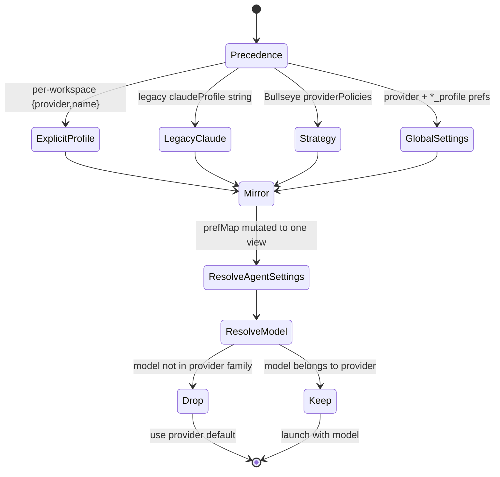

# Preferences & Configuration

## Purpose & business capability

This module is the board's **settings substrate**: a single SQLite table of `(key, value)` strings (`packages/shared/src/schema/preferences.ts:3`) plus the resolution logic that turns those flat strings into *effective behavior* — which agent provider launches a workspace, with which credential profile and model; whether a project auto-starts work and how aggressively; how the monitor balances feature-vs-bugfix work; and what board config can be exported and re-imported into another checkout.

The reason it exists as a module — rather than scattered `if (pref === "true")` reads — is that **one logical setting is rarely one row**. "What provider should this project use?" is answered by up to four sources (a Strategy Bullseye JSON blob, global `provider`/`*_profile` prefs, a per-workspace override, and the value baked into the workspace record), resolved by an explicit precedence chain. "Should this project auto-start tickets?" is a single derived decision (`resolveStartPolicy`) computed from a per-project mode pref plus several legacy flags. The module's job is to be the **layered resolver** that collapses these scattered inputs into one effective answer, so every consumer (workspace creation, the monitor, the butler, the Conductor) agrees.

If it vanished: nothing would know which agent/credential to launch, the monitor would have no targets, projects could not be driven hands-off, and the Settings/Strategy UI would have nothing to read or write. CLAUDE.md flags this as **the most drift-prone surface in the codebase** — the same logical setting having multiple sources of truth is the recurring multi-cycle-stall hazard (see Risks).

## Ubiquitous language

| Term | Meaning *as used here* | Defined at |
|------|------------------------|------------|
| Preference | One persisted `(key, value, updatedAt)` row; value is always a string regardless of logical type | `schema/preferences.ts:3` |
| Setting (static) | A global preference whose key is in the typed registry — the only keys writable through the Settings panel | `settings-registry.ts:41` |
| Settings Registry | The single source of truth for static setting keys + their type + default; the `Settings` TS type, defaults, and write-whitelist all derive from it | `settings-registry.ts:41` |
| Dynamic / per-project key | `<prefix>_<projectId>` (UUID suffix) or `<prefix>_<freeform>` key recognized by prefix, not by exact list (project IDs are unknowable ahead of time) | `dynamic-preference-keys.ts:12` |
| Strategy Bullseye | A per-project JSON config (`board_strategy_<projectId>`) of weighted work-type segments + provider policies; the intended single source of truth for monitor targets AND provider routing | `strategy-objective.service.ts:64` |
| Monitor Tunables | The 4 effective dials derived from the Bullseye: active-agents target, backlog floor, max-new-starts/cycle, refill focus | `strategy-objective.service.ts:74` |
| Provider Policy | A per-profile rate-limit routing rule (`fill`/`throttle`/`fallback-only` + headroom %) the orchestrator uses to pick which provider+profile to launch | `strategy-objective.service.ts:35` |
| Start Mode | The ONE per-project decision (`manual`/`monitor`/`conductor`) every auto-start path consults | `start-policy.service.ts:24` |
| Profile | A named credential/config set for a provider (e.g. Claude `settings_<name>.json`, a `~/.codex-<name>` license dir) | `preference.service.ts:187` |
| Provider divergence | Drift between the global `provider`/`*_profile` prefs and what the active project's Bullseye would select | `project-runtime-config.service.ts:182` |
| Harness setting | A per-agent-harness behavior knob (`harness.<harness>.<setting>`) that means different things per provider | `harness-settings.ts:33` |
| Effective model | The model actually launched, after dropping any model id that doesn't belong to the resolved provider | `effective-config.service.ts:62` |

## Domain model & invariants

| Invariant / rule / policy | Why (business reason, inferred) | Enforced at |
|---------------------------|----------------------------------|-------------|
| The schema IS the gate: a static setting referenced in code but absent from the registry is a compile error, not a runtime 422 | A forgotten registry entry previously caused silently-dropped writes (`auto_rebase_on_continue`, `skip_preflight`, #874) — the toggle "worked" in the UI but never persisted | `settings-registry.ts:41`, `preference.service.ts:33` |
| A write key not in `SETTINGS_KEYS` and not a recognized dynamic key is rejected LOUDLY (422 + `droppedKeys`), never silently swallowed | Silent drops hid real bugs; failing loudly surfaces a mistyped/un-registered key | `preference.service.ts:118`, `routes/preferences.ts:100` |
| **Provider-divergence write guard**: a `provider`/`*_profile` write that would put global prefs out of sync with the active project's Bullseye is rejected (422), nothing persisted | Makes the old passive "divergence banner" an enforced invariant so global prefs can no longer drift from the Bullseye — retires the `set-provider-default` skill's reason to exist (#903) | `preference.service.ts:138`, `routes/preferences.ts:86` |
| The guard only fires when the write *touches* a provider/profile key | An unrelated toggle save must never be blocked by a pre-existing, untouched drift | `preference.service.ts:141` |
| **Model is provider-scoped only**: the global `default_model` key is dead; only `default_model_<provider>` is consulted | A single cross-provider model id was the #696/#699 footgun — a stale Codex `gpt-5.5` leaking into a Claude launch and killing it ~5s in | `preference-keys.ts:15`, `effective-config.service.ts:79` |
| A model that doesn't belong to the resolved provider's family is DROPPED (use provider default) rather than passed as `--model` | A mismatched `--model` kills the agent launch; dropping degrades to the safe default | `effective-config.service.ts:86`, `strategy-objective.service.ts:572` |
| Provider precedence: explicit per-workspace profile > legacy `claudeProfile` > Strategy Bullseye selection > global settings pref | Lets a one-off launch override policy, while policy overrides bare global defaults | `provider-config-resolution.ts:63` |
| **Start Mode is the kill-switch**; `manual` truly stops ALL auto-start (in-process monitor, post-merge cascade, backlog refill, scheduled runs) | Before this, turning "drive" off didn't stop the post-merge cascade (it had its own gate) — projects kept auto-starting with every switch off (decision 008) | `start-policy.service.ts:57`, `start-policy.service.ts:87` |
| `conductor` mode forces all in-process auto-start OFF | The out-of-process loop is the SOLE driver; both running would double-start tickets into conflicting worktrees | `start-policy.service.ts:77` |
| `conductor` is never *derived* — only ever set explicitly | It's the dogfood-board control plane; a project shouldn't fall into it by accident | `start-policy.service.ts:103` |
| Per-project `start_mode_<id>` fully supersedes global `auto_monitor`; the global flag only participates in DERIVING a mode for a project that never set one | Back-compat: nothing breaks before anyone re-saves | `start-policy.service.ts:57`, `start-policy.service.ts:103` |
| `--dangerously-skip-permissions` is appended only for Claude | It's a Claude-specific flag; Codex/Copilot reject it and have native permission handling | `agent-settings.service.ts:93` |
| Bullseye save regenerates the git-tracked `objective.md` and auto-commits it (path-scoped, best-effort) | An uncommitted main checkout blocks the auto-merge queue; path-scoping avoids sweeping unrelated changes; swallowing git errors keeps a pref save from failing on git | `strategy-objective.service.ts:364`, `preference.service.ts:163` |
| `writeStrategyObjective` no-ops when no `objective.md` exists (every non-Conductor project) | Driven projects have no objective.md; the Bullseye still takes effect via `resolveMonitorTunables` reading the pref directly (#802) | `strategy-objective.service.ts:334` |
| Config export omits secrets/profiles/per-ID session data; only `auto_merge`/`auto_review`/`dynamic_column_scaling` workflow prefs are portable | Exports are meant to be shareable board templates, not credential dumps | `config-export-import.ts:9` |
| Import surfaces unknown keys as NON-fatal `droppedKeys` (older/newer schema) | A config from a different build version should still apply its valid keys, not 422 wholesale | `config-export-import.ts:241` |
| Untrusted provider strings always narrow to a canonical name, defaulting to `claude` | One mapping site instead of scattered `=== "codex"` ladders; a garbage/legacy `claude-code` value resolves safely | `agent-provider/registry.ts:44` |
| Quota-blocked policy degrades gracefully: missing telemetry → treated as not blocked, falls back to static priority order | The orchestrator must keep working when the quota service is down | `strategy-objective.service.ts:453` |

## Key workflows / use cases

### 1. Settings write (the guarded write path)
Trigger: `PUT /api/preferences/settings` with a flat `{key: value}` body.

```
PUT body
  → updateSettings: partition keys into applied (in registry/dynamic) vs dropped
  → checkProviderDivergenceGuard: if write touches provider/profile AND result
      would diverge from active project's Bullseye → REJECT (422, nothing written)
  → setPreferences (upsert rows)
  → updateStrategyObjectives: if a board_strategy_* key changed, regenerate +
      (conductor? write .kanban/objective.md : write objective.md + auto-commit)
  → return {applied, dropped, divergence}
```
Failure handling: divergence and dropped-key cases both return 422 with structured bodies; valid keys in a dropped-key response are still applied. (`preference.service.ts:110`, `routes/preferences.ts:80`)

### 2. Provider/profile/model resolution for a new workspace
Trigger: workspace creation / relaunch loads prefs and resolves the launch config.


Each precedence branch *mirrors its choice onto the prefMap* (sets `provider` + the provider-specific `*_profile` key) so the shared `resolveAgentSettings` reads a single consistent view (`provider-config-resolution.ts:63`). Model resolution then keeps the requested/provider-default model only if it belongs to the provider, else drops it (`effective-config.service.ts:62`).

### 3. Strategy Bullseye → monitor tunables + provider routing (the fan-out)
Trigger: any monitor cycle, or a fresh-workspace POST.

The single `board_strategy_<projectId>` JSON fans out three ways:
1. **Monitor tunables** — `deriveMonitorTunables` weights work-type segments; if bugfix weight ≥ all other work weight, `refillFocus = bugfix-only`, else `balanced` (`strategy-objective.service.ts:192`). Read by the in-process monitor via `resolveMonitorTunables` (`:398`).
2. **`objective.md` generated block** — rendered for the Conductor/Monitor-Butler agents, re-read each cycle with no restart (`strategy-objective.service.ts:218`).
3. **Provider routing** — `selectProviderFromStrategy` picks fill → throttle → fallback-only, skipping any policy blocked by live quota (`strategy-objective.service.ts:490`).

### 4. Start policy resolution
Trigger: every auto-start code path calls `resolveStartPolicy(prefMap, projectId)`.
Explicit `start_mode_<id>` wins; else derived from legacy `board_autodrive_<id>` / (`auto_monitor` AND `nudge_auto_start`). The returned `StartPolicy` exposes per-capability booleans (`autoStartUnblocked`, `postMergeCascade`, `backlogRefill`, `scheduledRuns`) that downstream auto-start paths consult and AND-in their own opt-in prefs (`start-policy.service.ts:65-66,73`).

### 5. Config export/import
Trigger: `GET /:projectId/config/export`, `POST /:projectId/config/import` (JSON or multipart). Export bundles statuses + Bullseye + the 3 safe workflow prefs. Import validates shape, supports `?dryRun=true` (returns computed status/pref/strategy diffs without applying), then applies statuses and prefs via `updateSettings` (`config-export-import.ts:99`).

## Entry points

| Entry point | Kind | What it lets a caller do | `file:line` |
|-------------|------|--------------------------|-------------|
| `PUT /api/preferences/settings` | API | Write global settings (guarded: 422 on unknown key or provider divergence) | `routes/preferences.ts:80` |
| `GET /api/preferences/settings` / `/settings-bootstrap` | API | Read all settings; bootstrap collapses 6 first-paint requests into 1 | `routes/preferences.ts:44`, `:54` |
| `GET/PUT /api/preferences/active-project` | API | Read/set the active project id (the project the divergence guard checks against) | `routes/preferences.ts:31` |
| `GET /api/preferences/{claude,codex,copilot,pi}-profiles` | API | Enumerate selectable credential profiles per provider | `routes/preferences.ts:115` |
| `GET /api/preferences/provider-divergence?projectId=` | API | Detect global-pref vs Bullseye drift (passive banner; now also enforced on write) | `routes/preferences.ts:225` |
| `GET /api/preferences/quota-usage` | API | Live quota from tampermonkey-direct `:8742` (503 if unavailable) | `routes/preferences.ts:234` |
| `POST /api/preferences/{codex,claude}-login` | API | Open a real terminal for OAuth login to a license/subscription dir | `routes/preferences.ts:150`, `:175` |
| `GET/POST /api/projects/:id/config/{export,import}` | API | Export/import a portable board config (statuses + Bullseye + safe prefs) | `config-export-import.ts:105`, `:145` |
| `resolveEffectiveProviderProfile` / `resolveEffectiveModel` | internal | The pure provider/profile/model resolver consumed by workspace creation | `effective-config.service.ts:54`, `:62` |

## Logic-bearing code (where the real decisions live)

| File / function | What decision/logic it holds | `file:line` |
|-----------------|------------------------------|-------------|
| `strategy-objective.service.ts` | The Bullseye fan-out: parse → derive tunables → render objective.md → quota-aware provider selection. The hub coupling monitor + providers | `strategy-objective.service.ts:192,490,546` |
| `start-policy.service.ts:resolveStartPolicy` | The ONE auto-start decision: mode → per-capability booleans; the kill-switch | `start-policy.service.ts:57` |
| `effective-config.service.ts:resolveEffectiveModel` | Provider-scoped-only model resolution + drop-on-mismatch (the #696 fix) | `effective-config.service.ts:62` |
| `provider-config-resolution.ts:resolveProviderConfig` | Pure provider/profile/model precedence; mirrors choice onto prefMap | `provider-config-resolution.ts:57` |
| `preference.service.ts:updateSettings + checkProviderDivergenceGuard` | The guarded write: whitelist partition + divergence rejection + objective regen | `preference.service.ts:110,138` |
| `project-runtime-config.service.ts:resolveProviderDivergence` | Computes Bullseye-vs-settings drift; basis for both banner and write guard | `project-runtime-config.service.ts:182` |
| `agent-settings.service.ts:resolveAgentSettings` | Translates flat prefs → launch command/args/profile; mock-agent selection; Claude-only skip-perms | `agent-settings.service.ts:73` |
| `settings-registry.ts:SETTINGS_REGISTRY` | The single source of truth for static keys/types/defaults; everything derives | `settings-registry.ts:41` |
| `dynamic-preference-keys.ts:isProjectScopedDynamicKey` | Prefix-based recognition of per-project keys (project IDs are dynamic) | `dynamic-preference-keys.ts:63` |

## Dependencies & bounded-context relationships

- **monitor-orchestration** (Customer-Supplier; this module is supplier). The monitor *consumes* `resolveMonitorTunables` and `resolveStartPolicy` to decide what/whether to start. The Bullseye→`objective.md` render is a **Published Language** the out-of-process Conductor reads as a file. Hidden co-change: editing the Bullseye schema ripples into the monitor's behavior without an import edge.
- **agent-providers** (Shared Kernel via `narrowProviderName`/`getProfilePrefKey` in `agent-provider/registry.ts`). This module decides *which* provider+profile+model; the providers module owns *how* to launch. The profile-pref-key mapping is shared kernel, deliberately centralized.
- **issues-board** (Conformist). Config export/import reaches into project statuses via `projectService`; the active-project pref scopes the divergence guard. Per-project keys are namespaced by the board's project UUIDs.
- **External: tampermonkey-direct `:8742`** (`quota-usage.service.ts`) — live quota telemetry; an injectable `QuotaUsageProvider` so the source can be swapped, and failures degrade gracefully to static priority.

## File topology

This capability is **scattered** — "one logical setting" is read/resolved from several files. Map by concern:

| Concern | Defines | Reads / Resolves | Multiple sources of truth? |
|---------|---------|------------------|----------------------------|
| **Static setting keys/types/defaults** | `settings-registry.ts:41` (SSOT) | `preference.service.ts:33` (derives `SETTINGS_KEYS`), client `Settings` type | No — collapsed to one registry (#903) |
| **Provider default** | global `provider` + `*_profile` prefs (`preference-keys.ts:5,14`); Strategy Bullseye `providerPolicies` (`strategy-objective.service.ts:35`) | `resolveProviderConfig` (`provider-config-resolution.ts:57`), `resolveAgentSettings` (`agent-settings.service.ts:73`), `selectProviderFromStrategy` (`strategy-objective.service.ts:490`) | **YES — Bullseye is intended SSOT; global prefs + per-workspace + workspace-record also feed it.** Write guard now prevents global-pref drift (`preference.service.ts:138`) |
| **Model default** | `default_model_<provider>` (`preference-keys.ts:23`); Bullseye policy `model` (`strategy-objective.service.ts:61`) | `resolveEffectiveModel` (`effective-config.service.ts:62`) | **Partially — legacy global `default_model` is dead but kept for one-time migration delete** (`preference-keys.ts:22`) |
| **Monitor tunables** (WIP/floor/starts/refill) | Bullseye fields (`strategy-objective.service.ts:64`); legacy `nudge_wip_limit` | `resolveMonitorTunables` (`strategy-objective.service.ts:398`) — strategy wins, else legacy prefs | **YES — strategy vs legacy `nudge_*` fallback**; `source` field reports which drove a cycle |
| **Start mode / auto-start** | `start_mode_<id>` (`dynamic-preference-keys.ts:29`); legacy `board_autodrive_<id>`, `auto_monitor`, `nudge_auto_start` | `resolveStartPolicy` (`start-policy.service.ts:57`) — explicit wins, else derived | **YES — explicit mode vs derived from 3 legacy flags**; `source` field reports provenance |
| **Harness behavior** (`plan_auto_continue`) | `harness.<harness>.<setting>` + legacy flat key | `getHarnessBoolSetting` (`harness-settings.ts:47`) — scoped → legacy → per-harness default | **YES — per-harness key vs legacy flat key** |
| **Drive one-switch** | `buildDriveRuntimePreferencePatch` writes autodrive + auto_merge_disabled + start_mode together | `project-runtime-config.service.ts:164` | Mitigation — writes all derived keys atomically so they can't drift |
| **Per-project dynamic keys** | prefix table (`dynamic-preference-keys.ts:12`) | `isAllowedDynamicKey` (`preference.service.ts:43`) + board-strategy predicate (`strategy-objective.service.ts:427`) | No (recognition only) |
| **Profiles (credentials)** | filesystem (`~/.claude`, `~/.codex`, `~/.codex-<name>`, `~/.pi-<name>`) + rotation rings | `listClaudeProfiles`/`listCodexProfiles`/`listPiProfiles` (`preference.service.ts:187`) | No |
| **Persistence** | `preferences` table (`schema/preferences.ts:3`) | `preferences.repository.ts` (get/set/getAll/setPreferences, upsert) | No — one flat table |
| **Quota telemetry** | external `:8742/api/usage` | `quota-usage.service.ts:102` (injectable provider) | No |
| **Config export/import** | `config-export-import.ts` (version 1 shape) | `WORKFLOW_PREF_KEYS` whitelist (`:9`) | No |

## Risks, gaps & open questions

- **The drift hazard is the module's defining property.** CLAUDE.md names this the most drift-prone surface: the Strategy Bullseye is *meant* to be the single source of truth, but the global `provider`/`claude_profile` settings prefs and (historically) the global `default_model` sit outside its fan-out. The codebase has progressively closed these:
  - Global `default_model` → **deleted** in favor of `default_model_<provider>` (#902, `preference-keys.ts:15`); the constant survives only so a one-time startup migration can read-and-delete it. **Unverified**: that this module never re-reads it — confirmed `effective-config.service.ts` doesn't, but other modules outside this set are not checked here.
  - Global `provider`/`*_profile` drift → **enforced** via the write-time divergence guard (#903, `preference.service.ts:138`), which CLAUDE.md says "retires the `set-provider-default` skill's reason to exist." **Tension (inferred, unverified):** CLAUDE.md's operational section still documents `set-provider-default` as the way to change the default and warns the prefs "drift if set independently." Either the guard fully closed it (docs lagging) or the guard has gaps (e.g. it only checks the *active* project — a write while a different project is active, or before any Bullseye exists, is unguarded). The guard explicitly returns null when there's no active project or no Bullseye (`preference.service.ts:144,152`), so **drift is still possible for projects without a Bullseye** — the legacy global prefs are the only source there, and nothing reconciles them. This is the residual hazard.
- **Two-tier fallback everywhere** (strategy→legacy, explicit→derived, scoped→legacy-flat) means behavior depends on *which tier is populated*. The `source` discriminators (`resolveMonitorTunables`, `resolveStartPolicy`) exist precisely so an operator can tell which surface drove a decision — read them when a project behaves unexpectedly.
- **The Bullseye JSON is parsed defensively but silently** — malformed strategy JSON falls through to legacy prefs without surfacing an error to the user (`strategy-objective.service.ts:406`). A typo'd hand-edit could silently revert a project to legacy WIP behavior.
- **The #903 write-time provider-divergence guard fails OPEN on malformed Bullseye JSON.** `resolveProviderDivergence` wraps the Bullseye parse/select in a try/catch and, on a parse error, returns `diverged: false` (`project-runtime-config.service.ts:203-205`) — so a corrupt Bullseye makes the guard silently allow the `provider`/`*_profile` write it was meant to block. Same hazard class as the monitor-tunables silent fallthrough above: a typo'd hand-edit defeats the enforced invariant rather than failing loudly.
- **Config export is lossy by design** (only 3 workflow prefs, no provider/profile/Start-Mode), so an imported config does NOT reproduce drive behavior — a re-imported board still needs its provider/Start-Mode configured separately. This is intentional (no secrets) but a likely surprise.
- **`auto_monitor` is force-disabled on every boot** (per CLAUDE.md/Server Resilience) — so the global flag's only live role is *deriving* a Start Mode for never-configured projects; this is easy to misread as "monitoring is on globally."
- **Inferred, unverified:** that every auto-start path actually routes through `resolveStartPolicy` (the module claims to be the one decision point at `start-policy.service.ts:8`). Verifying that the post-merge cascade, backlog refill, and crons all consult it is a monitor-orchestration concern outside this file set.
