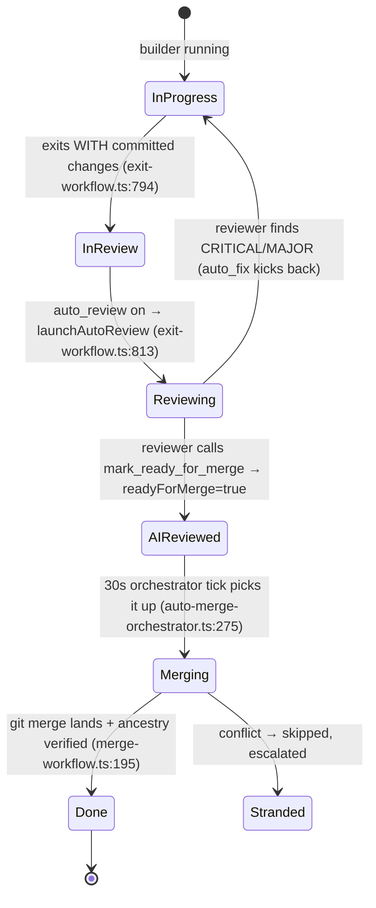

# Review & Merge (landing work on the default branch)

## Purpose & business capability

This module owns the **delivery boundary**: the point where an AI builder's work stops being a throwaway branch in a worktree and becomes code on the project's default branch. It is the kanban board's answer to "how does an autonomous coding agent actually ship?"

The product promise is hands-off autonomy: a builder finishes a ticket, the system reviews its diff with another agent, and — if approved and clean — lands it on `main` and moves the ticket to Done, all without a human. The hard part is not the `git merge`; it is doing this **safely and honestly** across dozens of parallel worktrees that touch overlapping files, race each other for the same migration number, crash mid-merge, or silently fail to land. So the module is dominated not by the merge itself but by **gates** (what is allowed to merge) and **reconcilers** (catching the lies that creep in when DB status and git reality drift apart).

If this module vanished: builders would produce branches nobody integrates; "Done" tickets would have no code on `main`; conflicting parallel work would pile up with no resolution; and the board's status would become fiction. The two invariants it exists to protect are **"a ticket is Done ⇔ its code is reachable from the default branch"** and **"nothing merges that wasn't approved (or explicitly allowed to skip approval)."**

Consumers: the in-process board monitor and the auto-merge orchestrator (scheduled), the Butler and human users (manual `/review`, `/merge`, `/fix-and-merge`), the post-merge dependency cascade (`workflow-engine`), and the drive/completion reconcilers.

## Ubiquitous language

| Term | Meaning *as used here* | Defined at |
|------|------------------------|------------|
| Review | A second agent reads the builder's diff and either approves (signals ready) or kicks the ticket back to In Progress with findings. NOT a human PR review — an LLM code-review session. | `review.service.ts:325`, prompt `review.service.ts:26` |
| readyForMerge | The boolean approval gate. Set by the reviewer via the `mark_ready_for_merge` MCP tool; it is the merge engine's permission slip. Distinct from issue status. | `workspace-internals.ts:235`, `review.service.ts:112` |
| Approved | A non-direct workspace is approved iff `readyForMerge=true` (or the project allows un-approved In-Review merges). Unapproved → merge 409s `not_approved`. | `workspace-internals.ts:235`, `workspace-merge-prevalidation.service.ts:50` |
| mergedAt | Timestamp stamped the instant a git merge lands. The crash-recovery anchor: its presence means "git already merged this," so cleanup can finish idempotently after a dropped response. | `workspace-internals.ts:201`, `workspace-merge-execution.repository.ts:7` |
| Auto-merge | The scheduled engine that scans approved/reviewed workspaces and merges them via the queue, ~every 30s. ON by default. | `auto-merge-orchestrator.ts:346`, `auto-merge-pref.ts:31` |
| Merge queue | Plans an *ordered batch* merge of many workspaces, sequencing by least file-overlap and skipping conflicts. | `merge-queue.service.ts:433` |
| Reconcile strategy | The classifier's verdict on HOW a (sub)set should land: `direct`/`rebase`/`sequence-migrations`/`integration-union`/`agent-reapply-intent`/`escalate`. | `merge-queue.service.ts:70` |
| Fix-and-merge | When a merge conflicts, relaunch an agent IN the worktree to clean the tree / resolve conflicts, then re-merge. Workspace goes to status `fixing`. | `workspace-merge.service.ts:394` |
| Reconciler (batch) | One agent handed a whole stranded conflict batch to land the cluster's union once instead of N re-conflicting rebases. | `auto-merge-orchestrator.ts:158`, `merge-reconciler-prompt.ts` |
| Stranded review | Work stuck "In Review", not ready, with no review session — the auto-review handshake never fired. | `stranded-review-reconciler.ts:25` |
| Silent merge loss | An issue marked Done whose branch is NOT on the base branch — the lie this module hunts. | `done-unmerged-invariant-scanner.ts:96` |
| Foundational blocker | A no-dependency ticket that other open tickets depend on; merged synchronously so dependents aren't cut from a pre-merge base. | `foundational-merge.service.ts:73` |
| isDirect | A workspace with no worktree (works in the main checkout). Merge is a no-op close — there is no branch to land. | `workspace-internals.ts:239`, `merge-workflow.ts:142` |

## Domain model & invariants

| Invariant / rule / policy | Why (business reason, inferred) | Enforced at |
|---------------------------|----------------------------------|-------------|
| **Done ⇔ code on default branch.** A Done/AI-Reviewed issue whose branch isn't an ancestor of base is flagged as a violation and (if safe) force-merged forward; the issue is never reopened. | The board's core honesty contract. A "Done" lie wastes downstream dependents and human trust. Reopening was found worse than the silent loss (mass-reopen incident #590). | `done-unmerged-invariant-scanner.ts:96`, never-reopen `:100` |
| **No merge without approval** (non-direct). `readyForMerge` must be true unless `auto_merge_in_review` (and not a gated project). | An LLM reviewer is the only quality gate before code ships unattended; skipping it ships unreviewed code. | `workspace-internals.ts:235`, gating carve-out `auto-merge-orchestrator.ts:148` |
| **Verify the merge actually landed.** After `git merge`, assert branch tip is an ancestor of target; refuse Done if not. Also re-verify a stamped `mergedAt` via git before honoring it. | Plumbing anomalies / interrupted ref updates / stale flags can return "success" without landing the work — a silent-merge-loss vector (#820, #575). | `merge-workflow.ts:195`, `workspace-internals.ts:214`, `merge-queue.service.ts:425` |
| **Never merge into a dirty main checkout.** Any uncommitted tracked change in the main repo blocks the merge. | Merging on top of someone's uncommitted work would entangle/lose it; the merge writes the main working tree. | `merge-workflow.ts:173`, `workspace-internals.ts:245` |
| **Conflicts skip, don't stop, in batch mode.** A conflicting workspace is set aside (`skipOnConflict`) so clean siblings still land; the residue is escalated. | One messy ticket must not block a wave of clean ones (autodrive pileup pitfall). | `merge-queue.service.ts:435`, residue escalation `auto-merge-orchestrator.ts:308` |
| **Migration-number collisions land sequentially + auto-renumber.** Parallel branches that picked the same `NNNN_*.sql` are merged one at a time, renumbering siblings. | Parallel worktrees independently pick "next migration number"; naive merge double-applies / collides. | `merge-queue.service.ts:291`, renumber `:470` |
| **Pure-append hot-file conflicts auto-resolve by concatenation.** | A wave of tickets all appending to one shared smoke-test/log shouldn't each need fix-and-merge (#763). | `merge-workflow.ts:188` (`autoResolveAppendConflicts`) |
| **Foundational blocker merges synchronously** (no own deps + ≥1 open dependent). | Otherwise a scaffold sits Done-but-unmerged for ≤30s and a dependent is cut from the empty pre-merge base (#797/#784). | `foundational-merge.service.ts:73` |
| **One merge at a time per repo** (in-memory lock; stale after 15 min). | Concurrent merges corrupt the shared main checkout / `.git`. | `workspace-merge.service.ts:173`, `merge-workflow.ts:151`, `MERGE_LOCK_STALE_MS workspace-internals.ts:304` |
| **Auto-recovery is rate-limited & forward-only.** Scanner: ≤3 auto-merges/cycle, only ahead≥1 & behind≤20 & conflict-free; never touches a 0-commit branch. | Bounds blast radius; 0-commit/ancient-divergent branches are the false-positive class (#590). | `done-unmerged-invariant-scanner.ts:19,23,30,102` |
| **Reviewer must not move the issue to Done / merge itself.** It only SIGNALS readiness via `mark_ready_for_merge`; the system owns the merge so the verify/smoke gate (below), the repo lock, and ancestry verification always run — a hand-merge would skip them. | The reviewer is an LLM signal, not the enforcer; letting it self-merge would route around every gate (#821). | `review.service.ts:36`, `:113`, `:211` (reviewer signal contract only) |
| **Verify/smoke pre-merge gate is the actual merge enforcer.** A configured `verify_script_<id>` exiting non-zero, or a web (`isWeb`) project's boot/render smoke check failing, FAILS the merge; a CONFIGURED gate that can't run (no worktree) fails closed. Neither configured → no-op pass. | The diff-only LLM review can't catch build/test/boot regressions; this is the only gate that can BLOCK a merge for unverified/un-rendered code. **Wired only into the review-exit and monitor paths** (see Risks) — `runWorkspacePreMergeValidation` does NOT call it (OpenSpec + migration renumber only). | `pre-merge-gate.service.ts:47` (`runPreMergeGate`, self-described "single source of truth for the gate", #821); invoked from `exit-workflow.ts:536` + `monitor-cycle.ts:247,323` |
| **Review/fix runs on the workspace's OWN provider+profile**, not the global default. | The global default may have rotated (e.g. a different Codex OAuth license); reviewing on it 401s/uses wrong creds. | `review.service.ts:68`, `exit-workflow.ts:818` |
| **`mergedAt` makes cleanup idempotent.** Issue→Done reconciliation no-ops once already Done; workspace-close failure after merge does NOT roll back Done. | A dropped HTTP response mustn't double-transition or strand Done-with-branch-on-master (#668). | `merge-cleanup.service.ts:64`, `:91`, `:147` |
| **Review-exit on a 0-commit branch must NOT approve** (#629). If a review session exits but the branch has no committed changes (re-verified via `hasCommittedChanges`), `readyForMerge` stays false, the workspace stays idle / In Review, and `workspace_ready_for_merge` is NOT broadcast. | A branch reset/rebased to equal base by the time review exits would otherwise approve empty work — merging nothing or stranding the ticket. The flag is the merge engine's permission slip, so it must reflect real committed work. | re-verify `exit-workflow.ts:718` (`hasCommittedChanges` `:164`); withhold + log `:720`; set flag + broadcast only PAST the guard `:724`–`:725` |
| **Already-merged reconcile is a no-op, never a merge** (#583/#492). When the branch tip is already an ancestor of base, `/merge` returns HTTP 200 `{merged:false, reconciled:true, baseBranch, baseHeadShaBefore/After}`, creates NO merge commit (`mergeBranch` not called), transitions the issue to Done, and closes the stale reviewing workspace + running review session. **But a branch with 0 unique commits (`branchSha===baseSha` / `countUniqueCommits===0`) must NOT reconcile-as-Done** — it is kept In Review (`reconciled:false`) as a false-positive guard. | The monitor repeatedly re-`/merge`s already-landed zero-commit workspaces; creating a merge commit or flipping an empty branch to Done is silent-merge-loss. | reconcile no-op `workspace-merge-prevalidation.service.ts:252`; 0-commit guard `keepCleanAncestorInReview :263`; `reconcile` vs `clean-ancestor` classified by `resolveMergeState` `workspace-internals.ts:159` |

## Key workflows / use cases

### 1. Builder exit → auto-review → auto-merge (the happy path)

Trigger: a builder session exits having committed work (`exit-workflow.ts:794`). Steps: move issue to In Review; launch a review session on the builder's own provider/profile (`:813`); the reviewer reads the diff and either kicks back to In Progress (with fixes, if `review_auto_fix`) or marks `readyForMerge`; the scheduled orchestrator later merges. Outcome: code on `main`, issue Done. Failure: review launch failure resets the workspace to idle so the stranded-review reconciler recovers it (`:847`).

### 2. Scheduled auto-merge tick (the batch engine)

Trigger: 30s interval (`auto-merge-orchestrator.ts:346`), only if `isAutoMergeEnabled` and strategy is `merge_queue`. Steps (`runOnce` `:204`): (a) if a batch reconciler agent is in flight, wait / reap-if-zombie and skip; (b) run completion/drive/project reconcilers; (c) `findCompletedWorkspaceIds` — the gating query (`:72`); (d) `computePlan` → classify; (e) `executeQueue(..., {skipOnConflict:true})` — rebase-onto-base then merge each, in least-overlap order; (f) collect conflict residue; (g) if ≥2 stranded, launch ONE batch reconciler agent. Outcome: clean batch lands, conflicts deferred to an agent.

### 3. Manual merge (`POST /:id/merge`)

`mergeWorkspaceDeduped` → `mergeWorkspace` (`workspace-merge.service.ts:163`): recover any failed/zombie fix sessions → acquire repo merge lock → `resolveMergeState` (the pre-flight state machine, `workspace-internals.ts:193`) classifies the workspace into one of 9 outcomes → `handleWorkspaceMergeResolution` either completes early (already-merged / direct-close / reconcile / clean-ancestor) or throws (`not_approved`, `already_closed`, conflict) or proceeds → `runWorkspacePreMergeValidation` (OpenSpec + migration renumber) → `executeWorkspaceMerge` → async post-merge cleanup.

### 4. Conflict recovery: fix-and-merge

Trigger: a merge throws a conflict and the caller chooses recovery (`POST /:id/fix-and-merge` `:184`). Steps (`workspace-merge.service.ts:394`): build a fix prompt, relaunch an agent in the worktree with `triggerType: "fix-and-merge"`, set workspace `fixing`, record a timeline event. The agent cleans the tree / resolves conflicts and exits; the fix-session exit path re-attempts the merge. For ≥2 conflicting siblings the orchestrator escalates the **whole batch** to one reconciler agent instead (`auto-merge-orchestrator.ts:308`).

### 5. Reconcilers (honesty restoration — run on interval + startup)

- **completion-state-reconciler** (`:54`): a workspace stuck `active`/`reviewing`/`fixing`/`blocked` whose session is really dead (PID gone, committed work) or hung >30 min → reset to idle so the normal flow proceeds.
- **stranded-review-reconciler** (`:43`): idle, In Review, not ready, has commits, no session, no prior review → relaunch review (or mark ready if auto_review off).
- **done-unmerged-invariant-scanner** (`:109`): Done/AI-Reviewed but `mergedAt` null and branch not on base → flag (telemetry) + safe forward-only auto-merge.
- **ancestor-branch-reconciler** (`ancestor-branch-reconciler.ts:50`): In-Review work (and idle + `readyForMerge` In-Progress work, e.g. after a dropped merge response) whose branch tip is already an ancestor of base but `mergedAt` is null → close workspace + move issue to Done. Guards: NEVER reaps an **active In-Progress** workspace (`:115`, may have uncommitted work); NEVER auto-Dones a **0-unique-commit** branch even when "trivially an ancestor" (`:136`, #581/#585 incident — a freshly-launched `branchSha===baseSha` ws or one whose base advanced past an empty branch); skips closed/direct/`mergedAt`/terminal-status (`:101`–`:104`); idempotent. Disable via `reconciler_ancestor_branch_enabled` pref (`:59`).
- **zombie-fix-session-reconciler** (`zombie-fix-session-reconciler.ts:37`, #596): a `fixing`/`reviewing` workspace whose `fix-and-merge`/`review` session is still `running` but has a dead/absent PID, 0 output messages, and started past the 60s grace window → stop the session, reset workspace to idle, broadcast `workspace_idle`+`issue_updated`. Skips: within grace (`:60`), has output (`:108`), PID alive (`:99`), workspace not in fixing/reviewing (`:125`), triggerType ∉ {fix-and-merge, review} (`:81`). Disable via `reconciler_zombie_fix_enabled` pref (`:40`).

## Entry points

| Entry point | Kind | What it lets a caller do | `file:line` |
|-------------|------|--------------------------|-------------|
| `POST /api/workspaces/:id/review` | API | Manually (re)launch an AI review; optional `thoroughReview` | `route-setup.ts:27` |
| `POST /api/workspaces/:id/merge` | API | Merge an approved workspace into its base (deduped) | `workspace-actions.ts:126` |
| `POST /api/workspaces/:id/fix-and-merge` | API | Relaunch an agent to fix a failed merge | `workspace-actions.ts:184` |
| `POST /api/workspaces/:id/resolve-conflicts` / `/update-base` | API | Agentic conflict resolution / rebase-or-merge base in | `workspace-actions.ts:165`, `workspace-merge.service.ts:357,294` |
| Scheduled 30s tick | scheduled | Batch auto-merge of approved/reviewed work | `auto-merge-orchestrator.ts:346` |
| Builder-session exit | event | Auto-review handshake on committed exit | `exit-workflow.ts:813` |
| Interval reconcilers (60s / 5min / boot) | scheduled | Restore status↔git honesty | `stranded-review-reconciler.ts:137`, `done-unmerged-invariant-scanner.ts:397` |

## Logic-bearing code (where the real decisions live)

| File / function | What decision/logic it holds | `file:line` |
|-----------------|------------------------------|-------------|
| `resolveMergeState` | The 9-state merge pre-flight machine: approval gate, stale-`mergedAt` trust-but-verify, dirty-main guard, ancestor/conflict classification. **Read first.** | `workspace-internals.ts:193` |
| `findCompletedWorkspaceIds` | What the auto-merger is *allowed* to touch: per-project opt-out, gated-project carve-out, terminal-status exclusion vs readyForMerge recovery, `auto_merge_in_review`. | `auto-merge-orchestrator.ts:72` |
| `classifyReconcileStrategies` | Pure union-find clustering of file-overlap + the cheapest→hardest strategy ranking that routes the batch. | `merge-queue.service.ts:119` |
| `executeQueue` | The actual ordered rebase→merge loop with skip-on-conflict, migration auto-renumber, and per-step events. | `merge-queue.service.ts:433` |
| `scanDoneUnmergedWorkspaces` | The Done⇔merged invariant: two false-positive guards (issue has a merged ws; branch too far behind), forward-only rate-limited recovery. | `done-unmerged-invariant-scanner.ts:109` |
| `autoMerge` (merge-workflow) | The end-to-end merge body for the workflow path: backup, dirty-main guard, append-conflict resolve, post-merge ancestry assertion, worktree teardown, optional visual-verify agent. | `merge-workflow.ts:105` |
| `resolveMergeStrategy` / `isAutoMergeEnabled` | The two policy knobs: which engine owns merges, and the canonical default-ON `auto_merge`. | `merge-strategy.ts:6`, `auto-merge-pref.ts:31` |
| `isFoundationalBlocker` | The synchronous-merge eligibility (no own deps + open dependent). | `foundational-merge.service.ts:73` |
| `reconcileMergedIssue` | Idempotent Done convergence (single source of truth for post-merge status). | `merge-cleanup.service.ts:64` |
| `buildReviewPrompt` | Encodes the reviewer contract: classify CRITICAL/MAJOR/MINOR, signal via `mark_ready_for_merge`, never self-merge, optional visual verification. | `review.service.ts:81` |

## Dependencies & bounded-context relationships

- **git-integration (Anti-Corruption Layer / Conformist).** Every git fact and mutation goes through the shared git service (`@agentic-kanban/shared/lib/git-service`) and its single spawn adapter `git-exec`. This module reasons in domain terms (ancestor? conflict? behind-count?) and never spawns git itself. Heavy reliance: `checkBranchTipIsAncestor`, `mergeBranch`, `rebaseOntoBase`, `detectConflicts`, `autoRenumberMigrations`.
- **workspaces (Shared Kernel).** Reads/writes the `workspaces` row (`status`, `readyForMerge`, `mergedAt`, `workingDir`) — the shared state both contexts mutate. Merge is the terminal state transition of a workspace's lifecycle.
- **workflow-engine (Customer-Supplier).** This module is the supplier of the "merged" event; on Done it calls `syncCurrentNodeToStatus` (`merge-workflow.ts:278`) so the workflow node advances and `blocked_by`/`depends_on` dependents can resolve, driving the post-merge cascade.
- **Preferences (Published Language).** Behaviour is steered entirely by string prefs read into a `Map`: `auto_merge`, `auto_review`, `auto_merge_in_review`, `merge_strategy`, `review_auto_fix`, `learning_step_before_merge`, `visual_verification_mode`/`after_merge_verify_agent`, and per-project `auto_merge_disabled_<id>` / `verify_script_<id>` / `project_stack_profile_<id>`.
- **Hidden coupling (co-change, no import):** the reviewer agent and the merge gate are linked only by the `mark_ready_for_merge` MCP tool name + the `readyForMerge` column — a string/flag contract, not a typed call. The reconcilers co-change with `workspaces`/`sessions` schema but reach them via repositories.

## File topology

| Sub-responsibility | Implemented in | Layer |
|--------------------|----------------|-------|
| Review trigger (manual + relaunch) | `services/review.service.ts` (`startManualReview`, `buildReviewPrompt`); route `startup/route-setup.ts:27` | service / route |
| Review trigger (automatic, on builder exit) | `startup/exit-workflow.ts:813` (`launchAutoReview`) | startup/event |
| Review data access | `repositories/review.repository.ts` (skills, sessions, status) | repository |
| Auto-merge engine + scheduling | `startup/auto-merge-orchestrator.ts`; policy `startup/merge-strategy.ts`; default `packages/shared/src/lib/auto-merge-pref.ts` | startup / shared |
| Batch planning, clustering, strategy classification, ordered execution | `services/merge-queue.service.ts`; data `repositories/merge-queue.repository.ts` | service / repository |
| Single-workspace merge orchestration (lock, pre-flight, execute, post-merge) | `services/workspace-merge.service.ts`; route `routes/workspace-actions.ts:126` | service / route |
| Merge pre-flight state machine + approval/dirty-main gates | `services/workspace-internals.ts:193` (`resolveMergeState`); resolution dispatch `services/workspace-merge-prevalidation.service.ts` | service |
| Verify/smoke pre-merge quality gate (the enforcer that FAILS a merge) | `services/pre-merge-gate.service.ts:47` (`runPreMergeGate`); wired into `startup/exit-workflow.ts:536` + `startup/monitor-cycle.ts:247,323`. NOT called by `runWorkspacePreMergeValidation` (manual `/merge` body) | service |
| Pre-merge data access (prefs, clear readyForMerge) | `repositories/workspace-merge-prevalidation.repository.ts` | repository |
| Workflow-path merge body (backup, append-resolve, verify, teardown, Done) | `startup/merge-workflow.ts` (`autoMerge`) | startup |
| Merge bookkeeping (stamp mergedAt) | `repositories/workspace-merge-execution.repository.ts` | repository |
| Post-merge cleanup / idempotent Done convergence | `services/merge-cleanup.service.ts` | service |
| Conflict recovery (fix-and-merge / resolve-conflicts / batch reconciler) | `services/workspace-merge.service.ts:394,357,496`; prompts `services/merge-helpers.service.ts` | service |
| Synchronous foundational merge eligibility | `services/foundational-merge.service.ts` | service |
| Reconciler: stuck active/blocked workspaces | `startup/completion-state-reconciler.ts` | startup |
| Reconciler: stranded In-Review work | `startup/stranded-review-reconciler.ts` | startup |
| Invariant scanner: Done-but-unmerged (silent merge loss) | `startup/done-unmerged-invariant-scanner.ts` | startup |
| Reconciler: branch-tip-is-ancestor but issue non-terminal (#581/#585) | `startup/ancestor-branch-reconciler.ts` (`reconcileAncestorBranchWorkspaces`); scheduled `startup-tasks.ts:502` + 5-min interval | startup |
| Reconciler: zombie fix/review sessions (dead PID + 0 msgs + past 60s grace) | `startup/zombie-fix-session-reconciler.ts` (`reconcileZombieFixSessions`, `startZombieFixSessionReconciler:184`) | startup |

## Risks, gaps & open questions

- **`merge_strategy` triple meaning is easy to confuse.** `direct`/`monitor`/`merge_queue` (`MergeStrategy`, `merge-strategy.ts:4`) selects WHICH engine lands reviewed work; `ReconcileStrategy` (`merge-queue.service.ts:70`) is a per-cluster HOW; and Start Mode (`manual`/`monitor`/`conductor`) is yet another axis. Three "mode" vocabularies overlap.

  **Truth table — which engine lands the work** (`resolveMergeStrategy` / `merge-strategy.ts`). The pref itself is registered with an **empty-string default** (`settings-registry.ts:103`), so when unset `resolveMergeStrategy` falls back to legacy ownership: `auto_monitor === "true"` ⇒ `monitor`, else `merge_queue` (`merge-strategy.ts:14`). Since `auto_monitor` is force-disabled on every boot, the **effective default is `merge_queue`**.

  | `merge_strategy` | Engine that auto-lands reviewed work | Gate (`merge-strategy.ts`) |
  |---|---|---|
  | `merge_queue` (effective default) | The auto-merge **queue orchestrator** (`auto-merge-orchestrator.ts:69` requires `=== "merge_queue"`) | `isAutomaticMergeEnabled` true |
  | `monitor` | The **in-process monitor cycle** (`monitor-setup.ts:246` arms auto-merge only when `=== "monitor"`) | `isAutomaticMergeEnabled` true |
  | `direct` | **Nothing auto-merges** — only an explicit `POST /:id/merge` lands work | `isAutomaticMergeEnabled` false (`merge-strategy.ts:18`) |

  **Known silent-no-merge trap:** `merge_strategy=monitor` while the in-process monitor is OFF. `isAutomaticMergeEnabled` reports true (so auto-merge looks enabled), but the queue orchestrator stands down (it owns only `merge_queue`) and the monitor never runs — reviewed/`AI Reviewed` work strands unmerged with no error. **Recovery:** switch the pref to `merge_queue` (the queue orchestrator then lands it), or turn the in-process monitor on, or hand-merge via `POST /:id/merge`. *Verified against `resolveMergeStrategy`, the two engine gates, and `merge-strategy.test.ts`.*
- **Approval is a flag the reviewer self-asserts.** Nothing verifies the reviewer actually inspected the diff before calling `mark_ready_for_merge`; a misbehaving/looping reviewer can approve unreviewed code. The only backstop is the optional verify_script/smoke gate for gated projects.
- **The verify/smoke gate runs on only SOME merge paths.** `runPreMergeGate` (`pre-merge-gate.service.ts:47`) is wired into exactly two callers: the review-exit handler (`exit-workflow.ts:536`) and the in-process monitor's auto-merge (`monitor-cycle.ts:247,323`). The **manual/orchestrator merge body** — `POST /:id/merge` → `mergeWorkspace` → `runWorkspacePreMergeValidation` (`workspace-merge-prevalidation.service.ts:80`) — runs only OpenSpec validation + migration auto-renumber and does NOT invoke `runPreMergeGate`. So a hand-merge (or any path that hasn't already passed the review-exit gate) can land code that was never build/test/boot-verified. The gate's "single source of truth" claim holds for *where the check is implemented*, not for *every path that can merge*. *Inferred from call-site analysis.*
- **Two near-duplicate merge bodies.** `merge-workflow.ts autoMerge` (workflow/exit path) and `workspace-merge.service.ts doMerge` (manual/API path) both implement backup → dirty-main guard → merge → ancestry verify → teardown. They have drifted before (visual-verify tagging lives only in `autoMerge`). Risk of divergent guards. *Inferred, unverified.*
- **Zombie/stale heuristics are time-based magic numbers** (reconciler 5min zombie, 30min hung, scanner behind≤20, 3 merges/cycle). These encode "launch-failed ≈ ~1s/0-token" lore; legitimately slow agents could be reaped. Documented in memory as recurring tuning pain.
- **`done-unmerged` scanner can auto-merge work a human deliberately parked** only if `mergedAt` is null AND status Done AND ahead≥1 AND not behind/conflicting — narrow, but it is an automatic write to `main` triggered by a status the user set by hand. Mitigated by guard #1 (issue already has a merged ws) but the policy is "recover over respect-the-park."
- **Gated-project detection is pref-shape parsing** (`verify_script_<id>` non-empty OR `project_stack_profile_<id>.isWeb`), `auto-merge-orchestrator.ts:94`. A malformed/absent profile silently means "not gated" → un-ready In-Review work could merge unverified when `auto_merge_in_review` is on. *Inferred, unverified.*
