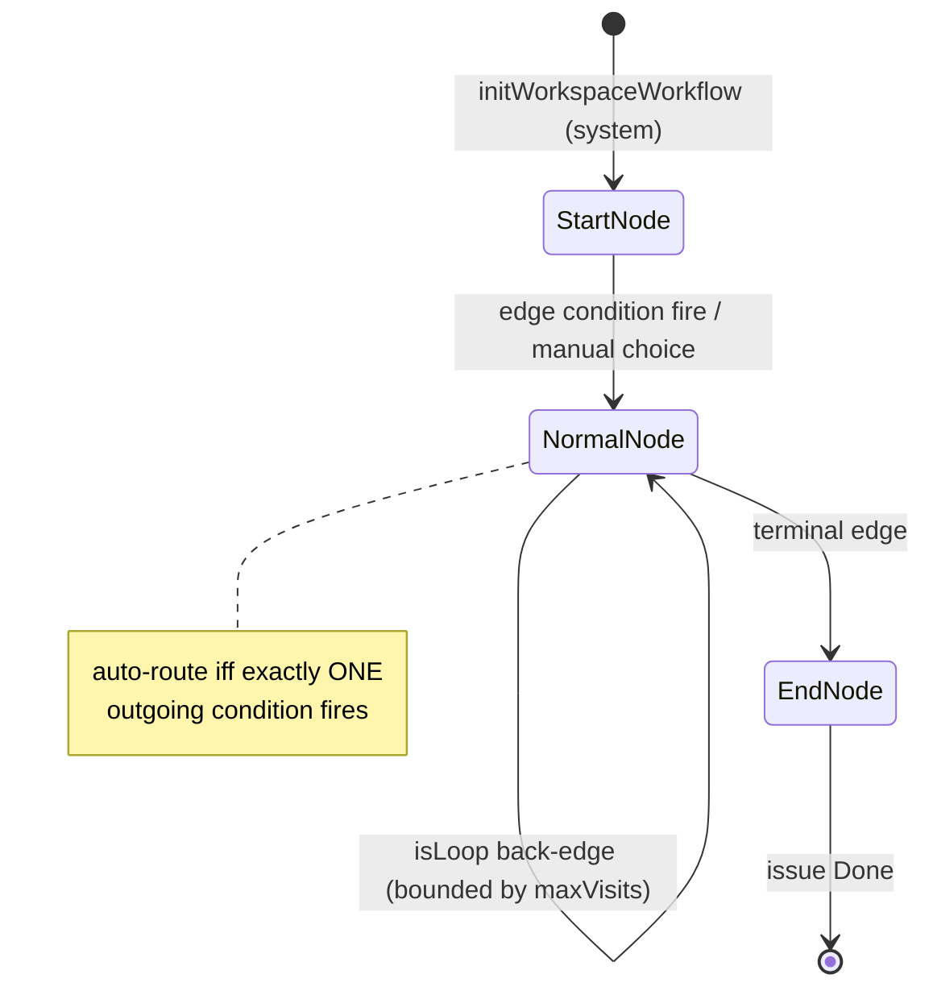

# Workflow Engine (configurable status graphs)

## Purpose & business capability

A kanban board normally hard-codes its lanes (Todo → In Progress → In Review → Done) and the rules
for moving work between them. This module **turns that lifecycle into data**: a *workflow template*
is a directed graph of *nodes* (stages) and *edges* (legal moves), stored per project (or globally),
so different kinds of work can flow through entirely different processes — a one-shot bug fix, a
research task with a human consult gate, a spec-driven plan with approval gates before any code, a
fork/join parallel review, or a multi-module legacy migration loop (`builtin-workflows.ts:70`).

The capability it actually unlocks is **driving an AI coding agent through a multi-stage process**.
Each node can carry an attached *skill* (the prompt/persona the agent runs at that stage) and
*guidance* (instructions injected when the agent arrives), and edges can carry *conditions* that let
the workflow auto-route based on real workspace signals (did tests pass? is the diff clean? which
files changed?). So the graph is simultaneously the board's column model, the agent's state machine,
and the routing policy.

The hypothesis is **confirmed and broader than stated**: it is not only "columns + transitions" —
nodes bind to agent skills and the engine evaluates a small condition DSL to auto-advance, and the
graph supports structural fan-out (`parallel-fork`/`parallel-join`) executed by a separate
orchestrator. The legacy fixed board is just one template ("Simple Ticket"), making the old behavior
a special case of the general system (`workflows.ts:38-41`).

Consumers: the server's workflow service + REST routes (template editing, the visual builder, the
progress viewer, analytics), workspace creation (`initWorkspaceWorkflow`), the agent prompt builder
(`buildTransitionBlock`), the MCP `propose_transition` tool, the fork/join orchestrator
(`workflow-fork.service.ts`), and the board (an issue's column is *derived from its current node's
status*). If this module vanished, issues would lose their per-type lifecycle, agents would lose
stage guidance + the `propose_transition` contract, and the board would fall back to raw status-only
movement.

## Ubiquitous language

| Term | Meaning *as used here* | Defined at |
|------|------------------------|------------|
| Workflow template | A named graph of nodes + edges describing the stages an issue of a given ticket type flows through; project-scoped or global built-in | `workflows.ts:42` |
| Node / stage | One step in the graph. Has a `nodeType`, optional `statusName`, optional attached skill, `maxVisits`, free-form `config` | `workflows.ts:67` |
| Edge / transition | A directed, legal move between two nodes, carrying a `condition` and human `label` | `workflows.ts:98` |
| Node type | Structural role: `start` / `normal` / `parallel-fork` / `parallel-join` / `end` | `workflows.ts:14` |
| Status (board column) | A project's kanban lane. A node *maps to* a status via `statusName`; the issue's status is **derived from its current node**, not set independently | `workflows.ts:77`, `node-config.ts:72` |
| Condition | An edge guard from a small DSL (`manual`, `auto_on_exit_0`, `tests_pass/fail`, `diff_clean`, `diff_touches:<glob>`) | `conditions.ts:56`, `workflows.ts:27` |
| Signal | Live workspace state evaluated against conditions: agent-reported `testsPassed` + git-computed diff stats/files | `conditions.ts:7`, `transitions.ts:14` |
| Verdict | A condition's outcome: `fire` (auto-take), `block` (forbid), `manual` (human/agent chooses) | `conditions.ts:54` |
| currentNodeId | The pointer tracking which node a *workspace* (and, via sync, its *issue*) currently sits on | `workspace-init.ts:97`, `transitions.ts:181` |
| Transition record | A history row per node entry; powers cycle counting, the progress viewer, and analytics | `workflows.ts:131` |
| maxVisits | Per-(workspace,node) visit budget; cycle protection against infinite loops (0 = unlimited) | `workflows.ts:83`, `transitions.ts:139` |
| isLoop | An edge flagged as an intentional back-edge; exempt from save-time cycle detection but still routable | `workflows.ts:114`, `graph-validation.ts:60` |
| Fork mode | How a `parallel-fork` runs children: `worktree` (concurrent, own branches) vs `shared` (sequential, parent branch) | `node-config.ts:50` |
| Join strategy | How a `parallel-join` consolidates: `artifacts` (collect diffs, agent merges) vs `merge` (server auto-merges branches) | `node-config.ts:27` |
| Fork child | A workspace with a `parentWorkspaceId`; shares the parent's issue and must NOT drive the issue's status | `transitions.ts:161` |
| Spec-planning stage | A node named `specify`/`design`/`tasks` — an interactive human-gated phase advanced from the UI, not by the agent | `node-config.ts:14`, `prompt.ts:32` |

## Domain model & invariants

The module owns four entities (`workflows.ts`): templates, nodes, edges, and transition history.
The reverse-engineered rules it enforces:

| Invariant / rule / policy | Why (business reason, inferred) | Enforced at |
|---------------------------|----------------------------------|-------------|
| A valid graph has **exactly one start** and **≥1 end** | A workflow is an agent state machine; ambiguous entry or no terminal makes "where does a new workspace begin / when is it done" undefined | `graph-validation.ts:39-40` |
| Every non-start node needs an inbound edge; every non-end node needs an outbound edge | An orphan stage can never be reached; a dead-end (non-terminal) stage strands work with no legal exit | `graph-validation.ts:66-74` |
| All nodes must be reachable from the start | A disconnected stage is unreachable dead config — surfaced as an editor error | `graph-validation.ts:76-91` |
| Cycles are rejected unless every back-edge is flagged `isLoop` | Unmarked cycles are author mistakes; intentional loops (rework, "next module") must be declared so the engine treats them as deliberate, not accidental | `graph-validation.ts:93-119`, `workflows.ts:113` |
| A `parallel-join` requires a `parallel-fork` upstream and vice-versa | Fork/join are paired structural primitives; a join with nothing to join (or a fork that never reconverges) is malformed | `graph-validation.ts:121-124` |
| Node ids must be unique within a template | Duplicate ids corrupt edge resolution and id-remapping on persist | `graph-validation.ts:28-34` |
| A transition is legal only along an **existing outgoing edge** from the current node | The graph IS the legality contract; you cannot teleport to an arbitrary stage | `transitions.ts:87-122` |
| With no explicit target, auto-advance **iff exactly one edge's condition fires** | Deterministic auto-routing: zero firing ⇒ ask the agent to choose; multiple firing ⇒ ambiguous, refuse and ask | `transitions.ts:98-113` |
| An explicitly chosen edge whose condition evaluates to `block` is refused | Honors a known-unsatisfied guard even when a human/agent names the target (e.g. can't go to "Done" when tests demonstrably failed) | `transitions.ts:125-133` |
| Entering a node already visited `maxVisits` times is refused (escalate to human) | Bounds rework/loops so an agent can't spin forever; a budgeted node forces human escalation instead of infinite looping | `transitions.ts:139-147` |
| The issue's status is **derived from the current node's `statusName`**, never set independently | Single source of truth for the board column: move the node, the column follows — keeps board + workflow consistent | `transitions.ts:163-191`, `workspace-init.ts:87-93` |
| A **fork child's** transitions never touch the shared issue's currentNode/status | Multiple child workspaces share one issue; only the parent path may drive the issue, else children race the board column | `transitions.ts:161-191` |
| Built-in templates cannot be edited or deleted (duplicate first) | Built-ins are re-seeded/synced on every boot; editing them would be clobbered, so they're immutable system defaults | `templates.ts:151,174` |
| Template resolution priority: explicit id → project default-for-type → global default-for-type → global Simple Ticket → null | Lets a project override per ticket type while always falling back to a sane global default (or the legacy status-only flow) | `templates.ts:19-68` |
| Status name → status id resolves case-insensitively, exact match preferred | Templates store human status *names*; projects store status *rows* — tolerant matching bridges the two without brittle id coupling | `status-resolution.ts:18-21` |
| Diff signals are best-effort; on git failure the condition degrades to `manual` | A missing worktree / git error must not hard-block the workflow — it falls back to human choice rather than crashing | `transitions.ts:32-34`, `conditions.ts:71,74` |
| **On issue creation, the issue stays in the status column it was created in; `currentNodeId` is aligned (via `syncCurrentNodeToStatus`) to the node mapping that status — the START node only if the created status maps to a node, otherwise left `null` even when `workflowTemplateId` is set.** | Quick-add clicks a specific column's "+"; forcing every new issue onto the start node (usually "In Progress") silently overrode the chosen column. So creating in "Todo" with a template attached is **workflow-inactive** (`currentNodeId` null) until the issue moves into a mapped status. A template not owned by the project (and not global) is rejected with `BAD_REQUEST`. | `issue.service.ts:225-227`, `:267-268` (`syncCurrentNodeToStatus` after insert), `:291` (returns `currentNodeId: null`), `:282-283` (project-ownership reject); regression `packages/server/src/__tests__/issue-create-workflow-status.test.ts` |

**Utilities / defined-but-currently-unwired helpers (test-only — NOT enforced invariants).** Two
node-config helpers exist and are unit-tested but have **zero production callers** (referenced only
from `packages/server/src/__tests__/workflow-engine.test.ts`):
- `deriveStatusName(nodeType)` (`node-config.ts:72-81`) maps a node with no `statusName` by type
  (start→Backlog, end→Done, else→In Progress). It looks like a status fallback, but **the live
  transition/init path never calls it** — when `statusName` is null the issue's status is left
  **unchanged** (`transitions.ts:164` `if (issue && !isForkChild && toNode.statusName)`,
  `transitions.ts:184-191` only writes `statusId` when truthy; `workspace-init.ts:87`
  `if (startNode.statusName)`). So the "fall back by type" behavior never fires in production.
- `isTerminalNodeType(nodeType)` (`node-config.ts:87`) is likewise test-only — the engine does not
  consume it to detect terminal/end nodes at runtime.

## Key workflows / use cases

### 1. Workspace initialization onto the graph
**Trigger:** a workspace is created for an issue (`initWorkspaceWorkflow`, `workspace-init.ts:51`).
**Steps (domain-level):** resolve the issue's template (persist it onto the issue if unset) → find
the start node → set `currentNodeId` on both issue and workspace → derive + persist the issue's
status from the start node → record an initial `system` transition ("Workspace started", `fromNodeId:
null`) → return the start node + its outgoing transitions so the caller can inject stage guidance
into the agent prompt. **Outcome:** the workspace is "on the graph" at the start node. **No workflow
⇒ returns null** (legacy status-only issue). `resolveWorkflowStart` (`workspace-init.ts:13`) is the
read-only variant used to pick the start node's skill *before* the workspace row exists.

### 2. Proposing a transition (the agent/UI advancing work)
**Trigger:** MCP `propose_transition` (agent) or `POST .../transition` (UI, `workflows.ts:151`).
```
proposeTransition(workspaceId, {toNodeId|toNodeName|—}, signals)
  → load workspace + current node
  → fetch outgoing transitions of current node
  → resolve target:
       explicit id/name  → must be a real outgoing edge
       none              → auto-resolve: take the single edge whose condition "fire"s
  → guard: explicit target whose condition is "block" → refuse
  → guard: target.maxVisits exceeded → refuse (escalate)
  → record transition history row
  → set workspace.currentNodeId
  → if not a fork child: set issue.currentNodeId + derived statusId/statusChangedAt
  → return next outgoing transitions (for prompt re-injection)
```
(`transitions.ts:56-195`)



### 3. Condition evaluation (data-driven routing)
`computeWorkspaceSignals` (`transitions.ts:14`) gathers signals: agent-reported `testsPassed` plus
git-computed `diffFilesChanged` / `diffFiles` (vs the workspace base branch). `evaluateCondition`
(`conditions.ts:56`) maps a stored condition string to a verdict: `auto_on_exit_0` always fires (the
agent reached this point on success); `tests_pass`/`tests_fail` fire/block on the reported flag (or
`manual` if unknown); `diff_clean` fires when zero files changed; `diff_touches:<glob>` fires when any
changed path matches the glob (custom mini glob→regex, `conditions.ts:25`). Unknown/`agent_score`/
`custom_js` ⇒ `manual` (reserved, not auto-evaluable). This is **conditional-edges v2** (#85);
schema marks several conditions as reserved (`workflows.ts:27`).

### 4. Manual status drag (keeping node + status in sync — the reverse direction)
**Trigger:** a human drags an issue between columns / `move_issue` / CLI. `syncCurrentNodeToStatus`
(`status-sync.ts:11`) repoints `currentNodeId` to a node whose `statusName` matches the new status,
and propagates to non-closed workspaces so the board's column override updates immediately. This is
the inverse of rule "status derives from node": when a human moves the *status*, the *node* follows.
**No-op if** the issue has no workflow or no node maps to the status.

### 5. Parallel fork/join (structural movement)
A `parallel-fork` node is a control point: the agent that arrives stops and does nothing — the server
spawns the branches (`prompt.ts:24-30`). `placeWorkspaceOnNode` (`transitions.ts:204`) moves
workspaces structurally (NOT edge-validated), used by the orchestrator to drop each child onto its
entry node and to move the parent onto the join once all children complete. `findJoinNode`
(`node-queries.ts:76`) locates the join. Fork mode + join strategy (`node-config.ts`) decide
concurrent-worktree-vs-sequential and auto-merge-vs-artifacts. **The orchestration itself lives in
`server/services/workflow-fork.service.ts` (downstream), not this module** — this module supplies the
graph primitives + node-config readers it consumes.

### 6. Template authoring (the visual builder)
Create/update/delete/import/export/clone via the REST routes (`workflows.ts:45-108`). `writeTemplateGraph`
(`templates.ts:71`) replaces a template's nodes+edges, remapping client-supplied ids to fresh UUIDs.
`validateTemplateInput` runs the graph rules before persist (create allows an empty-node draft,
`templates.ts:125`). Built-ins are immutable.

## Entry points

| Entry point | Kind | What it lets a caller do | `file:line` |
|-------------|------|--------------------------|-------------|
| `createWorkflowsRoute` | REST | Template CRUD, import/export/clone, resolve template for an issue, workspace progress, analytics, manual transition | `routes/workflows.ts:13` |
| `POST /workspaces/:id/transition` | REST | UI-driven manual stage advance | `routes/workflows.ts:151` |
| `GET /workflows/resolve` | REST | Preview which template/start an issue would use | `routes/workflows.ts:130` |
| `workflow-engine.ts` facade | lib (import surface) | The only sanctioned import path (`@agentic-kanban/shared/lib/workflow-engine`) | `workflow-engine.ts:15` |
| `initWorkspaceWorkflow` | event (workspace create) | Place a new workspace on the graph + derive status | `workspace-init.ts:51` |
| `proposeTransition` | lib (MCP `propose_transition`) | Advance a workspace along a legal/auto-routed edge | `transitions.ts:56` |
| `buildTransitionBlock` | lib (agent prompt) | Inject stage guidance + the `propose_transition` contract into the agent prompt | `prompt.ts:8` |

## Logic-bearing code (where the real decisions live)

| File / function | What decision/logic it holds | `file:line` |
|-----------------|------------------------------|-------------|
| `transitions.ts` / `proposeTransition` | The transition legality + auto-routing + gating + cycle-budget + fork-child status rules — the heart of "how work moves" | `transitions.ts:56-195` |
| `conditions.ts` / `evaluateCondition` | The condition DSL and its fire/block/manual semantics (data-driven routing policy) | `conditions.ts:56-82` |
| `graph-validation.ts` / `validateGraph` | All graph well-formedness rules (start/end count, reachability, cycle detection, fork/join pairing) | `graph-validation.ts:22-127` |
| `templates.ts` / `resolveTemplateForIssue` | The 5-tier template-selection precedence — which process an issue gets | `templates.ts:19-68` |
| `node-config.ts` | The fork-mode / join-strategy / status-fallback / spec-stage policies hidden in node config | `node-config.ts:27-89` |
| `workspace-init.ts` / `initWorkspaceWorkflow` | How a workspace enters the graph + the issue/template persistence side-effects | `workspace-init.ts:51-113` |
| `prompt.ts` / `buildTransitionBlock` | The agent-facing contract: fork=stop, spec-stage=human-gated, else propose_transition with conditions | `prompt.ts:8-71` |
| `status-sync.ts` / `syncCurrentNodeToStatus` | The reverse sync (human status drag → node), incl. the workspace-override propagation | `status-sync.ts:11-48` |
| `builtin-workflows.ts` (server, downstream) | The seven canonical graphs + idempotent re-seed/sync | `server/src/db/builtin-workflows.ts:70` |

## Dependencies & bounded-context relationships

**Upstream (needs):**
- **persistence-schema** — Shared Kernel. The Drizzle tables (`workflows.ts`) ARE this module's
  domain model; it reads/writes `issues`, `workspaces`, `projectStatuses`, `agentSkills` directly via
  the injected `WorkflowDb` (`types.ts:4`). It also depends on the **git service** (`git-service.ts`)
  to compute diff signals (`transitions.ts:3`).
- **issues-board** — Customer–Supplier (board is customer). The board's column for an issue is
  *derived* from this module's current-node→status mapping; this module writes `issues.statusId` /
  `statusChangedAt` and propagates to `workspaces.currentNodeId` so the board column override is live
  (`status-sync.ts:41-47`). The board does not compute its own lifecycle.

**Downstream (needs this):**
- The server **workflow service / routes** (`server/src/services/workflow.service.ts`,
  `routes/workflows.ts`) and **workflow.repository.ts** — the REST + analytics layer over the engine.
- The **fork/join orchestrator** (`server/services/workflow-fork.service.ts`) — consumes
  `placeWorkspaceOnNode`, `findJoinNode`, `getForkMode`, `getJoinStrategy`.
- The **agent prompt builder** + **MCP `propose_transition`** — consume `buildTransitionBlock` and
  `proposeTransition`.

**Integration style:** Published Language via the facade barrel (`workflow-engine.ts`) — the public
import surface is frozen; sub-modules import each other by deep path (never the barrel) to keep the
graph acyclic (`engine.ts:7-9`). All db access is via an injected `WorkflowDb`, so the engine is a
node-only library with no direct server coupling.

**Hidden dependency (co-change, no import):** the **server `builtin-workflows.ts`** seed defines the
*content* (the seven graphs) while this module defines the *rules*. Adding a node type or condition
means editing schema enums here AND the seed there — they co-evolve without a compile-time link.

## File topology  _(brief — structure is well-formed)_

Cohesive decomposition behind the facade (#875 split a 688-line god-module). Pure policy is separated
from db-coupled I/O:

| Sub-responsibility | Implemented in | Layer |
|--------------------|----------------|-------|
| Public import surface | `workflow-engine.ts` (+ `engine.ts` sub-barrel) | facade |
| Types (rows, transition targets, `WorkflowDb`) | `workflow-engine/types.ts` | pure |
| Condition DSL + signals | `conditions.ts` | pure |
| Graph validation rules | `graph-validation.ts` | pure |
| Node config readers (fork/join/guidance/status fallback) | `node-config.ts` | pure |
| Agent prompt block | `prompt.ts` | pure |
| Node/edge queries | `node-queries.ts` | db I/O |
| Status name→id leaf helper | `status-resolution.ts` | db I/O |
| Template CRUD + resolution + graph write | `templates.ts` | db I/O |
| Transition execution + signals + structural placement | `transitions.ts` | db I/O |
| Reverse status→node sync | `status-sync.ts` | db I/O |
| Workspace graph initialization | `workspace-init.ts` | db I/O |
| Schema (4 tables + relations + enums) | `schema/workflows.ts` | persistence |
| REST surface | `server/routes/workflows.ts` | server route |
| Query helpers (analytics/progress) | `server/repositories/workflow.repository.ts` | server repo |

## Risks, gaps & open questions

- **Save-time cycle detection vs runtime loops are different guards.** `validateGraph` rejects cycles
  on unmarked edges (`graph-validation.ts:93`); runtime relies on `maxVisits` (`transitions.ts:139`).
  A loop edge with `maxVisits: 0` (unlimited) on its target — the **default** (`templates.ts:93`,
  `workflows.ts:83`) — has no runtime cycle bound. Built-in loops mostly set budgets (Fix=5,
  Migrate=10) but a `review→implement` loop in Simple Ticket does NOT (`builtin-workflows.ts:99`), so
  an agent could ping-pong unboundedly there. **Inferred risk, unverified** that anything else caps it.
- **`diff_touches` glob is a hand-rolled mini-matcher** (`conditions.ts:25`) — supports `**`, `*`, `?`
  only; no brace/negation. Edge authors expecting full globbing would be silently wrong (verdict
  `manual`/no-match rather than an error).
- **`syncBuiltinWorkflowGraph` re-maps live issues/workspaces by node *name*** on every boot
  (`builtin-workflows.ts:560-571`). **Confirmed orphan risk:** the remap loop skips any node whose
  name no longer exists (`if (!newNodeId) continue`, `builtin-workflows.ts:562`), and then the old
  nodes are deleted **unconditionally** (`for (const oldNode of oldNodes) … delete`,
  `builtin-workflows.ts:569-571`). So renaming a built-in node between releases orphans every
  in-flight issue/workspace sitting on the old node — they are never repointed (no same-name new
  node to inherit them) yet their `currentNodeId` target row is removed.
- **Two transition writers, one with no edge validation.** `placeWorkspaceOnNode` (`transitions.ts:204`)
  bypasses edge legality by design (structural fork/join), but it is a powerful primitive — misuse
  outside the orchestrator could move a workspace to an arbitrary node, violating the "graph is the
  legality contract" invariant.
- **Empty-node templates pass create validation** (`templates.ts:125` only validates when
  `nodes.length > 0`) — a draft template with zero nodes can be persisted, which `validateGraph`
  would otherwise reject ("needs at least one node"). Intentional draft affordance, but such a
  template resolves to a start of `null` and silently yields no workflow.
- **`agent_score` / `custom_js` conditions are reserved but inert** (`conditions.ts:79`) — present in
  intent/schema discussion but always evaluate `manual`; an author selecting them gets no automation.
- **Fork node types are marked "future" in the schema comment** (`workflows.ts:17`) yet the
  `parallel-review` built-in ships and `placeWorkspaceOnNode`/`findJoinNode`/fork-child handling are
  live. The comment appears stale relative to the implemented orchestrator. Inferred, unverified —
  confirm against `workflow-fork.service.ts` (outside this module).
