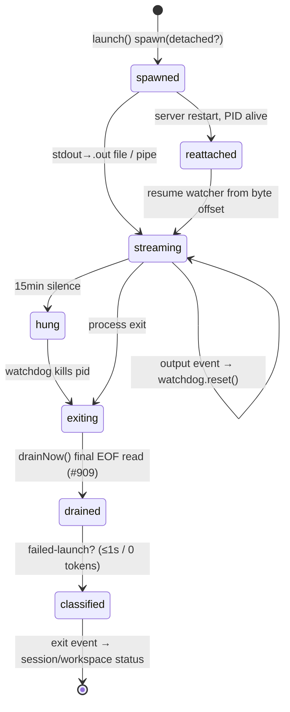

# Workspaces & Worktrees (the unit of agent work)

## Purpose & business capability

A **workspace** is this product's atomic unit of agentic work: the binding of *one ticket* to *one isolated place an AI agent can write code* and *one (or more) agent runs against it*. It exists because letting an autonomous agent edit code is only safe if its blast radius is contained, observable, and reversible. The workspace is that container — a dedicated git branch in a dedicated worktree directory, plus the bookkeeping that lets the board show the agent's status, surface its diff, and decide whether the work is mergeable.

The capability hypothesis is **confirmed**: provision an isolated git worktree on a branch, launch an agent, expose its diff, then merge or delete. The DB row *is* bookkeeping for a live process — but with two important refinements. First, the row outlives the process: it retains forensic state (`mergedHeadSha`, scorecards, setup/symlink run telemetry, `latestLaunchError`, `cleanupWarning`) so the board can reason about work that has finished, crashed, or been abandoned. Second, a workspace is **not always a worktree** — a "direct" workspace (`isDirect`) operates in the project's main checkout with no worktree at all (`workspaces.ts schema:12`), trading isolation for immediacy.

What consumes it: the board UI (renders a per-issue `workspaceSummary`), the monitor/Conductor (counts "active" workspaces against a WIP target, auto-starts and auto-merges them), the CLI/MCP, and the review/merge flow. If this module vanished, the board would have tickets but no way to actually *do* them — no agent could be launched, no diff inspected, no branch landed.

## Ubiquitous language

| Term | Meaning *as used here* | Defined at |
|------|------------------------|------------|
| Workspace | The unit binding one issue to an isolated work location and its agent runs. A DB row in `workspaces`. | `schema/workspaces.ts:6` |
| Worktree | The on-disk git worktree directory the agent edits; `workingDir`. Null/empty until created; reused as the merge/diff cwd. | `schema:11`, `crud.repository.ts:215` |
| Direct workspace | A workspace with **no** worktree — agent works in the project's main checkout (`isDirect`). Merge is a no-op (just close). | `schema:12`, server `CLAUDE.md` "Direct workspaces" |
| Base branch | The branch the worktree was cut from and the merge target; null for direct. | `schema:10` |
| `baseCommitSha` / `mergedHeadSha` | Commit range anchors. `mergedHeadSha` is captured at merge so `baseCommitSha..mergedHeadSha` still resolves *after* the feature branch ref is deleted. | `schema:44,51` |
| Activity state | The *derived* live status of a workspace (`active`/`fixing`/`idle`/`in-review-idle`/`failed`/`blocked`/`merged`/`closed`) — distinct from the stored `status` column. | `workspace-activity-state.ts:13` |
| `countsAsActiveCapacity` | Whether a workspace consumes an agent slot against the WIP target. The board's capacity arithmetic SSOT. | `workspace-activity-state.ts:25` |
| Showdown | A group of sibling workspaces competing on the *same* issue (`showdownId`, slot label a–d). | `schema:36-38` |
| Fork child | A workspace spawned by a parallel fork/join workflow node, tracking its parent + join convergence point. | `schema:31-34` |
| Plan mode | Workspace runs the agent to produce a *plan* awaiting human approval before implementing (`planMode`, `pendingPlanPath`). | `schema:17,24` |
| Setup / symlink run | Per-worktree dependency bootstrap telemetry (`latestSetup*`, `latestSymlink*`) — did `pnpm install` / junctioning succeed. | `schema:65-80` |
| Follow-up auto-start | After a merge, unblocked dependents get a workspace created + agent launched automatically. | `followup-workspace.service.ts:27` |
| Evidence artifact | Proof-of-work an agent attaches to its workspace/issue — a Playwright `.webm` "visual proof" that a change actually works, a screenshot, a link, or text — so the work's correctness is *observable* without re-running it. Rows in `issue_artifacts`. | `schema/issue-artifacts.ts:6` |

## Domain model & invariants

The `workspaces` table is the entity; `workspace-activity-state.ts` holds the *rules* for interpreting it. Most invariants are policies reverse-engineered from guards and constants.

| Invariant / rule / policy | Why (business reason, inferred) | Enforced at |
|---------------------------|----------------------------------|-------------|
| A workspace cannot exist without an issue (`issueId NOT NULL`, FK). | Agent work is meaningless without a ticket to anchor scope/prompt; the issue is the unit of intent. | `schema:8` |
| Creating a workspace requires an `issueId` at the boundary; rejected 400 otherwise. | No half-formed work unit may enter the system. | `routes/workspaces.ts:210` |
| Plan mode **auto-enables** for a high/critical-priority issue when the caller did not set `planMode` explicitly. | A cost-control gate: catch an expensive misunderstanding as an approvable plan *before* the agent burns tokens implementing it. Explicit caller intent still wins. | `workspace-create.service.ts:380-383` |
| At most **one open direct workspace per issue** — creation asserts no existing direct workspace with `status != "closed"`. | Two direct workspaces would both operate in the shared main checkout and collide; only one agent may hold it at a time. | `workspace-create.service.ts:378`, `crud.repository.ts:88-106` |
| Worktree/launch failure still returns 201 with the record + `error` field — the row persists. | The workspace is bookkeeping first: a failed launch must be *visible and recoverable* (`latestLaunchError`), not silently dropped. | server `CLAUDE.md`; `crud.repository.ts:115` |
| "Active capacity" = `active` OR `fixing` OR `reviewing` OR `awaiting-plan-approval`. | These four states mean an agent (or conflict-resolver) is genuinely consuming a slot. **Caveat:** this is the *board-summary* notion of active capacity; the monitor's auto-start gate uses a SEPARATE 3-state list (`AUTO_START_WIP_STATUSES = ["active","reviewing","fixing"]`, NOT derived from this set) — so an `awaiting-plan-approval` workspace shows as active capacity but does NOT consume an auto-start WIP slot. The two do not agree. | `workspace-activity-state.ts:160-165`; `startup/monitor-auto-start.ts:24` |
| `fixing` (fix-and-merge conflict resolution) counts as active capacity. | A conflict-resolving agent is real work occupying a slot — under-counting it caused over-spawning (board learning). | `workspace-activity-state.ts:107` |
| A stopped session that ended ≤1000 ms OR with zero in+out tokens OR with an explicit `launchFailure` flag is classified **failed**, not idle. | Distinguishes a crash-on-launch (recoverable by relaunch) from a finished idle agent; the "~1s/0-token = launch-failed" heuristic. | `workspace-activity-state.ts:53-68` |
| An idle workspace in the "In Review" lane *with a cached non-empty diff* is `in-review-idle` (auto-merge-eligible), NOT plain idle. | Such a workspace is finished work awaiting landing, not work awaiting an agent — it must not be counted as an empty slot to refill. | `workspace-activity-state.ts:129-134` |
| Closed + `mergedAt` set ⇒ `merged`; closed without `mergedAt` ⇒ `closed` (abandoned). | The product distinguishes *delivered* from *abandoned*; `mergedAt` is the proof code actually landed. | `workspace-activity-state.ts:94-98` |
| `mergedHeadSha` is captured at merge time and survives branch deletion. | The merged-commits/diff panels must still resolve the delivered range after the feature branch ref is gc'd. | `schema:45-51` |
| Symlink dir names are validated against path traversal and absolute paths before any link is created. | A worktree-bootstrap that linked `..`/absolute paths could write outside the worktree — a containment/safety boundary for autonomous setup. | `worktree-symlink-bootstrap.ts:17-24,93-97` |
| A request to symlink `node_modules` in a pnpm-workspace source expands to each `packages/*/node_modules`. | Under a strict pnpm linker, deps resolve per-package, not at root; junctioning only the root would leave the worktree unable to import `vitest`/`react`. | `worktree-symlink-bootstrap.ts:57-91,192-196` |
| Follow-up auto-start refuses to run when the project has no `defaultBranch`. | A worktree cannot be cut without a base; better to skip than create a broken workspace. | `followup-workspace.service.ts:44-47` |
| Follow-up auto-start skips a dependent that already has any non-closed workspace. | Never double-launch an agent on an issue already in flight. | `followup-workspace.service.ts:61-62` |
| A dependent is only auto-started when *all* its blocking deps are in a terminal (Done) status. | Respects the dependency DAG: unblocked-means-all-blockers-delivered. | `followup-workspace.service.ts:55-59` |
| A merged "active" status flip is only emitted as `workspace_merged` after the agent actually launches. | The board's live event reflects real state transitions, not intent. | `followup-workspace.service.ts:109-112` |
| "Dirty main checkout" = uncommitted *tracked* `.ts/.tsx/.sql` changes under `packages/**`. | Any uncommitted tracked change in main blocks auto-merge; this surfaces it as an operator warning before automation stalls. | `dirty-main-checkout.ts:6-10,33-62` |
| The spawn-layer hang watchdog kills an agent after 15 min of *zero output*, resetting on every event. | A provider deadlocked on a prompt/network/stdin used to be invisible until the ~30-min monitor cycle; this catches genuine silence directly. | `agent.service.ts:34,248-284,545-560` |
| A workspace (and its issue) accumulates **evidence artifacts** — agents attach proof-of-work (`.webm` visual proof, screenshots, links, text) via the `attach_artifact` MCP tool; an artifact is keyed to its workspace and *also* tied to that workspace's issue. | The product treats "did the change actually work" as something the agent must *demonstrate*, not merely assert: artifacts make correctness reviewable in the UI and let a `requested-visual-proof` workspace be checked. Workspace-scoped proof is still issue-scoped so it survives the workspace being closed/merged. Surfaced in a dedicated workspace **Artifacts** tab (a highlighted "Visual Proof" band). | `attach-artifact.ts:32-78`, `session-artifacts.repository.ts:29`, client `WorkspaceArtifactsView.tsx`, `WorkspaceViewTabs.tsx:83` |

## Key workflows / use cases

### 1. Create → launch (the core flow)
**Trigger:** `POST /api/workspaces` (UI "New Workspace", Conductor, Butler) or the post-merge cascade. The route (`routes/workspaces.ts:214`) delegates to `workspaceService.createWorkspace`, which fans through `workspace-crud.service.ts:193` → `workspace.service.ts:47` to the real orchestrator `createWorkspace` (`workspace-create.service.ts:343`). The `crud.repository` holds only the DB reads/writes the orchestrator calls — it is not the orchestrator.
**Steps (domain-level, all in `workspace-create.service.ts`):** `resolveIssueAndProject` (:374) → assert at most one open direct workspace for the issue (:378) → default plan mode on for high/critical priority (:380-383) → `setupWorktree` (worktree + setup-script + symlink bootstrap, recorded in `latestSetup*`/`latestSymlink*`; `:386`, defined in `workspace-provision.service.ts:46`; skipped for direct) → `packContextPrimer` (:395) → `writeWorktreeTicketContext` (:401) → `resolveAgentPromptAndSkill` (:405) → `insertWorkspaceRecord` inside a transaction (:415) → place on the workflow start node *or* `moveIssueToInProgressStrict` (:425-429) → launch the agent subprocess (`agent.service.ts:417`).
**Outcome:** 201 with the workspace record; agent running, issue moved to In Progress.
**Failure handling:** worktree/launch failure still persists the row + `error`/`latestLaunchError` so it is recoverable (`crud.repository.ts:115`).

### 2. Agent process lifecycle (where the real runtime decisions live)

Detached agents survive a tsx hot-reload (`detached + unref`, `agent.service.ts:509,521`); their stdout is redirected to a `.out` file polled every 500 ms, with a synchronous `drainNow()` on exit to close the exit-before-output race that otherwise misclassifies a fast real run as a zero-output launch failure (`agent.service.ts:156-212,375-380` — #909). Captured stderr is drained into the session on crash (`agent.service.ts:119-129,386` — #779).

### 3. Inspect → merge or discard
`GET /:id/diff` (ETag-cached, `workspace-actions.ts:110`) → `POST /:id/merge` (lands branch on base, sets `mergedAt`/`mergedHeadSha`, terminal & irreversible) → or conflict path: `/conflicts`, `/update-base` (rebase/merge), `/resolve-conflicts`, `/fix-and-merge` (spawns a `fixing` session) → or `/close` (abandon) / `DELETE` (cascade sessions+messages). Direct-workspace merge is a no-op close.

### 4. Plan-mode gate
`planMode` is **not only caller-set**: when the caller omits `planMode`, creation defaults it on for a high/critical-priority issue (`workspace-create.service.ts:380-383`) so an expensive misunderstanding surfaces as an approvable plan before implementation. A `planMode` workspace produces a plan (`pendingPlanPath`) and awaits human approval: `GET /:id/plan`, `POST /:id/implement-plan`, `POST /:id/reject-plan` (`workspace-actions.ts:75-93`). The agent does not write implementation code until approved.

### 5. Post-merge dependency cascade
On merge, `autoStartFollowups` finds dependents whose blockers are now all Done, creates worktrees + launches agents for them (`followup-workspace.service.ts:27`). This is a *driver* of new work — and is gated by per-project Start Mode upstream (a `manual` project must not cascade).

## Entry points

| Entry point | Kind | What it lets a caller do | `file:line` |
|-------------|------|--------------------------|-------------|
| `POST /api/workspaces` | API | Create worktree + record + auto-launch agent for an issue | `routes/workspaces.ts:188` |
| `POST /api/workspaces/preview` | API | Dry-run the launch config (read-only, no side effects) | `routes/workspaces.ts:105` |
| `GET /api/workspaces?projectId=\|issueId=` | API | Slim project/issue-scoped workspace list (status, provider, model, mergedAt) | `routes/workspaces.ts:156` |
| `GET/PATCH/DELETE /api/workspaces/:id` | API | Read details / patch / cascade-delete | `routes/workspaces.ts:238-274` |
| `POST /:id/turn` | API | Send a follow-up message (`content`, 409 if busy) | `workspace-actions.ts:52` |
| `GET /:id/diff` | API | ETag-cached working-tree diff vs base | `workspace-actions.ts:110` |
| `POST /:id/merge` / `/fix-and-merge` / `/update-base` | API | Land the branch / resolve+land / rebase onto base | `workspace-actions.ts:126,184,162` |
| `POST /:id/launch` / `/stop` / `/quarantine` | API | (Re)launch, stop, or stop+move-back-to-In-Progress | `workspace-actions.ts:45,62,69` |
| `autoStartFollowups()` | event | Post-merge cascade auto-creates dependent workspaces | `followup-workspace.service.ts:27` |
| `GET /api/workspaces/stale-worktrees`, `/cleanup-warnings` | API | Operator hygiene: orphaned dirs, failed post-merge cleanup | `routes/workspaces.ts:89,97` |
| analytics: `/provider-mix`, `/cost-over-time`, `/scorecard-distribution` | API | Per-project dashboards over workspace/session rows | `routes/workspaces.ts:36,51,78` |

## Logic-bearing code (where the real decisions live)

| File / function | What decision/logic it holds | `file:line` |
|-----------------|------------------------------|-------------|
| `workspace-activity-state.ts` `deriveWorkspaceActivityState` | The canonical map from stored `status` + latest session → live activity state + whether it counts as capacity. The board/CLI/monitor MUST all use this one function (prior drift caused inconsistent counts). | `:86-141` |
| `workspace-activity-state.ts` `isFailedLaunchSession` | The launch-failure heuristic (≤1s / 0 tokens / explicit flag). | `:53-68` |
| `workspace-create.service.ts` `createWorkspace` | The **real create→provision→launch orchestrator** (the route only delegates here). Owns the ordered sequence: resolve issue/project, the at-most-one-open-direct guard (:378), the priority-driven plan-mode default (:380-383), provisioning, context primer/ticket-context injection, prompt/skill resolution, the transactional row insert + workflow-start-vs-In-Progress decision (:415-429), and the deferred launch. | `:343-450` |
| `workspace-provision.service.ts` `setupWorktree` | Worktree creation + per-worktree dependency bootstrap (setup script and/or symlink junctioning), returning `branch`/`worktreePath`/`baseBranch`/`baseCommitSha` + `latestSetup*`/`latestSymlink*` telemetry. The orchestrator's provisioning step. | `:46` |
| `agent.service.ts` `launch` | The subprocess contract: detach-or-pipe decision, stdout→file redirect, stdin handling (Windows buffering), hang watchdog arming, env/port injection. | `:417-566` |
| `agent.service.ts` exit/drain handlers | The exit-before-output drain barrier (#909) and stderr capture drain (#779) — correctness of failure classification depends on these. | `:357-410,680-739` |
| `worktree-symlink-bootstrap.ts` `discoverWorkspaceNodeModules` / `bootstrapSymlinks` | Workspace-aware dependency junctioning + path-traversal safety for autonomous worktree setup. | `:57-91,175-204` |
| `followup-workspace.service.ts` `autoStartFollowups` | The dependency-cascade unblocking rule + the full create-worktree-and-launch sequence replicated outside the route. | `:27-117` |
| `workspace-crud.repository.ts` | The create-context reads (issue→project→repo, skill, prefs) and all lifecycle writes (launch-failure, closed, working-dir, cleanup-warning). | `:40-372` |
| `dirty-main-checkout.ts` `scanDirtyMainCheckouts` | The "main checkout is dirty ⇒ automation will stall" operator-warning policy. | `:33-62` |

## Dependencies & bounded-context relationships

- **agent-providers** (Customer-Supplier; this module is customer): `launch()` delegates the provider-specific command/args/env to `buildAgentLaunchConfig` (`agent.service.ts:440`). The workspace owns *where/when*; the provider context owns *how the binary is invoked*.
- **agent-sessions** (Shared Kernel): a session is the per-run child of a workspace; activity-state derivation reads the *latest session* (`workspace-activity-state.ts:86`), and DELETE cascades sessions+messages. The `providerSessionId` column (historically named after Claude) doubles as the provider-resume slot (server `CLAUDE.md`).
- **git-integration** (Conformist / Anti-Corruption): all worktree/merge/diff git work routes through the shared git service and the single `git-exec` adapter (`dirty-main-checkout.ts:1`). This module never spawns git directly.
- **review-merge** (Customer-Supplier): `/review`, `/merge`, `/fix-and-merge` actions and the `readyForMerge`/`requiresReview`/`thoroughReview` flags + scorecards drive the landing pipeline.
- **Hidden dependency — lifecycle reconcilers in `startup/`** (co-change without import here): the *birth* of a workspace lives in this module, but much of its *death/recovery* logic lives in `packages/server/src/startup/*reconciler.ts` and `monitor-cycle*.ts` (session-restore reattach, stranded-review, completion-state, terminal-workspace-reaper, ancestor-branch). A maintainer changing workspace status semantics must check those files — the activity-state SSOT (`workspace-activity-state.ts`) is the seam that keeps them consistent.
- **Start Mode / monitor** (upstream policy): whether the post-merge cascade and idle-refill actually fire is gated by `resolveStartPolicy` (project `CLAUDE.md`). The cascade in this module is a *mechanism*; Start Mode is the *kill switch*.

## File topology

Well-formed, but the capability is split server-side across routes → services → repositories, with lifecycle reconciliation deliberately elsewhere.

| Sub-responsibility | Implemented in | Layer |
|--------------------|----------------|-------|
| Entity definition | `shared/src/schema/workspaces.ts` | shared schema |
| Activity-state SSOT + capacity rules | `shared/src/lib/workspace-activity-state.ts` | shared lib |
| Worktree dependency bootstrap | `shared/src/lib/worktree-symlink-bootstrap.ts` | shared lib |
| HTTP doors (CRUD + analytics) | `server/src/routes/workspaces.ts` | route |
| HTTP doors (actions: turn/diff/merge/plan/conflicts/comments) | `server/src/routes/workspace-actions.ts` | route |
| Create→provision→launch orchestration | `server/src/services/workspace-create.service.ts` | service |
| Worktree creation + dependency bootstrap | `server/src/services/workspace-provision.service.ts` | service |
| Agent subprocess lifecycle | `server/src/services/agent.service.ts` | service |
| Post-merge cascade | `server/src/services/followup-workspace.service.ts` | service |
| Dirty-main operator warning | `server/src/services/dirty-main-checkout.ts` | service |
| Create-context reads + lifecycle writes | `server/src/repositories/workspace-crud.repository.ts` | repository |
| Reads (by id/issue) + analytics-source reads + cascade-delete | `server/src/repositories/workspace.repository.ts` | repository |
| Board summary aggregation + diff/conflict caches | `server/src/repositories/workspace-summary.repository.ts` | repository |
| Close-state reads/writes + running-session stop | `server/src/repositories/workspace-lifecycle-reconcile.repository.ts` | repository |
| **Birth ↔ death split:** recovery/reaping/reconcile | `server/src/startup/*reconciler.ts`, `monitor-cycle*.ts`, `session-restore.ts` | startup (NOT in this module) |

## Risks, gaps & open questions

- **`status` column vs derived activity-state are two vocabularies.** The DB stores `active/fixing/reviewing/awaiting-plan-approval/blocked/idle/error/closed`; the derived layer adds `in-review-idle/failed/merged`. A maintainer reading only the schema will miss that `merged` is *derived from* `closed + mergedAt`, not a stored value (`workspace-activity-state.ts:94`). **Inferred, unverified:** the full set of legal stored `status` values is not declared as an enum anywhere in the schema (`status` is a free `text` with default `"active"`, `schema:19`) — the `workspaceStatusPriority` switch and the activity-state branches are the de facto enum.
- **The create-and-launch sequence is replicated.** `followup-workspace.service.ts:67-112` re-implements worktree-create → insert row → set In Progress → start session, rather than calling the same `createWorkspace` service the route uses. Drift risk: a new creation invariant (e.g. context-primer, setup script, symlink bootstrap) added to the main path won't apply to cascaded follow-ups. (Follow-ups notably skip `skillId`, `requiresReview`, setup/symlink, context-packer.) **Worth the orchestrator's attention.**
- **Hang-watchdog timeout (15 min) is a heuristic.** A legitimately long, output-silent agent step (large build, long network wait) could be killed (`agent.service.ts:34`). Overridable via env; not per-provider tunable.
- **`countsAsActiveCapacity` correctness is load-bearing and easy to break.** Any new status that means "an agent is working" must be added in *three* aligned places — `deriveWorkspaceActivityState`, `ACTIVE_WORKSPACE_STATUSES`, and `workspaceStatusPriority` (`workspace-activity-state.ts:107,160,147`). They are not derived from one list; a missed edit silently mis-counts WIP and over/under-spawns. **Worse, a FOURTH list already diverges:** the monitor auto-start gate hardcodes `AUTO_START_WIP_STATUSES = ["active","reviewing","fixing"]` (`startup/monitor-auto-start.ts:24`, used by `countWipCapacity` :54), which is NOT derived from `ACTIVE_WORKSPACE_STATUSES` and omits `awaiting-plan-approval`. Real consequence today: an `awaiting-plan-approval` workspace counts as active capacity in the board summary but does NOT consume a monitor auto-start WIP slot — so the monitor can start work past the apparent ceiling.
- **Dirty-main scanner is TS-monorepo-shaped.** `SOURCE_PATHSPECS` only globs `packages/**/*.{ts,tsx,sql}` (`dirty-main-checkout.ts:6-10`); for a non-TS project (Rails/Go/Rust — see project memory) it would never warn about a dirty main checkout that still blocks auto-merge. **Inferred gap.**
- **`isDirect` merge-is-noop is documented only in prose** (server `CLAUDE.md`), not enforced in the schema; a direct workspace has null `baseBranch` (`schema:10`) and relies on the merge service to no-op rather than a guard in this module.
